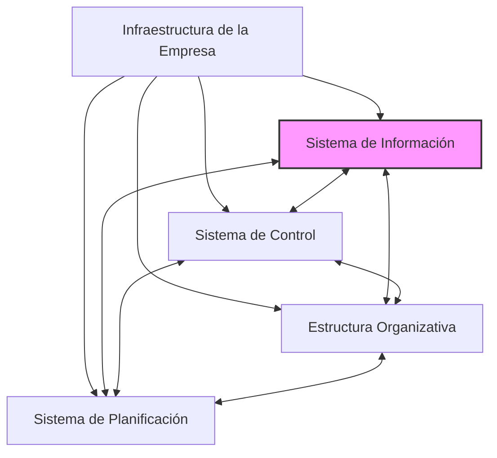

# 4. El Sistema de Información y los demás Sistemas de la Empresa

Este documento describe cómo el Sistema de Información (SI) se interrelaciona y debe ser coherente con otros sistemas fundamentales dentro de la infraestructura de una empresa.

```mermaid
mindmap
  root("SI y Otros Sistemas de la Empresa")
    ("Interrelación del SI con Otros Sistemas")
      ("SI no opera en aislamiento")
      ("Forma conjunto coherente y coordinado con")
        ("Sistema de Control" ~colon~ "Monitorizar y regular actividades")
        ("Estructura Organizativa" ~colon~ "División, agrupación, coordinación de tareas")
        ("Sistema de Planificación" ~colon~ "Definir objetivos y cursos de acción")
      ("Diagrama" ~colon~ "SI interactuando con otros sistemas")
    ("Coherencia Interna y con Objetivos Empresariales")
      ("Conjunto de sistemas (SI, control, org., planificación) debe ser coherente")
        ("Internamente (entre ellos)")
        ("Con objetivos de la empresa")
      ("Todos los sistemas deben contribuir a objetivos empresariales")
      ("Diseño e implementación de SI considera apoyo e integración con otros sistemas")
```

[< Volver al Índice Principal](./00_Indice_SI_TI.md) | [Anterior: 3. El Sistema de Información y la Cadena de Valor](./03_SI_Cadena_Valor.md)

## Interrelación del SI con Otros Sistemas de la Infraestructura Empresarial

El SI no opera en aislamiento. Forma un conjunto, que se supone **coherente y coordinado**, con el resto de sistemas que componen la infraestructura de toda empresa. Estos otros sistemas incluyen, pero no se limitan a:

*   **Sistema de Control**: Mecanismos y procesos para monitorizar y regular las actividades de la empresa (ej. control de gestión, control de calidad).
*   **Estructura Organizativa**: La forma en que se dividen, agrupan y coordinan las tareas y responsabilidades dentro de la empresa (ej. organigrama, definición de roles).
*   **Sistema de Planificación**: Procesos y herramientas para definir objetivos y cursos de acción futuros (ej. planificación estratégica, planificación operativa).


*Diagrama: El SI interactuando con otros sistemas de la infraestructura empresarial.*

## Coherencia Interna y con los Objetivos Empresariales

El conjunto de estos sistemas (SI, control, estructura organizativa, planificación) se supone **coherente**, tanto internamente (entre ellos) como con los objetivos que la empresa a la que pertenecen se ha fijado.

Todos estos sistemas deben contribuir explícitamente a la consecución de los objetivos empresariales. Esto significa que el diseño y la implementación del SI deben considerar cómo apoyará y se integrará con los demás sistemas para lograr las metas generales de la organización.

---

Siguiente: [5. El Rol de las Tecnologías de la Información (TI)](./05_Rol_Tecnologias_Informacion.md) 