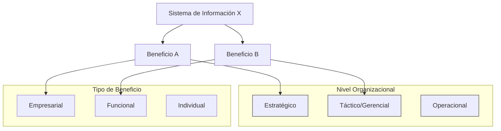

# 9.2. Beneficios de los SI y Valor de la Información

Este documento explora los beneficios que los Sistemas de Información (SI) pueden aportar a una empresa, cómo se conceptualiza el valor de la información, y la relación entre costos, valor, eficiencia y efectividad.

```mermaid
mindmap
  root("Beneficios SI y Valor Información")
    ("Beneficios de los SI" ~colon~ "Mejora situación empresa por manejo información")
    ("Atributos del Valor de la Información (14 atributos)")
      ("Precisión, Satisfacción usuario, Importancia, Rentabilidad, Calidad, Funcionalidad, Productividad, Velocidad, Capacidad de uso, Confiabilidad, Seguridad, Volumen, Flexibilidad, Utilización")
    ("Eficiencia vs. Efectividad")
      ("Ineficiencia Medible" ~colon~ "Misma calidad, más gasto")
      ("Balance Costos-Valor" ~colon~ "Punto óptimo, mayor diferencia valor-costo")
      ("Eficiencia info" ~colon~ "Bajar costos")
      ("Efectividad info" ~colon~ "Entender atributos de generación de valor")
    ("Tipos de Beneficios Genéricos")
      ("Nivel Organizacional" ~colon~ "Estratégico, Táctico, Operacional")
      ("Tipo de Beneficio" ~colon~ "Empresarial, Funcional, Individual")
    ("Seis Categorías de Valor en Uso Información")
      ("ROI")
      ("Adecuación estratégica")
      ("Ventaja competitiva")
      ("Apoyo información para management")
      ("Reacción competitiva")
      ("Arquitectura estratégica de los IS")
    ("Beneficios Tangibles e Intangibles")
      ("Tangibles" ~colon~ "Cuantificables (pesos, tiempo)")
      ("Intangibles" ~colon~ "Cualitativos (comunicación, homogeneidad)")
      ("Directos" ~colon~ "Resultado inmediato")
      ("Indirectos" ~colon~ "Secundarios, largo plazo")
      ("Ejemplo Sistema Mesa de Entradas")
      ("Dificultad en estimar intangibles indirectos")
    ("Límites del Valor de la Información")
      ("Valor esperado = Ganancia CON info - Ganancia SIN info")
      ("Límite superior" ~colon~ "Valor información perfecta (elimina riesgo)")
```

[< Volver a Valor de la Información e Inversión en SI](./09_Valor_Informacion_Inversion_SI.md) | [< Volver al Índice Principal](./00_Indice_SI_TI.md)

Los **beneficios de los SI** son las diversas formas en las que una empresa puede mejorar su situación como consecuencia de la manera en que se maneja la información.

## Atributos del Valor de la Información

El valor surge potencialmente de un número de aspectos (atributos) de la información. La siguiente lista es extensiva e identifica los puntos donde se acumula el valor:

*   Precisión
*   Satisfacción del usuario
*   Importancia
*   Rentabilidad
*   Calidad
*   Funcionalidad
*   Productividad
*   Velocidad
*   Capacidad de uso
*   Confiabilidad
*   Seguridad
*   Volumen
*   Flexibilidad
*   Utilización

Estos atributos definen los aspectos que potencialmente dan valor a la información.

## Eficiencia vs. Efectividad en SI

La diferencia entre **eficiencia** (hacer algo bien) y **efectividad** (hacer lo que está bien) se ve desde una perspectiva económica.

*   **Ineficiencia Medible**: Si el sistema A y el sistema B producen la misma calidad, pero A incurre en más gastos, existe una cantidad medible de ineficiencia en A, o una mejora medible en la eficiencia de B.
    ```
    Costo |        / Frontera de Eficiencia
          |       / 
          |      * (B)
          |     / \
          |    * (A) \
          |   /       \ (Ineficiencia de A)
          |  /
          +------------------ Capacidad/Calidad
    ```
    *La frontera de eficiencia se desplaza constantemente por nuevos desarrollos.*

*   **Balance entre Costos y Valor (Beneficio)**:
    Generalmente, existe un incremento en los costos cuando se mejora la calidad (curva de costo). La curva de valor (beneficio para la empresa) sigue una línea diferente.
    ```
    Valor/Costo |
                |         ---- (Curva de Valor)
                |        /    \
                |       /      *(Punto Óptimo: Mayor diferencia Valor-Costo)
                |      /        \
                |     *----------*(Curva de Costo)
                |    /
                |   /
                +------------------ Calidad del Sistema/Información
    ```
    Existe un **estado óptimo** donde se obtiene el mejor balance: el punto de mayor diferencia positiva entre el valor obtenido y el costo.

*   **Eficiencia en la información**: Consiste en bajar los costos tanto como sea posible (herramientas de productividad, control de proyectos).
*   **Efectividad en la información**: Solo puede estimarse estableciendo la curva de valor, lo que requiere entender los atributos de generación del valor asociados con la información.

## Tipos de Beneficios Genéricos

Es necesario justificar los beneficios e indicar a qué nivel organizacional apunta dicho beneficio.


*Diagrama conceptual: Un SI puede generar múltiples beneficios que impactan diferentes niveles y tipos organizacionales.*

## Seis Categorías de Valor en el Uso de la Información

Estas categorías pueden formar la base para justificar las inversiones en SI:

1.  **Rendimiento de la inversión (ROI)**: Análisis financieros de costo/beneficio que evidencian una diferencia positiva neta con el tiempo.
2.  **Adecuación estratégica**: Apoyo directo de una estrategia comercial declarada por un proyecto determinado.
3.  **Ventaja competitiva**: Valor creado por una nueva empresa o producto, o un aumento en la participación del mercado.
4.  **Apoyo de información para el management**: Provee información sobre aspectos cruciales de la empresa.
5.  **Reacción competitiva**: Actividades de informática que tienen como objetivo alcanzar la posición del competidor o aventajarla.
6.  **Arquitectura estratégica de los IS**: Una inversión básica y necesaria que posibilita la ocurrencia de otras aplicaciones estratégicas posteriores.

## Beneficios Tangibles e Intangibles

Así como los [costos](./09a_Costos_SI.md) pueden ser tangibles e intangibles, los beneficios también.

*   **Beneficios Tangibles**: Se pueden medir y expresar cuantitativamente (ej. en pesos, reducción de tiempos).
*   **Beneficios Intangibles**: Representan cuestiones cualitativas (ej. mejora en la comunicación, procesamiento homogéneo).

Pueden ser también:
*   **Directos**: Resultado inmediato de la implementación del SI.
*   **Indirectos**: Consecuencias secundarias o a más largo plazo.

**Ejemplo: Sistema de Mesa de Entradas**

| Tipo          | Tangible                                  | Intangible                                      |
| :------------ | :---------------------------------------- | :---------------------------------------------- |
| **Directos**  | Reducción de tiempos de procesamiento     | Procesamiento homogéneo de los trámites         |
| **Indirectos**| Ahorros por no incrementar el personal    | Mejora en la comunicación con el usuario interno-externo |

Uno de los grandes problemas al juzgar el valor de la información consiste en reconocer la diferencia entre beneficios tangibles e intangibles, y en tener algún método para estimar el valor de los beneficios intangibles.

Estimar beneficios intangibles indirectos (de inversiones en estructura básica) es muy difícil; evaluar los devengados de inversiones en servicios de la estructura de los IS es casi imposible.

> A pesar de la dificultad, muchas empresas ponen más atención en estimar y controlar los costos que los beneficios.

## Límites del Valor de la Información

La siguiente ecuación define los límites del valor de la información:

**Valor esperado de elementos de información dados = Ganancia posible CON la información - Ganancia posible SIN la información**

Aunque generalmente es imposible definir el valor exacto de todo elemento de información, es posible establecer el límite superior: el **valor de la información perfecta**, que elimina todo riesgo asociado con acciones futuras.

---

Siguiente Subtema: [9.3. Tipos de Inversiones en SI](./09c_Tipos_Inversiones_SI.md) 