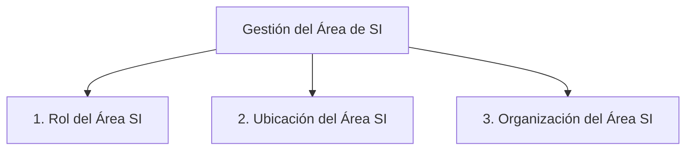

# 10. Management de Recursos de IS (Área de Sistemas)

Este documento introduce la gestión de recursos de Sistemas de Información (SI), enfocándose en el **Área de Sistemas** (o departamento de IS/IT) dentro de una organización. Se abordan tres temas específicos: el rol, la ubicación y la organización del área de SI.

```mermaid
mindmap
  root("Management de Recursos de IS (Área de Sistemas)")
    ("Aclaración Importante" ~colon~ "IS/SI aquí refiere al ÁREA/DEPARTAMENTO de Sistemas")
    ("Tres Temas Específicos en Gestión Área SI")
      ("1. Rol del Área de SI (¿Qué harán?)")
        ("Naturaleza interacciones área SI con entorno")
        ("Funciones, tareas, responsabilidades del área")
        ("Enlace" ~colon~ "10.1. Rol del Área de SI")
      ("2. Ubicación del Área de SI (¿Dónde estarán?)")
        ("Perspectiva empresarial recursos SI")
        ("Ubicación física y de management en la empresa")
        ("Enlace" ~colon~ "10.2. Ubicación del Área de SI")
      ("3. Organización del Área de SI (¿Cómo se dispondrán?)")
        ("Organización profesionales de SI")
        ("Agrupación, responsabilidades, jerarquías")
        ("Enlace" ~colon~ "10.3. Organización del Área de SI")
    ("Interdependencia de los Tres Aspectos")
```

**ACLARACIÓN IMPORTANTE**: Cuando se habla de "IS" o "SI" en esta sección, se refiere predominantemente al **ÁREA o DEPARTAMENTO de Sistemas de Información**, no a las aplicaciones o sistemas individuales, a menos que el contexto indique lo contrario.

[< Volver al Índice Principal](./00_Indice_SI_TI.md) | [Anterior: 9. Valor de la Información e Inversión en SI](./09_Valor_Informacion_Inversion_SI.md)

Existen tres temas específicos que deben resolverse en la gestión del área de sistemas de información:

1.  **¿Qué harán los sistemas de información? (Rol de los SI)**
    *   Se refiere a la naturaleza de las interacciones del área de SI con su entorno; a las funciones, tareas y responsabilidades del área.
    *   Detallado en: **[10.1. Rol del Área de SI](./10a_Rol_SI_Area.md)**

2.  **¿Dónde estarán los SI? (Ubicación de los SI)**
    *   Se refiere a la perspectiva empresarial de los recursos de SI e incluye la ubicación del área de sistemas dentro de la empresa, tanto desde el punto de vista físico como de management.
    *   Detallado en: **[10.2. Ubicación del Área de SI](./10b_Ubicacion_SI_Area.md)**

3.  **¿Cómo se dispondrán los SI? (Organización de los SI)**
    *   Se refiere a la organización de aquellas personas que serán consideradas profesionales de SI.
    *   Implica cómo estarán agrupados, qué responsabilidades tendrán y bajo qué jerarquías estarán distribuidos.
    *   Detallado en: **[10.3. Organización del Área de SI](./10c_Organizacion_SI_Area.md)**



Estos tres aspectos son interdependientes y deben considerarse de manera integral para una gestión efectiva de los recursos del área de SI.

---

Siguiente Subtema: [10.1. Rol del Área de SI](./10a_Rol_SI_Area.md)
O bien, navegue al siguiente tema principal: [11. Administración de los SI](./11_Administracion_SI.md) 