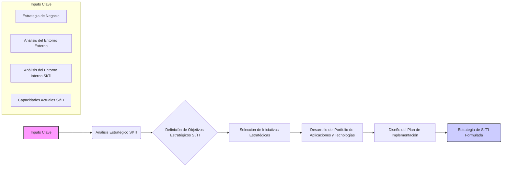

# Formulación de la Estrategia de SI/TI

[↩️ Volver al Índice](00_Indice_SI_TI.md) | [⬅️ Anterior](12b_Inputs_Clave_Estrategia.md) | [➡️ Siguiente](12d_Implantacion_Estrategia_SI_TI.md)

```mermaid
mindmap
  root("Formulación Estrategia SI/TI")
    ("Introducción" ~colon~ "Traduce inputs en plan de acción coherente y alineado")
    ("Componentes Clave Formulación")
      ("1. Análisis Estratégico")
        ("Análisis Interno" ~colon~ "Capacidades SI/TI, infraestructura, RRHH, procesos, cultura (FODA SI/TI)")
        ("Análisis Externo" ~colon~ "Competencia, tendencias tecno, clientes, regulaciones (Porter adaptado)")
        ("Análisis Brechas (Gap Analysis)" ~colon~ "Comparar actual vs. deseado")
      ("2. Definición Objetivos Estratégicos SI/TI")
        ("Basados en análisis y objetivos negocio, SMART")
        ("Ej: Mejorar eficiencia, satisfacción cliente, reducir riesgos, habilitar expansión")
      ("3. Selección Iniciativas Estratégicas")
        ("Identificar y priorizar proyectos (alineamiento, ROI, viabilidad, riesgos, impacto)")
        ("Ej: ERP, e-commerce, cloud, BI/Big Data, ciberseguridad")
      ("4. Desarrollo Portfolio Aplicaciones y Tecnologías")
        ("Evolución portfolio e infraestructura")
        ("Decisiones comprar vs. desarrollar, estandarización, obsolescencia, arquitectura objetivo")
      ("5. Gobernanza SI/TI")
        ("Marco para toma decisiones efectiva, alineamiento, gestión riesgos")
        ("Roles, responsabilidades, procesos")
    ("Proceso Formulación Estrategia SI/TI (Diagrama)")
      ("Inputs Clave")
        ("Estrategia Negocio")
        ("Análisis Entorno Externo")
        ("Análisis Entorno Interno SI/TI")
        ("Capacidades Actuales SI/TI")
      ("-> Análisis Estratégico SI/TI")
      ("-> Definición Objetivos Estratégicos SI/TI")
      ("-> Selección Iniciativas Estratégicas")
      ("-> Desarrollo Portfolio Aplicaciones y Tecnologías")
      ("-> Diseño Plan Implementación (roadmap, recursos, hitos)")
      ("-> Estrategia SI/TI Formulada")
    ("Conclusión" ~colon~ "Proceso iterativo, revisar y ajustar periódicamente")
```

---

La formulación de la estrategia de Sistemas de Información (SI) y Tecnologías de la Información (TI) es un proceso crucial que traduce los inputs de negocio y del entorno en un plan de acción coherente y alineado con los objetivos generales de la empresa. Este proceso implica tomar decisiones sobre cómo la tecnología y los sistemas de información pueden ser utilizados para crear valor, obtener ventajas competitivas y soportar las operaciones y la toma de decisiones.

## Componentes Clave de la Formulación Estratégica de SI/TI

### 1. Análisis Estratégico
Antes de formular la estrategia, es esencial realizar un análisis exhaustivo:
-   **Análisis Interno:** Evaluar las capacidades actuales de SI/TI, la infraestructura existente, los recursos humanos, los procesos y la cultura tecnológica. Herramientas como el análisis FODA (Fortalezas, Oportunidades, Debilidades, Amenazas) son útiles aquí, enfocándose en los aspectos de SI/TI.
-   **Análisis Externo:** Comprender el entorno competitivo, las tendencias tecnológicas emergentes, las expectativas de los clientes, las regulaciones y las estrategias de SI/TI de los competidores. Modelos como las Cinco Fuerzas de Porter pueden adaptarse para analizar el impacto de la tecnología en la industria.
-   **Análisis de Brechas (Gap Analysis):** Comparar el estado actual de SI/TI con el estado futuro deseado o requerido por la estrategia de negocio para identificar las carencias que la nueva estrategia debe abordar.

### 2. Definición de Objetivos Estratégicos de SI/TI
Basándose en el análisis y en los objetivos de negocio, se definen los objetivos específicos para SI/TI. Estos deben ser SMART (Específicos, Medibles, Alcanzables, Relevantes, con Plazo definido). Ejemplos:
-   Mejorar la eficiencia operativa en un X% mediante la automatización de procesos clave.
-   Incrementar la satisfacción del cliente en un Y% a través de nuevas plataformas digitales.
-   Reducir los riesgos de seguridad informática en un Z% implementando nuevas políticas y tecnologías.
-   Habilitar la expansión a nuevos mercados mediante una infraestructura tecnológica escalable.

### 3. Selección de Iniciativas Estratégicas
Una vez definidos los objetivos, se identifican y priorizan las iniciativas o proyectos de SI/TI que ayudarán a alcanzarlos. La priorización puede basarse en criterios como:
-   Alineamiento con la estrategia de negocio.
-   Retorno de la inversión (ROI) esperado.
-   Viabilidad técnica y de recursos.
-   Riesgos asociados.
-   Impacto en la organización.

Ejemplos de iniciativas estratégicas:
-   Implementación de un nuevo sistema ERP.
-   Desarrollo de una plataforma de e-commerce.
-   Migración de servicios a la nube.
-   Adopción de herramientas de Business Intelligence y Big Data.
-   Fortalecimiento de la ciberseguridad.

### 4. Desarrollo del Portfolio de Aplicaciones y Tecnologías
La estrategia debe definir cómo evolucionará el portfolio de aplicaciones y la infraestructura tecnológica para soportar los objetivos e iniciativas. Esto incluye:
-   Decisiones sobre comprar vs. desarrollar software.
-   Estandarización de tecnologías.
-   Planes de obsolescencia y actualización.
-   Arquitectura tecnológica objetivo.

### 5. Gobernanza de SI/TI
Establecer el marco de gobernanza para asegurar que las decisiones de SI/TI se tomen de manera efectiva, se alineen con la estrategia y se gestionen los riesgos. Esto incluye definir roles, responsabilidades y procesos para la toma de decisiones estratégicas en SI/TI.

## Proceso de Formulación de la Estrategia de SI/TI

El proceso de formulación puede visualizarse de la siguiente manera:



### Descripción del Diagrama:
-   **Inputs Clave:** Recopilación de información fundamental, incluyendo la estrategia general del negocio, análisis del entorno externo (mercado, competencia, tecnología) e interno (capacidades actuales, infraestructura).
-   **Análisis Estratégico SI/TI:** Evaluación de la situación actual y futura deseada, identificación de brechas, oportunidades y amenazas tecnológicas.
-   **Definición de Objetivos Estratégicos SI/TI:** Establecimiento de metas claras, medibles y alineadas con el negocio.
-   **Selección de Iniciativas Estratégicas:** Identificación y priorización de proyectos y acciones específicas.
-   **Desarrollo del Portfolio de Aplicaciones y Tecnologías:** Planificación de la evolución de las herramientas y sistemas.
-   **Diseño del Plan de Implementación:** Aunque la implementación detallada es la siguiente fase (`12d`), la formulación debe esbozar cómo se llevarán a cabo las iniciativas (roadmap general, recursos principales, hitos).
-   **Estrategia de SI/TI Formulada:** El documento o conjunto de documentos que articulan la dirección estratégica para SI/TI.

La formulación de la estrategia no es un evento único, sino un proceso iterativo que debe revisarse y ajustarse periódicamente en respuesta a los cambios en el negocio y en el entorno tecnológico.

---
[↩️ Volver al Índice](00_Indice_SI_TI.md) | [⬅️ Anterior](12b_Inputs_Clave_Estrategia.md) | [➡️ Siguiente](12d_Implantacion_Estrategia_SI_TI.md) 