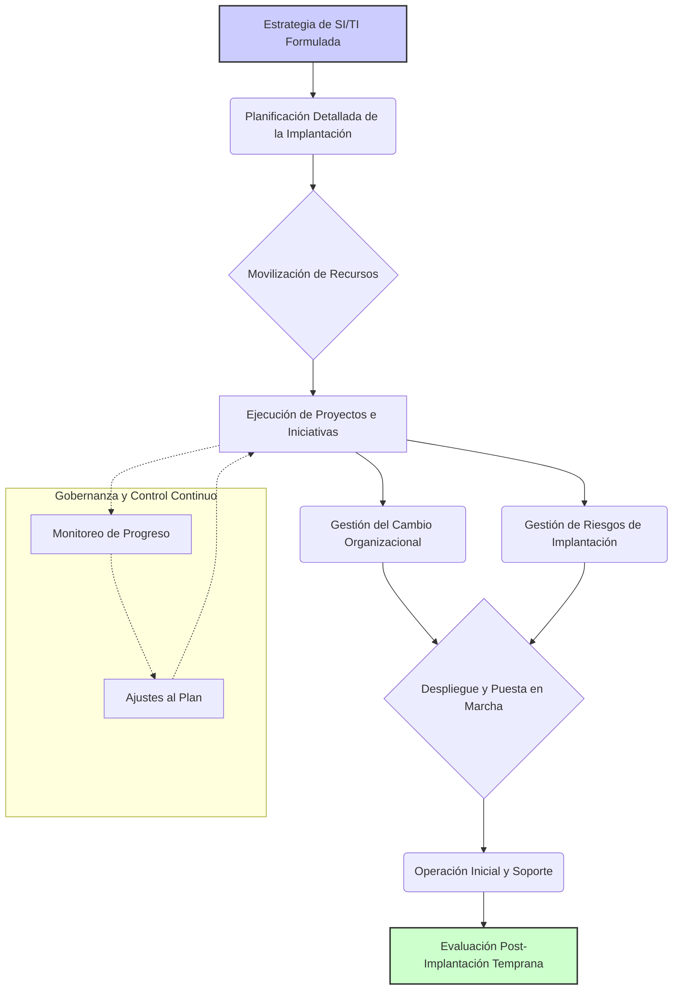

# Implantación de la Estrategia de SI/TI

[↩️ Volver al Índice](00_Indice_SI_TI.md) | [⬅️ Anterior](12c_Formulacion_Estrategia_SI_TI.md) | [➡️ Siguiente](12e_Seguimiento_Control_Estrategia_SI_TI.md)

```mermaid
mindmap
  root("Implantación Estrategia SI/TI")
    ("Introducción" ~colon~ "Convertir planes en realidad, ejecutar iniciativas, gestionar cambio")
    ("Elementos Clave Implantación")
      ("1. Plan Implantación Detallado")
        ("Desglose proyectos, priorización/secuenciación, asignación recursos, hitos/entregables")
      ("2. Gestión Proyectos (Project Management)")
        ("Metodologías (Agile, Waterfall), herramientas, roles/responsabilidades")
      ("3. Gestión Cambio Organizacional (Change Management)")
        ("Comunicación, capacitación, participación, soporte")
      ("4. Gobernanza Implantación")
        ("Comité Dirección SI/TI, informes progreso, gestión riesgos")
      ("5. Gestión Proveedores y Contratos")
        ("Relaciones y contratos para cumplimiento y calidad")
      ("6. Despliegue y Puesta en Marcha")
        ("Instalación HW/SW, migración datos, pruebas, lanzamiento")
    ("Ciclo Vida Implantación Estrategia SI/TI (Diagrama)")
      ("Estrategia Formulada -> Planificación Detallada -> Movilización Recursos")
      ("-> Ejecución Proyectos (con Gestión Cambio y Riesgos en paralelo)")
      ("-> Despliegue y Puesta en Marcha -> Operación Inicial y Soporte")
      ("-> Evaluación Post-Implantación Temprana")
      ("Paralelo: Gobernanza y Control Continuo (Monitoreo, Ajustes)")
    ("Conclusión" ~colon~ "Requiere liderazgo, comunicación, gestión proyectos disciplinada, enfoque en personas")
```

---

Una vez formulada la estrategia de Sistemas de Información (SI) y Tecnologías de la Información (TI), la fase de implantación es crítica para convertir los planes en realidad y alcanzar los beneficios esperados. Esta fase se centra en la ejecución de las iniciativas estratégicas definidas, la gestión del cambio y la movilización de los recursos necesarios.

## Elementos Clave de la Implantación de la Estrategia de SI/TI

### 1. Plan de Implantación Detallado
La formulación de la estrategia (`12c_Formulacion_Estrategia_SI_TI.md`) esboza un plan general. En la fase de implantación, este se detalla:
-   **Desglose de Proyectos:** Cada iniciativa estratégica se descompone en proyectos manejables con objetivos, alcance, entregables, cronogramas y presupuestos específicos.
-   **Priorización y Secuenciación:** Se confirman las prioridades y se establece la secuencia de los proyectos, considerando dependencias y la capacidad de la organización.
-   **Asignación de Recursos:** Se asignan formalmente los recursos humanos, financieros y tecnológicos a cada proyecto.
-   **Hitos y Entregables Clave:** Se definen puntos de control para monitorear el progreso.

### 2. Gestión de Proyectos (Project Management)
Es fundamental aplicar metodologías robustas de gestión de proyectos para asegurar que se completen a tiempo, dentro del presupuesto y con la calidad esperada. Esto incluye:
-   **Metodologías:** Agile, Waterfall, Híbridas, según la naturaleza del proyecto.
-   **Herramientas:** Software de gestión de proyectos para planificación, seguimiento y colaboración.
-   **Roles y Responsabilidades:** Jefes de proyecto, equipos de proyecto, comités de seguimiento.

### 3. Gestión del Cambio Organizacional (Change Management)
La introducción de nuevos SI/TI a menudo implica cambios significativos en los procesos de negocio, roles laborales y la cultura organizacional. Una gestión del cambio efectiva es crucial para minimizar la resistencia y asegurar la adopción por parte de los usuarios.
-   **Comunicación:** Informar a los stakeholders sobre los cambios, sus beneficios y el impacto esperado.
-   **Capacitación:** Entrenar a los usuarios en las nuevas tecnologías y procesos.
-   **Participación:** Involucrar a los empleados en el proceso de cambio.
-   **Soporte:** Proveer asistencia continua durante y después de la implantación.

### 4. Gobernanza de la Implantación
Se debe establecer un marco de gobernanza para supervisar la implantación:
-   **Comité de Dirección de SI/TI:** Responsable de la supervisión general, toma de decisiones clave y resolución de conflictos.
-   **Informes de Progreso:** Seguimiento regular del avance de los proyectos respecto a los planes.
-   **Gestión de Riesgos:** Identificación, evaluación y mitigación de los riesgos que puedan afectar la implantación (técnicos, financieros, operativos, de adopción).

### 5. Gestión de Proveedores y Contratos
Si la implantación involucra a proveedores externos (consultores, desarrolladores de software, proveedores de hardware o servicios en la nube), es vital una gestión eficaz de las relaciones y los contratos para asegurar el cumplimiento de los acuerdos y la calidad de los servicios.

### 6. Despliegue y Puesta en Marcha
Esto incluye la instalación de hardware, software, la migración de datos, las pruebas (unitarias, de integración, de aceptación del usuario) y el lanzamiento final de los nuevos sistemas o servicios.

## Ciclo de Vida de la Implantación de la Estrategia de SI/TI



### Descripción del Diagrama:
-   **Estrategia de SI/TI Formulada:** El punto de partida, que define qué se va a hacer.
-   **Planificación Detallada de la Implantación:** Creación de planes de proyecto, asignación de recursos y definición de cronogramas.
-   **Movilización de Recursos:** Asegurar que los equipos, la financiación y la tecnología estén disponibles.
-   **Ejecución de Proyectos e Iniciativas:** El trabajo diario de construir, configurar e integrar los SI/TI.
-   **Gestión del Cambio Organizacional:** Actividades paralelas para preparar a la organización.
-   **Gestión de Riesgos de Implantación:** Identificación y mitigación continua de problemas potenciales.
-   **Despliegue y Puesta en Marcha:** Lanzamiento de los sistemas a los usuarios.
-   **Operación Inicial y Soporte:** El período inmediato post-lanzamiento, crucial para estabilizar los nuevos sistemas.
-   **Evaluación Post-Implantación Temprana:** Una primera revisión para identificar lecciones aprendidas y realizar ajustes rápidos. La evaluación completa se trata en `12e_Seguimiento_Control_Estrategia_SI_TI.md`.
-   **Gobernanza y Control Continuo:** Supervisión constante, informes y ajustes al plan según sea necesario durante toda la fase de ejecución.

La implantación exitosa requiere un liderazgo fuerte, una comunicación clara, una gestión de proyectos disciplinada y un enfoque en las personas afectadas por el cambio.

---
[↩️ Volver al Índice](00_Indice_SI_TI.md) | [⬅️ Anterior](12c_Formulacion_Estrategia_SI_TI.md) | [➡️ Siguiente](12e_Seguimiento_Control_Estrategia_SI_TI.md) 