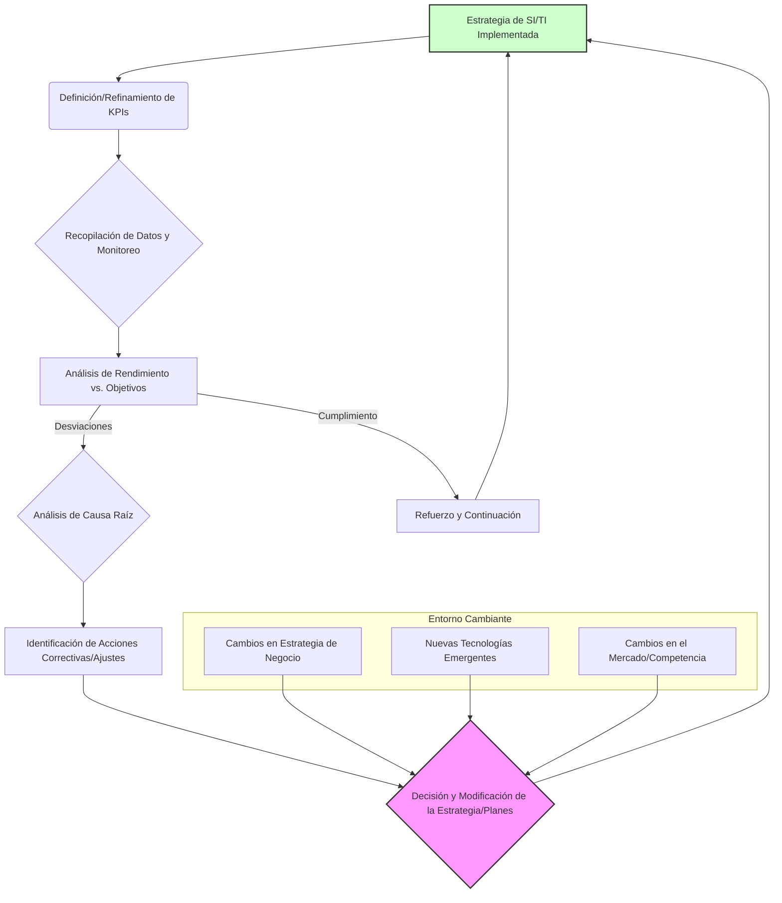

# Seguimiento y Control de la Estrategia de SI/TI

[↩️ Volver al Índice](00_Indice_SI_TI.md) | [⬅️ Anterior](12d_Implantacion_Estrategia_SI_TI.md) | [➡️ Siguiente](13_Gestion_Proyectos_SI_TI.md)

```mermaid
mindmap
  root("Seguimiento y Control Estrategia SI/TI")
    ("Introducción" ~colon~ "Proceso continuo, asegurar alineamiento, ejecución eficaz, entrega valor")
    ("Componentes Clave Seguimiento y Control")
      ("1. Establecimiento Métricas y KPIs")
        ("Alineados con objetivos SI/TI y negocio")
        ("Ej: ROI TI, adopción tecnologías, eficiencia operativa, satisfacción usuario, disponibilidad sistemas, cumplimiento proyectos, reducción riesgos, time-to-market")
      ("2. Procesos Monitoreo y Reporte")
        ("Recopilar datos KPIs y progreso iniciativas")
        ("Frecuencia (mensual, trimestral), herramientas (dashboards, informes), audiencia (stakeholders)")
      ("3. Revisiones Estratégicas Periódicas")
        ("Asegurar continua relevancia y efectividad (anual o más frecuente)")
        ("Alcance: validez objetivos, rendimiento iniciativas, nuevas oportunidades/amenazas, alineamiento")
      ("4. Evaluación Resultados y Desviaciones")
        ("Comparar real vs. planificado")
        ("Análisis causa raíz, lecciones aprendidas")
      ("5. Acciones Correctivas y Ajustes Estratégicos")
        ("Corregir desviaciones, ajustar estrategia, reasignar recursos")
    ("Ciclo Seguimiento, Control y Ajuste Estratégico (Diagrama)")
      ("Estrategia Implementada -> Definición KPIs -> Recopilación Datos")
      ("-> Análisis Rendimiento (Si Desviaciones -> Análisis Causa Raíz -> Acciones Correctivas -> Decisión/Modificación -> Estrategia Implementada)")
      ("-> Análisis Rendimiento (Si Cumplimiento -> Refuerzo/Continuación -> Estrategia Implementada)")
      ("Inputs Externos al Ciclo" ~colon~ "Cambios Estrategia Negocio, Nuevas Tecnologías, Cambios Mercado afectan Decisión/Modificación")
    ("Conclusión" ~colon~ "Garantiza valor sostenible inversión SI/TI, adaptación ágil")
```

---

El seguimiento y control de la estrategia de Sistemas de Información (SI) y Tecnologías de la Información (TI) es un proceso continuo y esencial para asegurar que la estrategia se mantenga alineada con los objetivos del negocio, se ejecute eficazmente y entregue el valor esperado. Esta fase cierra el ciclo estratégico, proporcionando retroalimentación para ajustes y futuras planificaciones.

## Componentes Clave del Seguimiento y Control

### 1. Establecimiento de Métricas y KPIs (Key Performance Indicators)
Para medir el éxito y el progreso de la estrategia de SI/TI, es crucial definir métricas claras y KPIs relevantes. Estos deben estar alineados con los objetivos estratégicos de SI/TI y, en última instancia, con los objetivos del negocio.
-   **Ejemplos de KPIs de SI/TI:**
    -   **Rendimiento de Inversiones en TI (ROI):** Beneficios obtenidos frente a los costos de las iniciativas de SI/TI.
    -   **Nivel de Adopción de Nuevas Tecnologías:** Porcentaje de usuarios utilizando activamente los nuevos sistemas.
    -   **Mejora de la Eficiencia Operativa:** Reducción de tiempos de ciclo, costos operativos gracias a SI/TI.
    -   **Niveles de Satisfacción del Usuario/Cliente:** Encuestas de satisfacción con los sistemas y servicios de TI.
    -   **Disponibilidad y Fiabilidad de Sistemas Críticos:** Uptime de los sistemas, número de incidentes.
    -   **Cumplimiento de Hitos y Presupuestos de Proyectos Estratégicos.**
    -   **Reducción de Riesgos de Seguridad.**
    -   **Tiempo de Comercialización (Time-to-Market) para nuevas capacidades habilitadas por TI.**

### 2. Procesos de Monitoreo y Reporte
Se deben establecer mecanismos regulares para recopilar datos sobre los KPIs y el progreso de las iniciativas estratégicas.
-   **Frecuencia:** Mensual, trimestral, anual, dependiendo de la métrica y la necesidad de la dirección.
-   **Herramientas:** Cuadros de mando (dashboards) de Business Intelligence, informes de gestión de proyectos, encuestas.
-   **Audiencia:** Los informes deben adaptarse a las necesidades de los diferentes stakeholders (Comité de Dirección, responsables de departamento, equipo de SI/TI).

### 3. Revisiones Estratégicas Periódicas
La estrategia de SI/TI no es estática. Debe revisarse periódicamente para asegurar su continua relevancia y efectividad.
-   **Frecuencia de Revisión:** Al menos anualmente, o con mayor frecuencia si ocurren cambios significativos en el negocio o el entorno tecnológico.
-   **Alcance de la Revisión:**
    -   Evaluar si los objetivos estratégicos de SI/TI siguen siendo válidos.
    -   Analizar el rendimiento de las iniciativas implementadas.
    -   Identificar nuevas oportunidades o amenazas tecnológicas.
    -   Valorar el alineamiento continuo con la estrategia general del negocio.

### 4. Evaluación de Resultados y Desviaciones
Comparar los resultados reales con los objetivos planificados para identificar desviaciones.
-   **Análisis de Causa Raíz:** Entender por qué ocurrieron las desviaciones (positivas o negativas).
-   **Lecciones Aprendidas:** Documentar lo aprendido para mejorar futuras planificaciones e implementaciones.

### 5. Acciones Correctivas y Ajustes Estratégicos
Basándose en la evaluación, se toman decisiones para:
-   **Corregir Desviaciones:** Implementar acciones para reencauzar proyectos o iniciativas.
-   **Ajustar la Estrategia:** Modificar objetivos, prioridades o iniciativas si el entorno o las premisas originales han cambiado significativamente.
-   **Reasignar Recursos:** Optimizar la asignación de recursos en función del rendimiento y las nuevas prioridades.

## Ciclo de Seguimiento, Control y Ajuste Estratégico

Este proceso es cíclico y se integra con la planificación estratégica continua.



### Descripción del Diagrama:
-   **Estrategia de SI/TI Implementada:** El estado actual de las iniciativas y sistemas en operación.
-   **Definición/Refinamiento de KPIs:** Asegurar que las métricas correctas están siendo monitoreadas.
-   **Recopilación de Datos y Monitoreo:** El proceso continuo de seguimiento del rendimiento.
-   **Análisis de Rendimiento vs. Objetivos:** Comparación de lo real con lo planificado.
-   **Análisis de Causa Raíz:** Profundizar en las razones de las desviaciones.
-   **Identificación de Acciones Correctivas/Ajustes:** Proponer soluciones o cambios.
-   **Decisión y Modificación de la Estrategia/Planes:** Tomar decisiones informadas para ajustar la estrategia, los planes de implantación o las operaciones. Este paso también considera los cambios del **Entorno Cambiante** (estrategia de negocio, nuevas tecnologías, mercado).
-   **Refuerzo y Continuación:** Si el rendimiento es el esperado, se continúan y refuerzan las acciones.

El seguimiento y control efectivos garantizan que la inversión en SI/TI genere valor de forma sostenible y que la organización pueda adaptarse ágilmente a un entorno dinámico.

---
[↩️ Volver al Índice](00_Indice_SI_TI.md) | [⬅️ Anterior](12d_Implantacion_Estrategia_SI_TI.md) | [➡️ Siguiente](13_Gestion_Proyectos_SI_TI.md)
