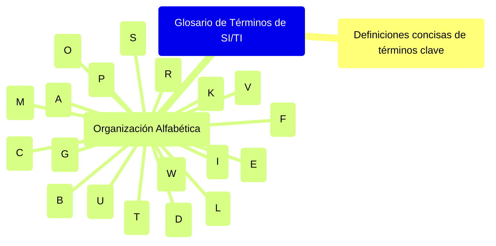

# 19. Glosario de Términos de SI/TI

[↩️ Volver al Índice](00_Indice_SI_TI.md) | [⬅️ Anterior](18_Tendencias_Futuras_SI_TI.md) | [Índice ↪️](00_Indice_SI_TI.md)

---

Este glosario proporciona definiciones concisas de términos clave utilizados a lo largo de esta documentación sobre Sistemas de Información (SI) y Tecnologías de la Información (TI).

## A

-   **Acta de Constitución del Proyecto (Project Charter):** Documento que autoriza formalmente la existencia de un proyecto y otorga al director del proyecto la autoridad para aplicar recursos de la organización a las actividades del proyecto.
-   **Agile (Ágil):** Enfoque iterativo e incremental para la gestión de proyectos y el desarrollo de software que enfatiza la flexibilidad, la colaboración, la entrega rápida de valor y la adaptación al cambio.
-   **Alineamiento Estratégico:** Proceso para asegurar que la estrategia de SI/TI apoye y esté en sintonía con la estrategia general del negocio.
-   **Análisis FODA (SWOT Analysis):** Herramienta de planificación estratégica utilizada para identificar las Fortalezas, Oportunidades, Debilidades y Amenazas de una organización o proyecto.
-   **Arquitectura Empresarial (Enterprise Architecture):** Práctica de analizar, diseñar, planificar e implementar el análisis empresarial para ejecutar con éxito las estrategias de negocio.
-   **Autenticación Multifactor (MFA):** Método de seguridad que requiere que el usuario proporcione dos o más factores de verificación para acceder a un recurso.

## B

-   **Balanced Scorecard (Cuadro de Mando Integral):** Herramienta de gestión estratégica que permite evaluar el funcionamiento de una organización desde cuatro perspectivas: financiera, del cliente, de procesos internos, y de aprendizaje y crecimiento.
-   **Big Data:** Grandes volúmenes de datos – tanto estructurados como no estructurados – que inundan los negocios cada día. Su análisis puede llevar a mejores decisiones y movimientos de negocios estratégicos.
-   **Blockchain:** Tecnología de registro distribuido (DLT) que permite crear un registro digital compartido, inmutable y transparente de transacciones o datos.
-   **Business Case (Caso de Negocio):** Documento que presenta la justificación para emprender un proyecto o tarea, a menudo incluyendo un análisis de costos y beneficios.
-   **Business Process Outsourcing (BPO):** Externalización de procesos de negocio específicos a un proveedor de servicios.

## C

-   **Cadena de Valor (Value Chain):** Modelo conceptual que describe la secuencia completa de actividades que las empresas realizan para diseñar, producir, comercializar, entregar y apoyar sus productos o servicios.
-   **Ciberseguridad:** Práctica de proteger sistemas, redes y programas de ataques digitales.
-   **Ciclo de Vida del Desarrollo de Software (SDLC - Software Development Life Cycle):** Proceso que siguen los equipos de desarrollo para diseñar, desarrollar y probar software de alta calidad.
-   **Cloud Computing (Computación en la Nube):** Modelo de entrega de servicios informáticos – incluyendo servidores, almacenamiento, bases de datos, redes, software, análisis e inteligencia – a través de Internet ("la nube") para ofrecer innovación más rápida, recursos flexibles y economías de escala.
-   **Confidencialidad, Integridad y Disponibilidad (Tríada CIA):** Modelo de seguridad diseñado para guiar las políticas de seguridad de la información dentro de una organización.
-   **CRM (Customer Relationship Management - Gestión de Relaciones con Clientes):** Estrategia y tecnología para gestionar todas las interacciones de una empresa con sus clientes actuales y potenciales.

## D

-   **Data Warehouse (Almacén de Datos):** Sistema utilizado para la generación de informes y el análisis de datos, y se considera un componente central de la inteligencia de negocios.
-   **Delegado de Protección de Datos (DPD / DPO - Data Protection Officer):** Rol de seguridad de datos responsable de supervisar la estrategia y la implementación de la protección de datos de una organización para garantizar el cumplimiento de los requisitos del RGPD.
-   **Digital Divide (Brecha Digital):** Desigualdad en el acceso, uso o impacto de las Tecnologías de la Información y la Comunicación (TIC) entre diferentes grupos sociales.

## E

-   **Edge Computing:** Modelo de computación distribuida que acerca el procesamiento de datos y el almacenamiento al lugar donde se generan los datos, reduciendo la latencia y el uso del ancho de banda.
-   **ERP (Enterprise Resource Planning - Planificación de Recursos Empresariales):** Tipo de software que las organizaciones utilizan para gestionar las actividades empresariales diarias, como la contabilidad, las adquisiciones, la gestión de proyectos, la gestión de riesgos y el cumplimiento, y las operaciones de la cadena de suministro.
-   **Estrategia de SI/TI:** Plan a largo plazo que define cómo los Sistemas de Información y las Tecnologías de la Información apoyarán y habilitarán los objetivos y la estrategia general del negocio.

## F

-   **FinOps:** Práctica cultural de gestión financiera en la nube que busca maximizar el valor empresarial de la nube a través de la colaboración entre equipos de ingeniería, finanzas, tecnología y negocio.
-   **Firewall:** Dispositivo de seguridad de red que monitorea el tráfico de red entrante y saliente y decide permitir o bloquear tráfico específico basándose en un conjunto definido de reglas de seguridad.

## G

-   **GDPR (General Data Protection Regulation - Reglamento General de Protección de Datos):** Reglamento de la legislación de la UE sobre protección de datos y privacidad para todas las personas dentro de la Unión Europea y el Espacio Económico Europeo.
-   **Gestión de la Configuración del Software (SCM - Software Configuration Management):** Proceso de seguimiento y control de los cambios en el software.
-   **Gobernanza de TI (IT Governance):** Marco de procesos y estructuras que aseguran que el uso de TI por parte de una organización sostiene y extiende las estrategias y objetivos de la organización.
-   **Green IT (TI Verde / TI Sostenible):** Práctica de utilizar los recursos informáticos de manera eficiente y eficaz con un impacto ambiental mínimo o nulo.

## I

-   **IaaS (Infrastructure as a Service - Infraestructura como Servicio):** Modelo de servicio en la nube que proporciona infraestructura informática virtualizada (servidores, almacenamiento, redes) bajo demanda.
-   **Inteligencia Artificial (IA):** Simulación de procesos de inteligencia humana por parte de máquinas, especialmente sistemas informáticos.
-   **Inteligencia de Negocios (BI - Business Intelligence):** Proceso impulsado por la tecnología para analizar datos y presentar información procesable para ayudar a los ejecutivos, gerentes y otros usuarios finales corporativos a tomar decisiones comerciales informadas.
-   **Internet de las Cosas (IoT - Internet of Things):** Red de objetos físicos ("cosas") que llevan incorporados sensores, software y otras tecnologías con el fin de conectar e intercambiar datos con otros dispositivos y sistemas a través de Internet.
-   **ISO/IEC 25010:** Estándar que describe un modelo de calidad para el producto software, definiendo características como funcionalidad, fiabilidad, usabilidad, eficiencia, mantenibilidad y portabilidad.

## K

-   **Kanban:** Método para gestionar el trabajo visualizando el flujo de trabajo, limitando el trabajo en curso (WIP) y maximizando la eficiencia.
-   **KPI (Key Performance Indicator - Indicador Clave de Rendimiento):** Valor medible que demuestra la eficacia con la que una empresa está logrando los objetivos clave del negocio.

## L

-   **Low-Code/No-Code (LCNC):** Plataformas que permiten crear aplicaciones con poca o ninguna codificación tradicional, utilizando interfaces visuales y componentes preconstruidos.

## M

-   **Machine Learning (ML - Aprendizaje Automático):** Subcampo de la inteligencia artificial que se centra en el desarrollo de sistemas que pueden aprender de los datos y mejorar con la experiencia, sin ser programados explícitamente.
-   **Malware:** Software malicioso diseñado para dañar, deshabilitar o obtener acceso no autorizado a un sistema informático.
-   **Metaverso:** Red de mundos virtuales 3D persistentes y en tiempo real centrados en la conexión social y la interacción.

## O

-   **Outsourcing (Externalización/Tercerización):** Práctica de contratar a un proveedor externo para realizar servicios o crear bienes que tradicionalmente se realizaban internamente.

## P

-   **PaaS (Platform as a Service - Plataforma como Servicio):** Modelo de servicio en la nube que proporciona una plataforma para que los clientes desarrollen, ejecuten y gestionen aplicaciones sin la complejidad de construir y mantener la infraestructura típicamente asociada con el desarrollo y lanzamiento de una aplicación.
-   **Phishing:** Tipo de ciberataque en el que los atacantes se hacen pasar por entidades legítimas para engañar a las víctimas y hacer que revelen información sensible.
-   **PRINCE2 (Projects IN Controlled Environments):** Metodología de gestión de proyectos orientada a procesos.
-   **PMBOK (Project Management Body of Knowledge):** Guía de conocimientos y buenas prácticas en gestión de proyectos publicada por el Project Management Institute (PMI).

## R

-   **Ransomware:** Tipo de malware que amenaza con publicar los datos de la víctima o bloquear perpetuamente el acceso a ellos a menos que se pague un rescate.
-   **RGPD (Reglamento General de Protección de Datos):** Ver GDPR.
-   **ROI (Return on Investment - Retorno de la Inversión):** Métrica de rendimiento utilizada para evaluar la eficiencia o rentabilidad de una inversión.
-   **RPA (Robotic Process Automation - Automatización Robótica de Procesos):** Tecnología que permite configurar software informático, o un "robot", para emular e integrar las acciones de una interacción humana en sistemas digitales para ejecutar un proceso de negocio.

## S

-   **SaaS (Software as a Service - Software como Servicio):** Modelo de entrega de software en el que un proveedor externo aloja aplicaciones y las pone a disposición de los clientes a través de Internet.
-   **Scrum:** Marco de trabajo ágil para gestionar proyectos, especialmente el desarrollo de software.
-   **Seguridad Zero Trust (Confianza Cero):** Modelo de seguridad estratégica basado en el principio de "nunca confiar, siempre verificar", que requiere que todos los usuarios, incluso aquellos dentro de la red de la organización, sean autenticados, autorizados y validados continuamente antes de que se les conceda o se mantenga el acceso a aplicaciones y datos.
-   **SI (Sistema de Información):** Conjunto de componentes interrelacionados que recogen (o recuperan), procesan, almacenan y distribuyen información para apoyar la toma de decisiones y el control en una organización.
-   **SLA (Service Level Agreement - Acuerdo de Nivel de Servicio):** Contrato entre un proveedor de servicios y un cliente que especifica, generalmente en términos medibles, los servicios que el proveedor proporcionará.
-   **SQA (Software Quality Assurance - Aseguramiento de la Calidad del Software):** Conjunto de actividades para garantizar la calidad en los procesos de desarrollo de software.

## T

-   **TI (Tecnologías de la Información):** Uso de computadoras, almacenamiento, redes y otros dispositivos físicos, infraestructura y procesos para crear, procesar, almacenar, asegurar e intercambiar todas las formas de datos electrónicos.

## U

-   **Usabilidad:** Facilidad con la que las personas pueden utilizar una herramienta o artefacto particular para lograr un objetivo particular.

## V

-   **VPN (Virtual Private Network - Red Privada Virtual):** Tecnología que crea una conexión segura y cifrada a través de una red menos segura, como Internet.

## W

-   **Waterfall (Cascada):** Modelo secuencial de gestión de proyectos en el que el progreso fluye constantemente hacia abajo (como una cascada) a través de las fases de concepción, iniciación, análisis, diseño, construcción, pruebas, despliegue y mantenimiento.
-   **Web3:** Idea para una nueva iteración de la World Wide Web basada en la descentralización, la tecnología blockchain y la economía basada en tokens.

---
[↩️ Volver al Índice](00_Indice_SI_TI.md) | [⬅️ Anterior](18_Tendencias_Futuras_SI_TI.md) | [Índice ↪️](00_Indice_SI_TI.md) 