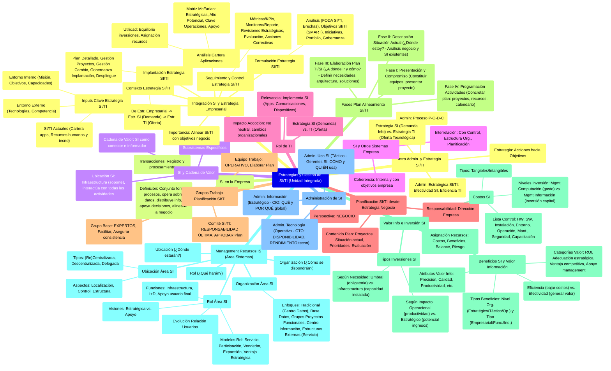

# Índice General: Estrategias y Gestión de Sistemas y Tecnologías de la Información

Este documento sirve como índice principal para la documentación detallada sobre Estrategias de Sistemas de Información (SI) y Tecnologías de la Información (TI), su planificación, valoración, gestión de recursos, e integración con la estrategia empresarial, junto con conceptos organizacionales relevantes.

## Sección 1: Conceptos Fundamentales y Planificación
*   [1. Introducción a la Administración y Estrategia de SI/TI](./01_Introduccion_Administracion_Estrategia.md)
*   [2. El Sistema de Información en la Empresa](./02_Sistema_Informacion_Empresa.md)
*   [3. El Sistema de Información y la Cadena de Valor](./03_SI_Cadena_Valor.md)
*   [4. El Sistema de Información y los demás Sistemas de la Empresa](./04_SI_Otros_Sistemas_Empresa.md)
*   [5. El Rol de las Tecnologías de la Información (TI)](./05_Rol_Tecnologias_Informacion.md)
*   [6. Planificación de SI/TI a partir de la Estrategia de Negocio](./06_Planificacion_SI_TI_Desde_Estrategia_Negocio.md)
*   [7. Grupos de Trabajo en la Planificación de SI/TI](./07_Grupos_Trabajo_Planificacion.md)
*   [8. Fases del Plan de Alineamiento de SI/TI con la Estrategia Organizacional](./08_Fases_Plan_Alineamiento.md)
    *   [8.1. Fase I: Presentación y Compromiso del Equipo](./08a_Fase_I_Presentacion_Compromiso.md)
    *   [8.2. Fase II: Descripción de la Situación Actual](./08b_Fase_II_Descripcion_Situacion_Actual.md)
    *   [8.3. Fase III: Elaboración del Plan de TI/SI](./08c_Fase_III_Elaboracion_Plan.md)
    *   [8.4. Fase IV: Programación de Actividades](./08d_Fase_IV_Programacion_Actividades.md)

## Sección 2: Valoración e Inversión en SI
*   [9. Valor de la Información e Inversión en SI](./09_Valor_Informacion_Inversion_SI.md)
    *   [9.1. Costos de los SI](./09a_Costos_SI.md)
    *   [9.2. Beneficios de los SI y Valor de la Información](./09b_Beneficios_SI.md)
    *   [9.3. Tipos de Inversiones en SI](./09c_Tipos_Inversiones_SI.md)

## Sección 3: Gestión de Recursos de SI (Área de Sistemas)
*   [10. Management de Recursos de IS (Área de Sistemas)](./10_Management_Recursos_IS.md)
    *   [10.1. Rol del Área de SI](./10a_Rol_SI_Area.md)
    *   [10.2. Ubicación del Área de SI](./10b_Ubicacion_SI_Area.md)
    *   [10.3. Organización del Área de SI](./10c_Organizacion_SI_Area.md)
*   [11. Administración de los SI](./11_Administracion_SI.md)

## Sección 4: Integración Estratégica y Modelos de Aplicación
*   [12. Integración de los SI y la Estrategia Empresarial](./12_Integracion_SI_Estrategia_Empresarial.md)
    *   [12.1. Contexto de la Estrategia de SI/TI](./12a_Contexto_Estrategia_SI_TI.md)
    *   [12.2. Entradas (Inputs) Clave para la Estrategia](./12b_Inputs_Clave_Estrategia.md)
    *   [12.3. Análisis de la Cartera de Aplicaciones](./12c_Cartera_Aplicaciones.md)
    *   [12.4. Estrategias Genéricas para la Gestión de SI/TI](./12d_Estrategias_Genericas_Gestion_SI_TI.md)
    *   [12.5. Proyección de Estrategias Genéricas sobre el Modelo de Cartera](./12e_Proyeccion_Estrategias_Cartera.md)
    *   [12.6. Migraciones y Prioridades dentro de la Cartera de Aplicaciones](./12f_Migracion_Prioridades_Cartera.md)

## Sección 5: Conceptos Organizacionales
*   [13. Las Organizaciones según Chiavenato](./13_Organizaciones_Chiavenato.md)
    *   [13.1. Organizaciones como Sistemas Sociales y Abiertos](./13a_Organizaciones_Sistemas_Sociales_Abiertos.md)
    *   [13.2. Enfoque de Tavistock: El Sistema Sociotécnico](./13b_Enfoque_Tavistock_Sistema_Sociotecnico.md)
    *   [13.3. Objetivos y Racionalidad de las Organizaciones](./13c_Objetivos_Racionalidad_Organizaciones.md)

## Sección 6: Modelos de Explotación
*   [14. El Modelo de Explotación de Sistemas](./14_Modelo_Explotacion.md)
    *   [14.1. Modelo Decisional](./14a_Modelo_Decisional.md)
    *   [14.2. Modelo Organizacional](./14b_Modelo_Organizacional.md)
    *   [14.3. Modelo Relacional](./14c_Modelo_Relacional.md)
    *   [14.4. Modelo Informacional](./14d_Modelo_Informacional.md) 