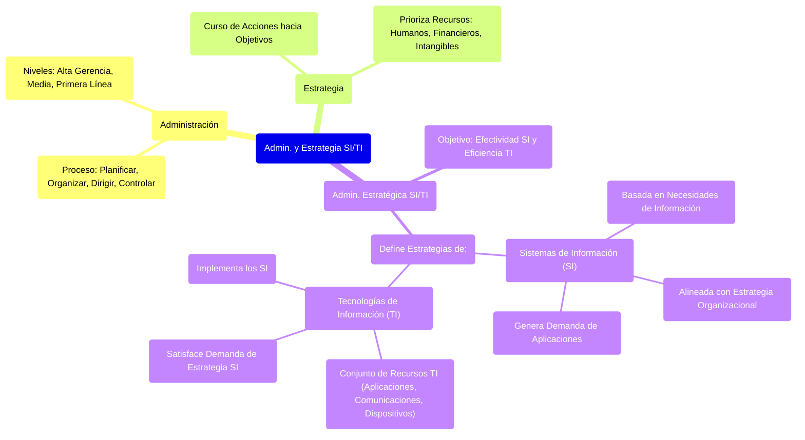

# 1. Introducción a la Administración y Estrategia de SI/TI

Este documento introduce los conceptos fundamentales de administración, estrategia, Sistemas de Información (SI) y Tecnologías de la Información (TI), que son la base para entender las estrategias de SI/TI.

## Resumen Gráfico de Conceptos Clave

[< Volver al Índice Principal](./00_Indice_SI_TI.md)

## Administración

La **administración** es el proceso sustantivo, fundamental y esencial que dirige toda la empresa. Implica cuatro actividades permanentes:

1.  **Planificar**: Definir objetivos y los medios para alcanzarlos.
2.  **Organizar**: Estructurar los recursos y actividades para alcanzar los objetivos.
3.  **Dirigir**: Orientar y guiar a las personas hacia el logro de los objetivos.
4.  **Controlar**: Medir y corregir el desempeño para asegurar que se cumplan los objetivos.

La administración no se limita a un área específica, sino que es llevada a cabo por la **alta gerencia, la gerencia media y la gerencia de primera línea**. El alcance de su administración dependerá de su nivel jerárquico.

## Estrategia

La **estrategia** es un conjunto de acciones que indica el curso de acción para llegar al objetivo. Además, marca la prioridad con la que se asignan recursos y se ejecutan esas acciones.

Los **recursos** se clasifican en:

*   **Materiales Humanos**: Personas y sus capacidades.
*   **Materiales Financieros**: Capital, presupuesto.
*   **Intangibles**: Conocimiento, marca, reputación.

## Administración Estratégica de SI/TI

La **administración estratégica de los SI/TI** se enfoca en la **efectividad** del sistema de información en la organización y, como consecuencia, en la **eficiencia** de la infraestructura tecnológica.

Consiste en establecer los sistemas de información y de comunicación necesarios para la organización.

## Tecnologías de la Información (TI)

**TI** es un conjunto de recursos tecnológicos utilizados para la implementación de los SI. Como mínimo, están conformados por:

*   **Aplicaciones**: Software que procesa datos y realiza tareas.
*   **Comunicaciones**: Redes y medios para transmitir información.
*   **Dispositivos para acceder a la información**: Hardware como computadoras, servidores, dispositivos móviles.

La **estrategia de TI** representa la solución a la demanda de aplicaciones. Es decir, cómo las TI satisfacen la demanda de aplicaciones definida por la estrategia de SI.

## Estrategia de Sistemas de Información (SI)

La **estrategia de SI** agrupa las necesidades de información para cumplir la estrategia organizacional.

---

Siguiente: [2. El Sistema de Información en la Empresa](./02_Sistema_Informacion_Empresa.md) 