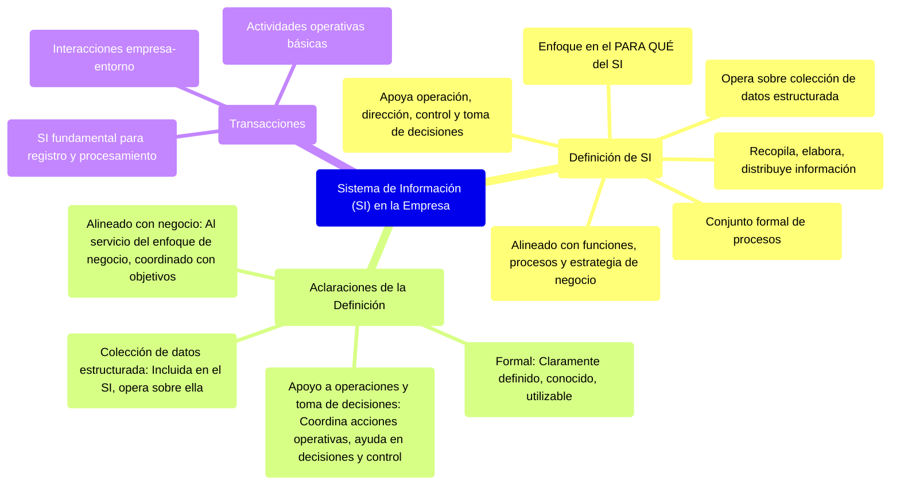

# 2. El Sistema de Información en la Empresa

Este documento define qué se entiende por un Sistema de Información (SI) en el contexto empresarial y aclara sus componentes y propósitos clave.

[< Volver al Índice Principal](./00_Indice_SI_TI.md) | [Anterior: 1. Introducción a la Administración y Estrategia de SI/TI](./01_Introduccion_Administracion_Estrategia.md)

## Definición de Sistema de Información (SI)

Se entiende por **SI** «el conjunto formal de procesos que, operando sobre una colección de datos estructurada de acuerdo con las necesidades de una empresa, recopila, elabora y distribuye (parte de) la información necesaria para la operación de dicha empresa y para las actividades de dirección y control correspondientes, apoyando al menos en parte, la toma de decisiones necesaria para desempeñar las funciones y procesos de negocio de la empresa de acuerdo con su estrategia».

Esta definición se aclara en los siguientes puntos:

*   **Formal**: Se refiere a la parte del SI claramente definida, que toda empresa conoce y sabe cómo utilizar. Los SI informales son, por naturaleza, menos estudiables, planificables y dirigibles.
*   **Colección de datos estructurada**: Esta colección está incluida en el SI y el sistema opera sobre ella, de acuerdo con las necesidades de la empresa.
*   **Apoyo a operaciones y toma de decisiones**: Enfatiza que los SI no solo cubren necesidades de información para coordinar acciones operativas, sino también para ayudar a tomar decisiones y ejercer el control adecuado en actividades de dirección y control.
*   **Alineado con funciones, procesos y estrategia de negocio**: El SI de una empresa debe estar al servicio de su enfoque de negocio. Es un elemento más que la empresa diseña y utiliza para conseguir sus objetivos y debe coordinarse explícitamente con ellos.

En definitiva, la definición se centra fundamentalmente en el **para qué** del SI, más que en el cómo o el qué.

## Transacciones

Las **transacciones** son actividades operativas básicas de toda actividad empresarial, que a menudo involucran interacciones de la empresa con su entorno. Los SI son fundamentales para registrar y procesar estas transacciones.

---

Siguiente: [3. El Sistema de Información y la Cadena de Valor](./03_SI_Cadena_Valor.md) 