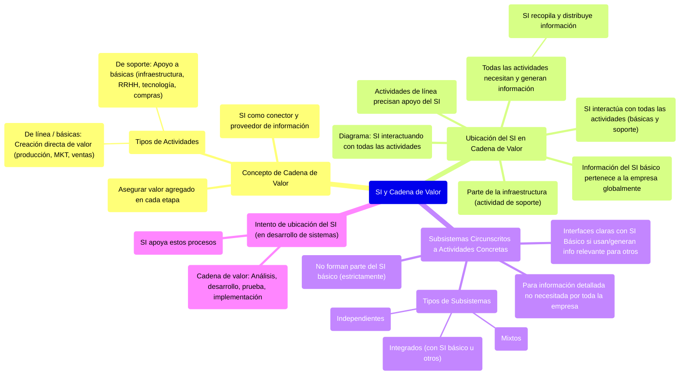
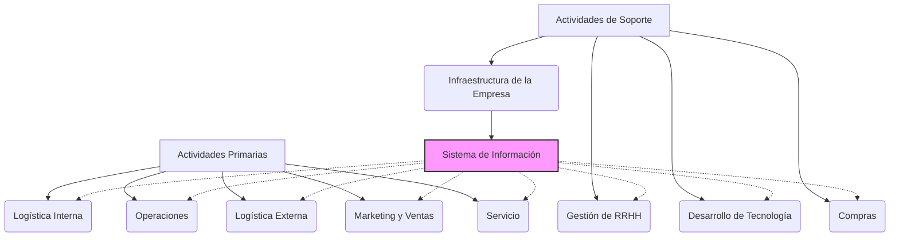

# 3. El Sistema de Información y la Cadena de Valor

Este documento explica cómo los Sistemas de Información (SI) se integran y aportan valor dentro de la Cadena de Valor de una empresa.

[< Volver al Índice Principal](./00_Indice_SI_TI.md) | [Anterior: 2. El Sistema de Información en la Empresa](./02_Sistema_Informacion_Empresa.md)

## El Concepto de Cadena de Valor

La **Cadena de Valor** hace referencia a que en la producción se debe asegurar que cada eslabón o etapa de la cadena le dé "valor agregado" a lo que se está produciendo. El sistema (SI) va a dar conexiones entre los eslabones y además brindará información necesaria a cada una de ellas.

El concepto de cadena de valor distingue entre dos tipos de actividades básicas en toda empresa:

1.  **Actividades «de línea» o «básicas»**: Tienen que ver directamente con la creación de valor (ej: producción, marketing, ventas, servicio postventa).
2.  **Actividades «de soporte»**: Aquellas en las que las actividades básicas se apoyan para coordinarse, compartir información, etc. (ej: infraestructura de la empresa, gestión de recursos humanos, desarrollo de tecnología, compras).

## Ubicación del SI en la Cadena de Valor

El **SI de una empresa forma parte precisamente de la infraestructura de la empresa**, que es una actividad de soporte.

*Diagrama: El SI como parte de la infraestructura (soporte) interactuando con todas las actividades de la cadena de valor.*

De ello se deduce que **todas las actividades «de línea» de la cadena de valor precisan de apoyo basado en el SI**. Dado que las distintas actividades de soporte «se apoyan entre sí», se llega a la conclusión de que el SI está llamado a interaccionar con todas las demás actividades de cualquier empresa, ya sean básicas o de soporte, y además en grado no trivial.

**Todas las actividades de la cadena de valor, ya sean básicas o de soporte, necesitan y generan información.** El SI recopila la información que, generada por las distintas actividades, es luego necesaria para el funcionamiento de otras. El propio SI distribuye dicha información a cada actividad.

La información que el SI «básico» maneja, aunque generada o utilizada por actividades concretas, no pertenece a ninguna actividad en particular; pertenece a la empresa considerada globalmente.

## Subsistemas Circunscritos a Actividades Concretas

Es posible que ciertas actividades precisen elaborar, tratar y utilizar volúmenes importantes de información en un grado de detalle que nadie más en la empresa necesite. Cuando esto ocurre, se puede decir que existen **sistemas o subsistemas de información circunscritos a actividades concretas** que, estrictamente hablando, no forman parte del SI «básico».

Estos subsistemas pueden ser:
*   **Independientes**: Operan de forma aislada.
*   **Integrados**: Se conectan e intercambian información con el SI básico u otros subsistemas.
*   **Mixtos**: Una combinación de ambos.

Los sistemas de información circunscritos a actividades concretas de la cadena de valor pueden utilizar o generar información relevante para otras actividades, pero lo hacen en volúmenes relativamente poco importantes. Si es así, acabarán teniendo **interfaces claras con el SI Básico**.

**Intento de ubicación del SI en la cadena de valor:** Si se desarrollan sistemas, la cadena de valor está dada por los procesos de análisis, desarrollo, prueba e implementación. El SI apoya estos procesos.

---

Siguiente: [4. El Sistema de Información y los demás Sistemas de la Empresa](./04_SI_Otros_Sistemas_Empresa.md) 