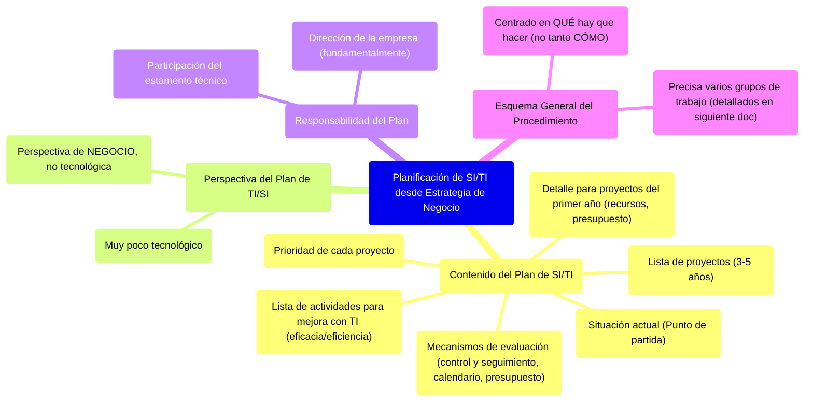

# 6. Planificación de SI/TI a partir de la Estrategia de Negocio

Este documento detalla el contenido esencial de un Plan de Sistemas y Tecnologías de Información (SI/TI) y subraya su perspectiva orientada al negocio.

[< Volver al Índice Principal](./00_Indice_SI_TI.md) | [Anterior: 5. El Rol de las Tecnologías de la Información (TI)](./05_Rol_Tecnologias_Informacion.md)

## Contenido del Plan de Sistemas y Tecnologías de Información

Un Plan de Sistemas y Tecnologías de Información debe incluir:

1.  **Lista de proyectos a desarrollar**: Proyectos planificados para los próximos 3-5 años.
2.  **Situación actual (Punto de partida)**: Descripción de la situación de las TI/SI en la empresa en el momento de preparar el Plan.
3.  **Prioridad de cada proyecto**: Clasificación de los proyectos según su importancia y urgencia.
4.  **Detalle para proyectos del primer año**: Suficiente detalle para evaluar los recursos necesarios para los proyectos a desarrollar en el primer año, permitiendo su inclusión en el presupuesto anual.
5.  **Mecanismos de evaluación**: Para permitir el control y seguimiento del plan (incluyendo calendario y presupuesto detallado).
6.  **Lista de actividades para mejora con TI**: Identificación de actividades de la empresa donde la TI pueda utilizarse como herramienta de soporte para aumentar su eficacia o eficiencia.

## Perspectiva del Plan de TI/SI

Es importante observar que el contenido del Plan de TI/SI es **muy poco tecnológico**. La perspectiva bajo la que se elabora el Plan de TI/SI es fundamentalmente una **perspectiva de negocio**, no una perspectiva tecnológica.

## Responsabilidad del Plan

La responsabilidad de desarrollar el Plan de TI/SI recae fundamentalmente en la **dirección de la empresa**, aunque en el proceso debe también participar el **estamento técnico**.

## Esquema General del Procedimiento

Las actividades descritas para elaborar un plan de TI/SI se centran más en el **qué hay que hacer** y no tanto en el cómo hacerlo. El procedimiento de planificación precisa de varios grupos de trabajo para su implementación, cuya composición y funciones principales se detallan en el siguiente documento.

---

Siguiente: [7. Grupos de Trabajo en la Planificación de SI/TI](./07_Grupos_Trabajo_Planificacion.md) 