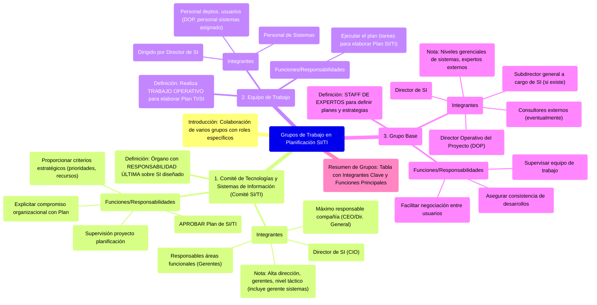

# 7. Grupos de Trabajo en la Planificación de SI/TI

Este documento describe la composición y funciones de los diferentes grupos de trabajo involucrados en el procedimiento de planificación de Sistemas y Tecnologías de Información (SI/TI).

[< Volver al Índice Principal](./00_Indice_SI_TI.md) | [Anterior: 6. Planificación de SI/TI a partir de la Estrategia de Negocio](./06_Planificacion_SI_TI_Desde_Estrategia_Negocio.md)

El procedimiento de planificación de SI/TI requiere la colaboración de varios grupos de trabajo con roles y responsabilidades específicas:

## 1. Comité de Tecnologías y Sistemas de Información (Comité de SI/TI)

*   **Definición**: Es el órgano con **responsabilidad última** sobre el Sistema de Información que se diseñe.
*   **Integrantes**:
    *   Máximo responsable de la compañía (CEO o Director General).
    *   Responsables de las distintas áreas funcionales (Gerentes de área).
    *   Director de Sistemas de Información (CIO o similar).
    *   *Nota: Quienes toman decisiones sobre las estrategias en el marco de objetivos estratégicos son la alta dirección. Si hay un gerente de sistemas, debe estar; si hay otro gerente a cargo del equipo de sistemas, también.* El comité está formado por los máximos gerentes (alto nivel gerencial) y los niveles tácticos (donde se incluye el gerente de sistemas o quien oficie como tal).
*   **Funciones/Responsabilidades**:
    *   Supervisión del proyecto de planificación.
    *   Explicitar el compromiso de la organización con el Plan en desarrollo.
    *   Proporcionar criterios estratégicos para la fijación de prioridades y asignación de recursos.
    *   **Aprobar el Plan de SI/TI desarrollado**.

## 2. Equipo de Trabajo

*   **Definición**: Lleva a cabo el **trabajo operativo** encaminado a elaborar el Plan de TI/SI.
*   **Integrantes**:
    *   Dirigido formalmente por el Director de Sistemas de Información.
    *   Personal de Sistemas.
    *   Personal de los departamentos usuarios especialmente dedicados al proyecto de planificación (el director líder del proyecto del sistema con el DOP -Director Operativo del Proyecto- y el personal de sistemas asignado al proyecto; dependiendo de la envergadura, puede haber varios DOP).
*   **Funciones/Responsabilidades**:
    *   Ejecutar el plan, realizando las tareas necesarias para la elaboración del Plan de SI/TI.

## 3. Grupo Base

*   **Definición**: Actúa como un **staff de expertos** para definir los planes y estrategias de sistemas.
*   **Integrantes**:
    *   Subdirector general a cargo de Sistemas de Información (si existe).
    *   Director de Sistemas de Información.
    *   Director Operativo del Proyecto (DOP).
    *   Eventualmente, consultores externos expertos en planificación de sistemas de información.
    *   *Nota: El grupo base vuelve a involucrar a quien oficie como gerente de sistemas. Está conformado por los niveles gerenciales de sistemas y los grupos de expertos externos.*
*   **Funciones/Responsabilidades**:
    *   Facilitar la negociación entre usuarios.
    *   Asegurar la consistencia de los desarrollos.
    *   Supervisar el equipo de trabajo.

## Resumen de Grupos, Integrantes y Funciones

| Grupo                          | Integrantes Clave                                                                | Funciones Principales                                                                                                                               |
| :----------------------------- | :------------------------------------------------------------------------------- | :-------------------------------------------------------------------------------------------------------------------------------------------------- |
| **Comité de SI/TI**            | Máximas autoridades, Subdirectores funcionales, Director de SI/TI                | Supervisión, compromiso organizacional, criterios estratégicos, aprobación del plan.                                                              |
| **Equipo de Trabajo**          | Director de SI/TI, Personal de sistemas, Personal de departamentos usuarios    | Ejecución del trabajo operativo para elaborar el plan.                                                                                              |
| **Grupo Base**                 | Subdirector de sistemas, Director de SI/TI, DOP, (Consultores externos)          | Facilitar negociación, asegurar consistencia, supervisar equipo de trabajo.                                                                       |

---

Siguiente: [8. Fases del Plan de Alineamiento de SI/TI con la Estrategia Organizacional](./08_Fases_Plan_Alineamiento.md) 