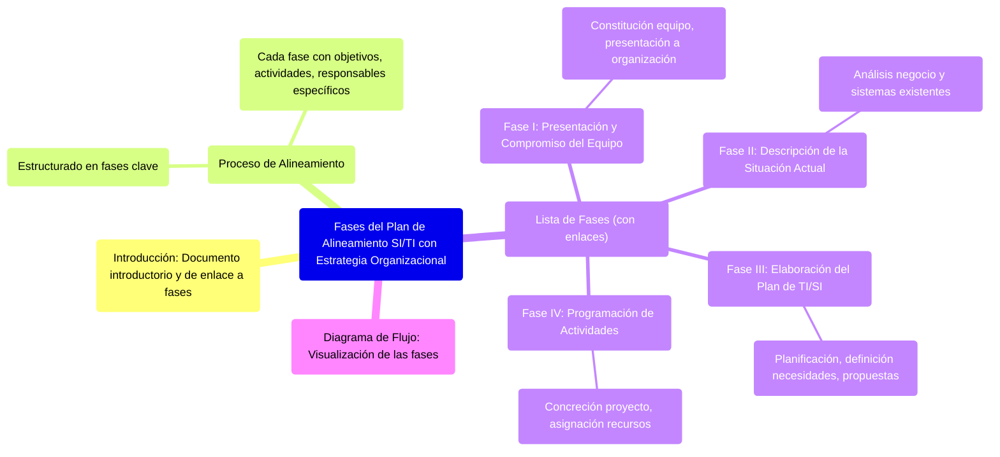
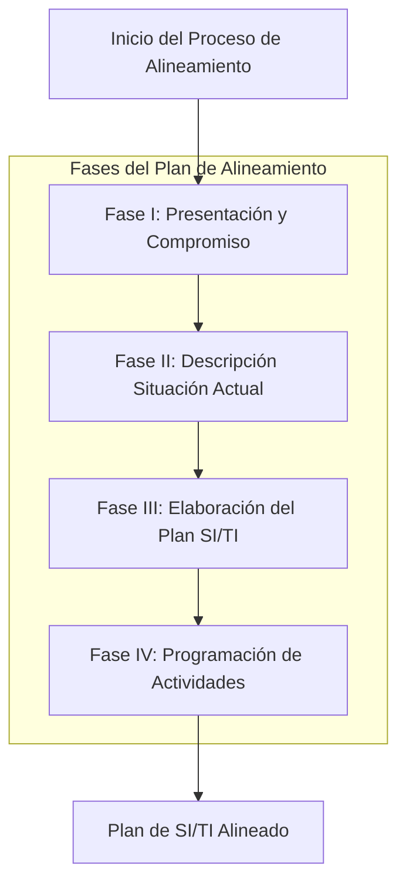

# 8. Fases del Plan de Alineamiento de SI/TI con la Estrategia Organizacional

Este documento sirve como introducción y enlace a las distintas fases del procedimiento para alinear el plan de Sistemas y Tecnologías de Información (SI/TI) con la estrategia organizacional.

[< Volver al Índice Principal](./00_Indice_SI_TI.md) | [Anterior: 7. Grupos de Trabajo en la Planificación de SI/TI](./07_Grupos_Trabajo_Planificacion.md)

El proceso de alineamiento del plan de SI/TI con la estrategia organizacional se estructura en varias fases clave. Cada fase tiene objetivos, actividades y responsables específicos.

Las fases son las siguientes:

1.  **[Fase I: Presentación y Compromiso del Equipo](./08a_Fase_I_Presentacion_Compromiso.md)**: Constitución del equipo de trabajo y presentación a la organización.
2.  **[Fase II: Descripción de la Situación Actual](./08b_Fase_II_Descripcion_Situacion_Actual.md)**: Análisis del negocio y de los sistemas existentes.
3.  **[Fase III: Elaboración del Plan de TI/SI](./08c_Fase_III_Elaboracion_Plan.md)**: Planificación propiamente dicha, definición de necesidades y propuestas.
4.  **[Fase IV: Programación de Actividades](./08d_Fase_IV_Programacion_Actividades.md)**: Concreción del proyecto y asignación de recursos.

*Diagrama: Flujo general de las fases del plan de alineamiento.*

---

Siguiente Fase: [8.1. Fase I: Presentación y Compromiso del Equipo](./08a_Fase_I_Presentacion_Compromiso.md)
O bien, navegue al siguiente tema principal: [9. Valor de la Información e Inversión en SI](./09_Valor_Informacion_Inversion_SI.md) 