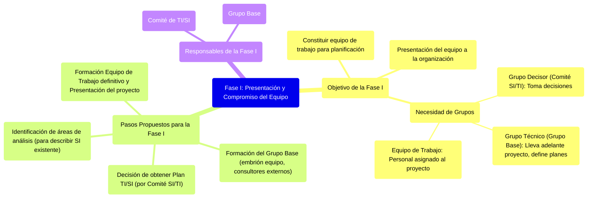

# 8.1. Fase I: Presentación y Compromiso del Equipo

Esta es la primera fase del Plan de Alineamiento de SI/TI con la Estrategia Organizacional. Su objetivo principal es constituir el equipo de trabajo y presentarlo formalmente a la organización, asegurando el compromiso necesario.

[< Volver a Fases del Plan de Alineamiento](./08_Fases_Plan_Alineamiento.md) | [< Volver al Índice Principal](./00_Indice_SI_TI.md)

## Objetivo de la Fase I

El objetivo de esta fase es **constituir el equipo de trabajo** que llevará a cabo el esfuerzo de planificación y su **presentación a la organización**.

Se necesita un **grupo de gente que tome decisiones** sobre los sistemas (grupo decisor) y un **grupo técnico** (que lleva adelante el proyecto).

*   **Grupo Decisor (Comité SI/TI)**: Compuesto por el máximo responsable, gerencias medias y quien tenga a cargo el SI. Ver [Grupos de Trabajo en la Planificación de SI/TI](./07_Grupos_Trabajo_Planificacion.md#1-comité-de-tecnologías-y-sistemas-de-información-comité-de-siti).
*   **Grupo Técnico (Grupo Base)**: Incluye consultores externos. Define los planes en torno a las decisiones del comité; son los que saben de sistemas o cómo gestionarlos. Ver [Grupos de Trabajo en la Planificación de SI/TI](./07_Grupos_Trabajo_Planificacion.md#3-grupo-base).
*   **Equipo de Trabajo**: Personal y personas de departamentos usuarios asignado al proyecto. Ver [Grupos de Trabajo en la Planificación de SI/TI](./07_Grupos_Trabajo_Planificacion.md#2-equipo-de-trabajo).

## Pasos Propuestos para la Fase I

1.  **La decisión de obtener un Plan de TI/SI**: Esta decisión es tomada e impulsada por el [Comité de Tecnologías y Sistemas de Información](./07_Grupos_Trabajo_Planificacion.md#1-comité-de-tecnologías-y-sistemas-de-información-comité-de-siti).
2.  **Formación del Grupo Base**: Se constituye un embrión del equipo de trabajo, posiblemente con la participación de consultores externos.
3.  **Identificación de áreas de análisis**: Para describir el Sistema de Información existente.
4.  **Formación del Equipo de Trabajo definitivo. Presentación del proyecto**: Se conforma el equipo completo y se presenta formalmente el proyecto de planificación a toda la organización, destacando su importancia y los beneficios esperados.

## Responsables de la Fase I

*   [Comité de TI/SI](./07_Grupos_Trabajo_Planificacion.md#1-comité-de-tecnologías-y-sistemas-de-información-comité-de-siti)
*   [Grupo Base](./07_Grupos_Trabajo_Planificacion.md#3-grupo-base)

---

Siguiente Fase: [8.2. Fase II: Descripción de la Situación Actual](./08b_Fase_II_Descripcion_Situacion_Actual.md) 