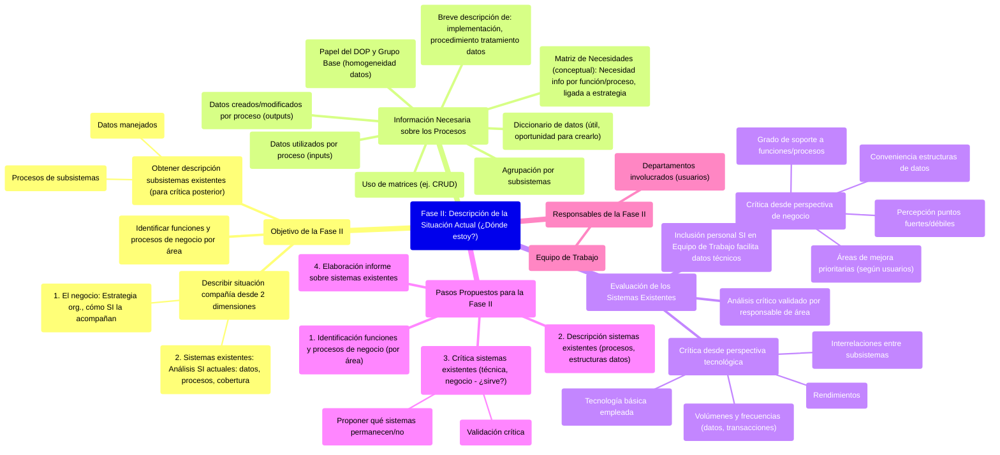

# 8.2. Fase II: Descripción de la Situación Actual (¿Dónde estoy?)

Esta fase se enfoca en describir la situación actual de la compañía desde dos dimensiones principales: el negocio y los sistemas de información existentes. Su objetivo es entender el punto de partida para la planificación.

[< Volver a Fases del Plan de Alineamiento](./08_Fases_Plan_Alineamiento.md) | [< Volver al Índice Principal](./00_Indice_SI_TI.md)

## Objetivo de la Fase II

Consiste en **describir la situación de la compañía** desde dos dimensiones:
1.  **El negocio**: Entender la estrategia organizacional y cómo los sistemas de información la acompañan.
2.  **Los sistemas existentes**: Analizar los SI actuales, sus datos, procesos y la cobertura que ofrecen.

Se deben identificar funciones y procesos de negocio por área de análisis. Alrededor de estas funciones se organizará el análisis posterior, incluyendo los flujos de información y el grado de cobertura que la «informática» da a los mismos.

Otro objetivo es obtener una descripción de los subsistemas de información existentes para poder elaborar posteriormente una crítica de los mismos. Se deben identificar:
1.  Los **datos manejados**.
2.  Los **procesos** que configuran los subsistemas existentes.

## Información Necesaria sobre los Procesos

*   Su **agrupación por subsistemas**.
*   La especificación de **qué datos utiliza cada proceso** en su funcionamiento (inputs).
*   La lista de los **datos que se crean o modifican** como resultado de la operación de dichos procesos (outputs).
*   Una breve descripción de:
    *   Cómo cada uno de ellos está **implementado**.
    *   El **procedimiento de tratamiento de datos** que el proceso requiere.

La utilización de **matrices** (ej. matriz CRUD: Crear, Leer, Actualizar, Borrar) para representar el grado de interacción de cada proceso con cada unidad de datos relevante puede ser útil.

### Matriz de Necesidades (Conceptual)
Se comienza a pensar en esta fase, aunque se desarrolla más en Fase III.
A partir de identificar cada función y proceso de negocio involucrado, se empieza a definir qué necesidad de información tiene cada una. Estas necesidades deben corresponder a un apoyo para lograr la estrategia organizacional.

Es central el papel del director operativo del proyecto (DOP) y del [Grupo Base](./07_Grupos_Trabajo_Planificacion.md#3-grupo-base), que velarán por la homogeneidad y coherencia de las estructuras de datos. Si existe un **diccionario de datos**, será de gran utilidad; si no, esta fase es una buena oportunidad para empezar a desarrollarlo.

## Evaluación de los Sistemas Existentes

Posteriormente a la descripción, se debe elaborar una **evaluación (crítica)** de los sistemas existentes desde dos perspectivas:

1.  **Crítica desde la perspectiva de negocio**:
    *   Grado de **soporte** que cada subsistema proporciona a cada función o proceso de negocio.
    *   Grado de **conveniencia** que las actuales estructuras de datos suponen en el desempeño de cada función o proceso.
    *   Percepción de **puntos fuertes y débiles** de cada subsistema.
    *   **Áreas de mejora** prioritarias según los usuarios (cómo y por qué).
2.  **Crítica desde la perspectiva tecnológica**:
    *   **Tecnología básica** empleada en cada subsistema y sus procesos.
    *   **Interrelaciones** entre diferentes subsistemas y cómo están resueltas.
    *   **Rendimientos**.
    *   **Volúmenes y frecuencias** de datos y transacciones.

La inclusión de personal del departamento de SI en el [Equipo de Trabajo](./07_Grupos_Trabajo_Planificacion.md#2-equipo-de-trabajo) facilita la obtención de datos técnicos.

Finalmente, el contenido del análisis crítico elaborado debe ser **validado** por el Subdirector General (o responsable) de cada área analizada.

## Pasos Propuestos para la Fase II

1.  **Identificación de las principales funciones y procesos de negocio por área**: Empezar a identificar las estrategias organizacionales y, a partir de ahí, la información que se tiene o se utiliza.
2.  **Descripción de los sistemas existentes**: Detallar procesos y estructuras de datos.
3.  **Crítica de los sistemas existentes**: Desde el punto de vista técnico y de negocio (¿sirve?). Proponer qué sistemas permanecen y cuáles no. Incluye la **validación** de esta crítica.
4.  **Elaboración del informe acerca de los sistemas existentes**.

## Responsables de la Fase II

*   [Equipo de Trabajo](./07_Grupos_Trabajo_Planificacion.md#2-equipo-de-trabajo)
*   Los departamentos involucrados (usuarios).

---

Siguiente Fase: [8.3. Fase III: Elaboración del Plan de TI/SI](./08c_Fase_III_Elaboracion_Plan.md) 