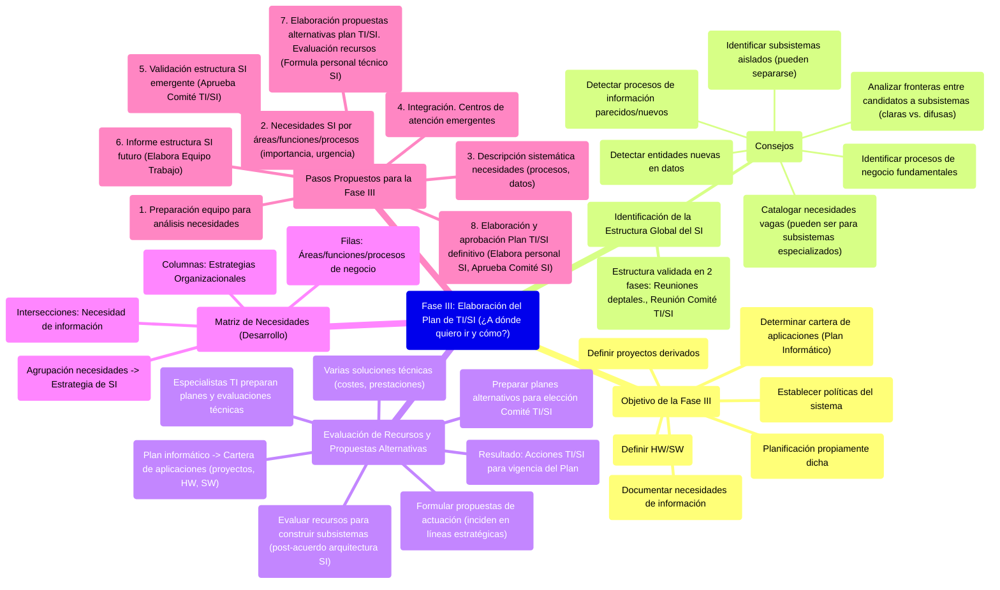

# 8.3. Fase III: Elaboración del Plan de TI/SI (¿A dónde quiero ir y cómo lo voy a hacer?)

En esta fase se realiza la planificación propiamente dicha. Se documentan las necesidades de información, se define la arquitectura del SI futuro, se proponen soluciones y se elabora el plan definitivo.

[< Volver a Fases del Plan de Alineamiento](./08_Fases_Plan_Alineamiento.md) | [< Volver al Índice Principal](./00_Indice_SI_TI.md)

## Objetivo de la Fase III

Llevar a cabo la **planificación propiamente dicha**. Esto incluye:

*   Documentar las necesidades de información de cada función y proceso de negocio (identificados en [Fase II](./08b_Fase_II_Descripcion_Situacion_Actual.md)).
*   Definir qué se tiene que hacer a nivel de Hardware (HW) o Software (SW).
*   Establecer políticas del sistema.
*   Definir los proyectos que se derivan.
*   Determinar la cartera de aplicaciones resultante (Plan Informático).

## Identificación de la Estructura Global del SI

Para identificar la estructura global del SI necesario, se pueden seguir estos consejos:

1.  **Identificar los procesos de negocio fundamentales** en la empresa.
2.  ¿Se detectan **entidades nuevas** en las estructuras de datos?
3.  ¿Se detectan **procesos de información parecidos** a otros ya existentes o nuevos?
4.  **Analizar las fronteras entre candidatos a subsistemas**: ¿Qué datos comparten? ¿Son fronteras claras o difusas? Tratar de evitar definiciones de subsistemas que interactúen de modo complejo o poco claro.
5.  Identificar en especial los **subsistemas que parecen aislados**; seguramente hacen referencia a procesos que pueden separarse de la estructura del SI central, simplificando la misma.
6.  **Catalogar las necesidades de información vagas o poco claras**; pueden referirse a procesos de toma de decisiones que requerirán subsistemas muy especializados.

La estructura elaborada debe ser **validada explícitamente** mediante un proceso de dos fases:
1.  Reuniones departamentales.
2.  Una reunión del [Comité de TI/SI](./07_Grupos_Trabajo_Planificacion.md#1-comité-de-tecnologías-y-sistemas-de-información-comité-de-siti) en pleno.

## Evaluación de Recursos y Propuestas Alternativas

Una vez acordada una arquitectura para el SI necesario, y especificados los procesos y estructuras de datos, es necesario **evaluar los recursos** que harían falta para construir los distintos subsistemas.

Generalmente existen **varias soluciones técnicas** para pasar de la situación actual a la futura, con distintos costes y prestaciones. Será necesario preparar **planes alternativos** para que el [Comité de TI/SI](./07_Grupos_Trabajo_Planificacion.md#1-comité-de-tecnologías-y-sistemas-de-información-comité-de-siti) elija el que crea más conveniente.

Es conveniente que los especialistas en tecnologías (informática y afines) preparen dichos planes alternativos y sus evaluaciones técnicas, y las sometan a la consideración de los responsables de las diferentes áreas de negocio.

Con las necesidades documentadas, se deben formular **propuestas de actuación** que incidan de manera directa en las líneas estratégicas más importantes de la compañía. El resultado es una serie de acciones de TI/SI a realizar durante la vigencia del Plan.

**Estructura de un procedimiento de alineamiento de plan de SI/TI**: Alinear las estrategias de la empresa con los procesos de negocio de cada departamento.

**Plan informático -> Cartera de aplicaciones**: Determina proyectos a desarrollar y lo relacionado a HW de base y SW.

### Matriz de Necesidades (Desarrollo)

*   **Columnas**: Estrategias Organizacionales.
*   **Filas**: Áreas, funciones o procesos de negocio.
*   **Intersecciones**: Determinan una necesidad de información de las áreas para con las estrategias.

A partir de agrupar una o más necesidades se define la **Estrategia de SI**.

## Pasos Propuestos para la Fase III

1.  **Preparación del equipo de trabajo para el análisis de necesidades**. Posibles nuevas áreas.
2.  **Necesidades de SI por áreas, funciones y procesos de negocio**. Definir importancia y urgencia.
3.  **Descripción sistemática de necesidades**. Procesos y estructuras de datos.
4.  **Integración. Centros de atención emergentes**.
    *   *Responsables de esta primera parte*: [Equipo de Trabajo](./07_Grupos_Trabajo_Planificacion.md#2-equipo-de-trabajo) y los departamentos involucrados.
5.  **Validación de la estructura del SI emergente**.
    *   *Aprueba la estructura*: [Comité de TI/SI](./07_Grupos_Trabajo_Planificacion.md#1-comité-de-tecnologías-y-sistemas-de-información-comité-de-siti).
6.  **Informe acerca de la estructura del SI necesario en el futuro**.
    *   *Elabora el informe*: [Equipo de Trabajo](./07_Grupos_Trabajo_Planificacion.md#2-equipo-de-trabajo).
7.  **Elaboración de propuestas alternativas para el plan de TI/SI. Evaluación de los recursos necesarios**.
    *   *Formula las propuestas*: Personal técnico de Sistemas de Información.
8.  **Elaboración y aprobación del definitivo Plan de TI/SI**.
    *   *Elabora*: Personal de SI.
    *   *Aprueba*: [Comité de Sistemas de Información](./07_Grupos_Trabajo_Planificacion.md#1-comité-de-tecnologías-y-sistemas-de-información-comité-de-siti).
    *   *Resultado*: Conjuntos de acciones SI/TI.

---

Siguiente Fase: [8.4. Fase IV: Programación de Actividades](./08d_Fase_IV_Programacion_Actividades.md) 