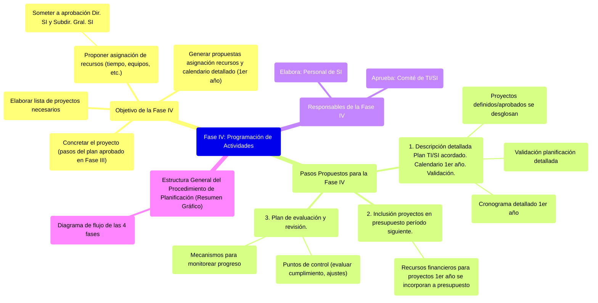
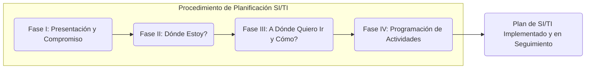

# 8.4. Fase IV: Programación de Actividades

Esta fase se centra en concretar el proyecto detallando los pasos indicados en el Plan de SI/TI aprobado, asignando recursos y estableciendo mecanismos de seguimiento.

[< Volver a Fases del Plan de Alineamiento](./08_Fases_Plan_Alineamiento.md) | [< Volver al Índice Principal](./00_Indice_SI_TI.md)

## Objetivo de la Fase IV

El objetivo principal es **concretar el proyecto** con los pasos indicados en el plan aprobado en la [Fase III](./08c_Fase_III_Elaboracion_Plan.md).

Se debe elaborar la **lista de proyectos necesarios** para implementar los sistemas integrantes del Plan aprobado. Además, se debe proponer una **asignación de recursos** (tiempo de personas, de equipos, etc.) a dichos proyectos y someterla a la aprobación del Director de SI y del Subdirector General a cargo de SI (o roles equivalentes).

Se deben generar propuestas de asignación de recursos y un **calendario detallado para cada proyecto del primer año** (generalmente, los planes se proyectan entre 1 a 3 años, pero se detallan con más granularidad para el primer período).

## Pasos Propuestos para la Fase IV

1.  **Descripción detallada del Plan de TI/SI acordado. Calendario concreto para el primer año. Validación.**
    *   Se toman los proyectos definidos y aprobados y se desglosan en actividades más pequeñas.
    *   Se establece un cronograma detallado para el primer año de ejecución del plan.
    *   Esta planificación detallada es validada por las partes correspondientes.
2.  **Inclusión de proyectos en el presupuesto del período siguiente.**
    *   Los recursos financieros necesarios para los proyectos del primer año se incorporan formalmente al presupuesto de la organización.
3.  **Plan de evaluación y revisión.**
    *   Se definen mecanismos para monitorear el progreso de los proyectos.
    *   Se establecen puntos de control para evaluar el cumplimiento del plan y realizar ajustes si es necesario.

## Responsables de la Fase IV

*   **Elabora**: Personal de SI (Sistemas de Información).
*   **Aprueba**: [Comité de TI/SI](./07_Grupos_Trabajo_Planificacion.md#1-comité-de-tecnologías-y-sistemas-de-información-comité-de-siti).

## Estructura General del Procedimiento de Planificación (Resumen Gráfico)

---

Siguiente Tema: [9. Valor de la Información e Inversión en SI](./09_Valor_Informacion_Inversion_SI.md) 