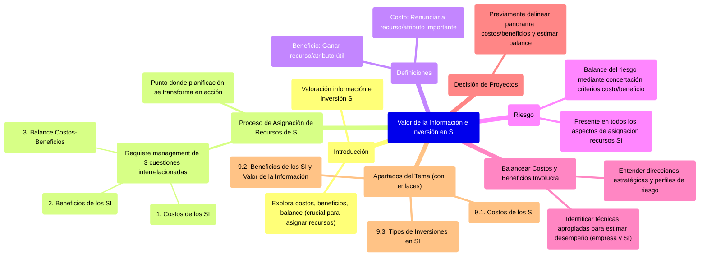

# 9. Valor de la Información e Inversión en SI

Este documento introduce el concepto de valoración de la información y la inversión en Sistemas de Información (SI). Se exploran los costos, beneficios y el balance entre ellos, elementos cruciales cuando la planificación se transforma en acción mediante la asignación de recursos.

[< Volver al Índice Principal](./00_Indice_SI_TI.md) | [Anterior: 8. Fases del Plan de Alineamiento de SI/TI con la Estrategia Organizacional](./08_Fases_Plan_Alineamiento.md)

La formulación de una estrategia de SI involucra la planificación de un modelo de asignación de recursos de SI. El punto en donde la planificación se transforma en acción constituye el **proceso de asignación de recursos de SI**.

Llevar a la realidad la estrategia de los SI mediante la asignación de recursos requiere el management de tres conjuntos interrelacionados de cuestiones:

1.  **[Cuestiones relacionadas con los costos de los SI](./09a_Costos_SI.md)**
2.  **[Cuestiones relacionadas con los beneficios de los SI](./09b_Beneficios_SI.md)**
3.  **Cuestiones relacionadas con el balance entre los costos y los beneficios de los SI** (abordado en los apartados de costos y beneficios).

*   **Costo**: Implica renunciar a algún recurso o atributo que se considera importante (capital, esfuerzo, entusiasmo, poder, compromiso, certeza, etc.).
*   **Beneficio**: Es ganar algún recurso o atributo que se considera útil (capital, poder, status, conformidad, certeza, etc.).

El **riesgo** está presente en todos los aspectos de las asignaciones de recursos de los SI. El balance del riesgo se logra mediante el proceso de concertar los criterios de costo/beneficio.

Balancear costos y beneficios involucra:

*   Entender las direcciones estratégicas y los perfiles de riesgo.
*   Identificar las técnicas apropiadas para estimar el desempeño de la empresa y de los SI dentro de plazos adecuados.

Para optar por un conjunto de proyectos u otro, previamente se debe delinear un panorama de los costos y beneficios, y estimar el balance entre ellos.

Este tema se desarrolla en los siguientes apartados:

*   **[9.1. Costos de los SI](./09a_Costos_SI.md)**: Detalla los diferentes tipos de costos asociados a los SI, tanto tangibles como intangibles.
*   **[9.2. Beneficios de los SI y Valor de la Información](./09b_Beneficios_SI.md)**: Explora cómo los SI generan beneficios y cómo se puede conceptualizar el valor de la información.
*   **[9.3. Tipos de Inversiones en SI](./09c_Tipos_Inversiones_SI.md)**: Clasifica las inversiones en SI según su impacto y necesidad.

---

Siguiente Subtema: [9.1. Costos de los SI](./09a_Costos_SI.md)
O bien, navegue al siguiente tema principal: [10. Management de Recursos de IS (Área de Sistemas)](./10_Management_Recursos_IS.md) 