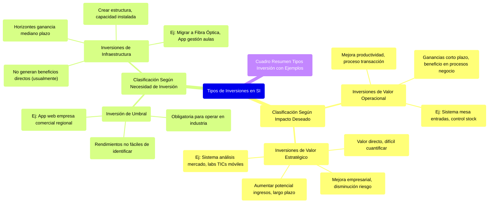

# 9.3. Tipos de Inversiones en SI

Este documento clasifica las inversiones en Sistemas de Información (SI) según el impacto deseado y la necesidad de la inversión, proporcionando ejemplos para cada categoría.

[< Volver a Valor de la Información e Inversión en SI](./09_Valor_Informacion_Inversion_SI.md) | [< Volver al Índice Principal](./00_Indice_SI_TI.md)

Las inversiones en SI se pueden clasificar de diferentes maneras para entender mejor su propósito y justificación.

## Clasificación Según el Impacto Deseado

1.  **Inversiones de Valor Operacional**:
    *   Son proyectos de **mejora en la productividad** y en el proceso de transacción.
    *   Buscan **ganancias a corto plazo**.
    *   También involucran aquellas que benefician en la **realización de los procesos de negocio**.
    *   *Ejemplos*: Sistema de mesa de entradas, sistema de control de stock.

2.  **Inversiones de Valor Estratégico**:
    *   Proyectos de **mejora empresarial o de disminución de riesgo**.
    *   Intentan **aumentar el potencial para generar ingresos**.
    *   El horizonte de ganancia (período anterior a la obtención de un beneficio) probablemente será de **largo plazo**.
    *   El valor de este proyecto será directo pero **muy difícil de cuantificar**, aunque los índices de crecimiento de ingresos pueden proporcionar alguna aproximación.
    *   *Ejemplos*: Sistema de análisis de mercado, laboratorios de TICs móviles.

## Clasificación Según la Necesidad de Inversión

1.  **Inversión de Umbral**:
    *   Son las que una empresa **debe hacer para operar dentro de la industria**.
    *   Si bien los rendimientos no son fáciles de identificar, la inversión es efectivamente **obligatoria**.
    *   *Ejemplos*: Una aplicación web para una empresa comercial de alcance regional.

2.  **Inversiones de Infraestructura**:
    *   Tienen típicamente horizontes de ganancia de **mediano plazo**.
    *   **No suelen generar beneficios directos** (como ahorros en costos de personal), pero contribuyen con muchos otros generadores de valor (ej. mejora en la comunicación de management).
    *   Tienen el objetivo de **crear una estructura** para la empresa y por lo tanto pueden considerarse y evaluarse como activos.
    *   También involucran aquellas que generan **capacidad instalada**.
    *   *Ejemplos*: Migrar a Fibra Óptica el cableado estructurado, aplicación de gestión de aulas inteligente.

## Cuadro Resumen de Tipos de Inversión con Ejemplos

| Categoría de Inversión        | Tipo de Proyecto                                   | Ejemplo Específico                                  |
| :---------------------------- | :------------------------------------------------- | :-------------------------------------------------- |
| **Según el Impacto Buscado**  |                                                    |                                                     |
| Valor Operacional             | Mejora productividad, procesos de transacción      | Sistema de mesa de entradas, Control de stock       |
| Valor Estratégico             | Mejora empresarial, generación de ingresos futuros | Sistema de análisis de mercado, Labs TICs móviles   |
| **Según la Necesidad de la Inversión** |                                                    |                                                     |
| Umbral                        | Obligatoria para operar en la industria            | Aplicación web para empresa comercial regional      |
| Infraestructura               | Crea estructura, capacidad instalada, mediano plazo| Migrar a Fibra Óptica, App gestión aulas inteligente|

---

Siguiente Tema: [10. Management de Recursos de IS (Área de Sistemas)](./10_Management_Recursos_IS.md) 