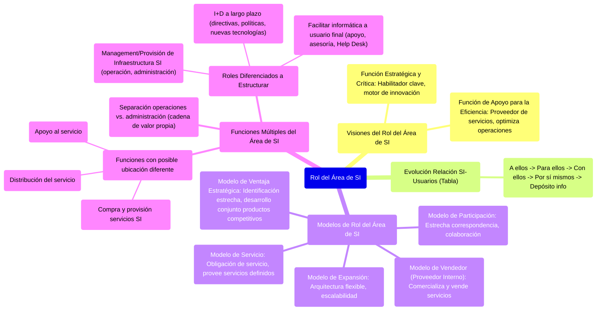

# 10.1. Rol del Área de SI

Este documento explora las diferentes visiones y modelos sobre el rol que el Área de Sistemas de Información (SI) puede desempeñar dentro de una organización, y cómo ha evolucionado la relación entre el área de SI y los usuarios.

[< Volver a Management de Recursos de IS](./10_Management_Recursos_IS.md) | [< Volver al Índice Principal](./00_Indice_SI_TI.md)

Existen dos visiones principales acerca del rol del Área de SI:

1.  **Función Estratégica y Crítica**: El área de SI es vista como un habilitador clave de la estrategia del negocio y un motor de innovación.
2.  **Función de Apoyo para la Eficiencia**: El área de SI se considera principalmente un proveedor de servicios para optimizar operaciones y reducir costos.

## Evolución de la Relación entre el Área de SI y los Usuarios

La siguiente tabla muestra cómo ha evolucionado el rol del área de SI y su relación con los usuarios:

| Rol del Área de SI                           | Relación con Usuarios                                       | Estructura Típica / Enfoque          |
| :------------------------------------------- | :---------------------------------------------------------- | :----------------------------------- |
| Hacerles algo **a ellos** (a los usuarios)   | El grupo de SI establece las reglas unilateralmente.        | Enfoque "tradicional"                |
| Hacer algo **para ellos**                    | Orientación al servicio.                                    | Guiada por bases de datos            |
| Hacer algo **con ellos**                     | Puentes y participación.                                    | Grupos de proyectos funcionales      |
| Ayudarlos a que lo hagan **por sí mismos**   | Influencia más que control.                                 | Centros de información y apoyo para las decisiones |
| Mantener un **depósito de información**      | Puente entre proveedores de información y usuarios de información. | Enfoque externo                      |

## Modelos de Rol del Área de SI

Una forma de categorizar o denominar los recursos (y por ende el rol) del Área de SI es centrarse en la relación con los usuarios:

1.  **Modelo de Servicio**:
    *   Formaliza la interacción entre el área de SI y los usuarios como una **obligación de servicio**.
    *   El área de SI provee servicios definidos a los usuarios.

2.  **Modelo de Participación**:
    *   Separa las líneas funcionales del modelo de servicio para desarrollar una **estrecha correspondencia** entre el área de SI y los usuarios empresariales.
    *   Fomenta la colaboración y el trabajo conjunto.

3.  **Modelo de Vendedor (o Proveedor Interno)**:
    *   El área de SI busca **comercializarse a sí misma y "vender" sus servicios** al grupo de usuarios.
    *   Atractivo para empresas interesadas en el valor que el área de SI aporta a los negocios.
    *   Puede implicar mecanismos de cobro interno o showback/chargeback.

4.  **Modelo de Expansión**:
    *   El área de SI crea una **arquitectura flexible** que sustentará los sistemas comunes para dar cabida a una serie de aspectos de SI relacionados con los usuarios.
    *   Busca escalar y adaptar los servicios a necesidades cambiantes.

5.  **Modelo de Ventaja Estratégica**:
    *   La identificación entre el área de SI y los usuarios es tan estrecha que los **productos competitivos se desarrollan en forma conjunta**.
    *   Ideal para empresas grandes y en crecimiento que buscan innovación a través de SI/TI.

## Funciones Múltiples del Área de SI

En principio, sería posible separar las operaciones de una función de SI (desarrollo, operación y mantenimiento) de las actividades administrativas (planificación, presupuesto, personal). En otras palabras, el área de SI tiene su propia cadena de valor.

La realidad actual es más compleja. El área de SI implica una serie de funciones, cada una de las cuales puede tener una ubicación diferente (ver [Ubicación del Área de SI](./10b_Ubicacion_SI_Area.md)). Estas funciones incluyen:

*   Compra y provisión de servicios de SI (a grupos internos, externos o ambos).
*   Distribución del servicio.
*   Apoyo al servicio.

Estos roles separados representan **actividades lógicas**, no necesariamente distintos departamentos o secciones.

Entre los roles del área de SI que tienen que estructurarse en forma diferenciada, se encuentran el management y la provisión de:

*   **Infraestructura de SI (operación y administración)**: Implica que los servicios centrales de la empresa tienen que brindarse en una forma efectiva y confiable para asegurar su calidad.
*   **Investigación y desarrollo (I+D) a largo plazo**: Las directivas a largo plazo tienen que estar separadas de las preocupaciones actuales. Las decisiones sobre políticas de SI pueden estar dentro de la órbita del área de SI. La I+D de nuevas tecnologías debe permitir que la función asesora del área de SI sea realista e innovadora.
*   **Facilitar la informática a nivel de usuario final**: Es la función de apoyo del área de SI para con el usuario. Es la función 'asesora' del área de SI (ej. Help Desk, Centros de Información).

---

Siguiente Subtema: [10.2. Ubicación del Área de SI](./10b_Ubicacion_SI_Area.md) 