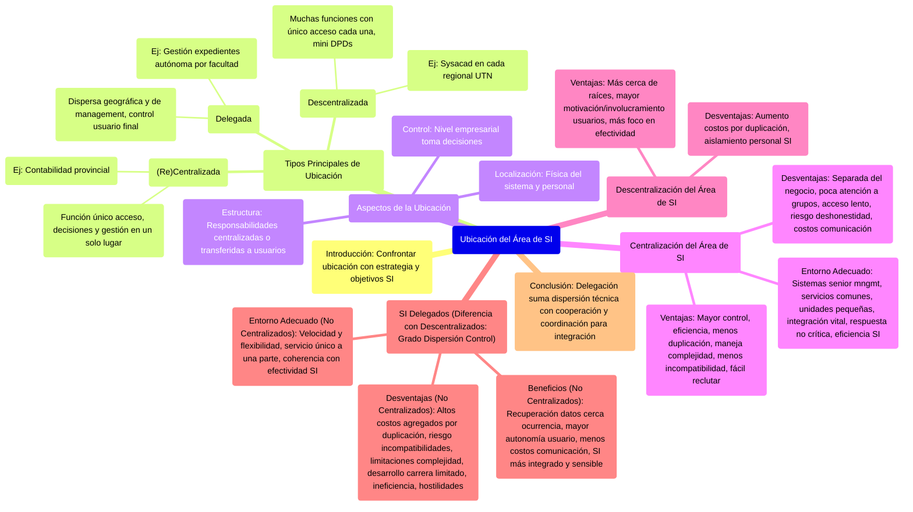

# 10.2. Ubicación del Área de SI

Este documento discute las diferentes formas de ubicar el Área de Sistemas de Información (SI) dentro de una organización, incluyendo modelos centralizados, descentralizados y delegados, junto con sus ventajas, desventajas y entornos adecuados.

[< Volver a Management de Recursos de IS](./10_Management_Recursos_IS.md) | [< Volver al Índice Principal](./00_Indice_SI_TI.md)

La manera de decidir con respecto a una ubicación adecuada para los elementos del Área de SI es confrontarlos contra la estrategia de SI que define sus objetivos.

Se pueden diferenciar tres tipos principales de ubicación para el Área de SI:

1.  **(Re)Centralizada**: Una función de un único acceso. El Área de SI provee un solo servicio, con un solo acceso. Las decisiones se toman en un solo lugar. La gestión y administración está en ese lugar.
    *   *Ejemplo*: Sistema de gestión contable del estado provincial (un único ente central gestiona la contabilidad para todas las dependencias).
2.  **Descentralizada**: Muchas funciones con un único acceso cada una. El Área de SI se divide en una serie de centros pequeños con accesos únicos, un conjunto de mini departamentos de procesamientos de datos. Son réplicas de la centralización a menor escala.
    *   *Ejemplo*: Sistema de registración académica de la UTN (Sysacad en cada regional, siendo cada regional una réplica funcional de un sistema central pero operado localmente).
3.  **Delegada**: Dispersas desde el punto de vista geográfico y de management. El Área de SI es una red de uniones laterales junto con un grado significativo de control por parte del usuario final con respecto al procesamiento, al desarrollo y al entorno de los sistemas. Son los opuestos a los centralizados. Responden a la necesidad de cada una de las áreas, y estas toman decisiones autónomas.
    *   *Ejemplo*: Sistema de registración de expedientes en UTN (si cada facultad/departamento gestionara sus expedientes de forma autónoma con sus propios sistemas y reglas).

Cualquiera de las tres ubicaciones es posible y, por lo general, las empresas agregan facetas de cada categoría. Comprender las ventajas y desventajas ayuda a desarrollar esquemas apropiados.

## Aspectos de la Ubicación del Área de SI

La ubicación del Área de SI involucra tres aspectos:

*   **Localización**: Ubicación física del sistema y del personal del área.
*   **Control**: Nivel empresarial al cual se toman las decisiones; en un sistema centralizado, los niveles de management superiores toman todas las decisiones.
*   **Estructura**: Las responsabilidades de los sistemas pueden estar centralizadas en la función del Área de SI o transferidas al grupo de usuarios.

La complejidad creciente significa que la empresa debe considerar qué componente del Área de SI ubicar en cada lugar (qué centralizar, cómo y en qué medida).

## Centralización del Área de SI

Una ubicación centralizada puede ser una continuación histórica o una respuesta a presiones para ahorrar costos.

**Ventajas de la ubicación y el control centralizados:**

*   Mayor control sobre las operaciones de SI.
*   Enfoque eficiente al desarrollo de sistemas.
*   Reducida duplicación de esfuerzo, recursos y experiencia (economías de escala, ahorro de costos).
*   Capacidad para manejar proyectos complejos.
*   Menor potencial de incompatibilidad de los sistemas.
*   Más sencillo reclutar personal especializado.

**Desventajas de los sistemas centralizados:**

*   El Área de SI puede estar separada del terreno de los negocios reales, sus preocupaciones y prioridades.
*   Poca atención a grupos particulares; políticas de desarrollo genéricas pueden ser inapropiadas.
*   Acceso lento en horas pico; planificación de capacidades más difícil (aunque puede mitigarse con procesamiento remoto limitado).
*   Riesgo de deshonestidad en sistemas de contabilidad de usuarios si no hay controles apropiados.
*   Costos de comunicación pueden ser altos si hay grandes distancias (aunque nuevas tecnologías los reducen).

**Entorno para una localización centralizada:**

*   Sistemas para senior management (complejos, información sensible).
*   Servicios comunes a unidades de negocios (ej. liquidación de sueldos).
*   Unidades de negocios muy pequeñas.
*   Integración es vital.
*   Tiempo de respuesta no es crítico.
*   Coherencia con objetivos de eficiencia de los SI.

## Descentralización del Área de SI

La proliferación de múltiples departamentos de IS hace que el Área de SI esté geográficamente más cerca del usuario, aunque no necesariamente en cultura y comprensión.

**Ventajas de la descentralización:**

*   El Área de SI está más cerca de las raíces de la empresa, mayor motivación e involucramiento de usuarios, mayor responsabilidad de ellos.
*   Menos énfasis en costos de SI y más en la efectividad.

**Desventajas de la descentralización:**

*   Muchos grupos pequeños con los mismos problemas: aumento de costos por duplicación.
*   Aislamiento del personal en las distintas secciones de SI.

## SI Delegados

La diferencia con los descentralizados está en el **grado de dispersión del control y la autoridad**. Los SI delegados incluyen la informática a nivel departamental y toda forma de computación manejada por el propio usuario.

**Beneficios de los IS no centralizados (Descentralizados y Delegados):**

*   Recuperación de datos de eventos empresariales más cercana a su ocurrencia.
*   Usuario final con mayor autonomía e involucramiento.
*   Informática departamental puede disminuir costos totales de comunicación; sistemas menos complejos, más fáciles de controlar y administrar.
*   Desarrollo de SI más integrado con los negocios; SI más cerca de usuarios (física y emocionalmente), más sensibles a sus requerimientos.
*   Cuanto más delegados, mayor percepción del usuario del balance costos/beneficios.

**Desventajas de los IS no centralizados (Descentralizados y Delegados):**

*   Cuanto más delegados, más probable altos costos agregados por duplicación.
*   Riesgo de incompatibilidades futuras (técnicas, infraestructura de RRHH e información).
*   Limitaciones ante la complejidad.
*   Posibilidades de desarrollo de carrera para especialistas pueden verse limitadas.
*   Duplicación de actividades implica ineficiencia.
*   Proceso de delegación puede generar hostilidades si no se maneja apropiadamente.

**Entorno para IS no centralizados:**

*   Requerimiento de velocidad y flexibilidad.
*   Servicio único para una parte de la empresa (debe ser administrado y controlado en esa sección).
*   Coherencia con objetivos de efectividad (descentralización/delegación es apropiada a menos que circunstancias indiquen lo contrario).

La delegación se suma a la dispersión técnica de la computación distribuida, pero reemplaza el control central con cooperación y coordinación a nivel de toda la empresa para mayor integración.

---

Siguiente Subtema: [10.3. Organización del Área de SI](./10c_Organizacion_SI_Area.md) 