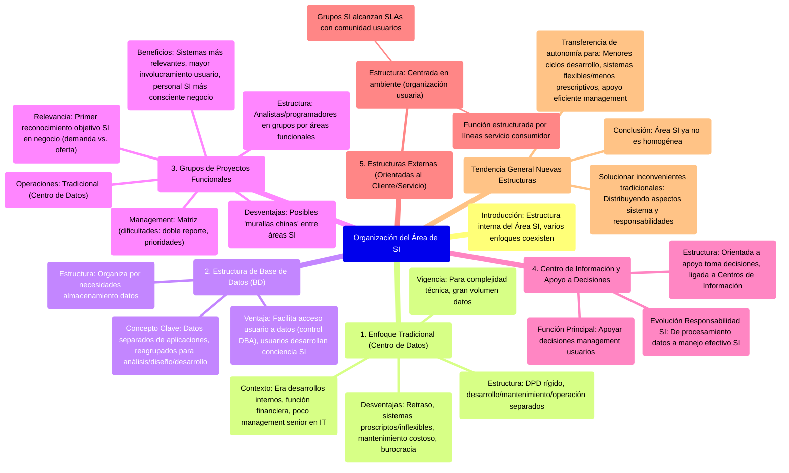

# 10.3. Organización del Área de SI

Este documento describe la estructura interna del Área de Sistemas de Información (SI), los diferentes enfoques organizacionales que han evolucionado con el tiempo, y cómo estos pueden coexistir. La elección de la estructura debe alinearse con la estrategia para los SI.

[< Volver a Management de Recursos de IS](./10_Management_Recursos_IS.md) | [< Volver al Índice Principal](./00_Indice_SI_TI.md)

La organización del Área de SI se refiere a la estructura interna de dicho departamento, independientemente de su [ubicación física o de control](./10b_Ubicacion_SI_Area.md). Existen diferentes enfoques que han evolucionado, y es común que varios coexistan dentro de una empresa para maximizar ventajas y minimizar desventajas.

## 1. Enfoque Tradicional (Centro de Datos)

*   **Estructura**: Departamento de procesamiento de datos (DPD) o sección de informática con una estructura rígida. Las funciones de desarrollo de aplicaciones, mantenimiento y operación de sistemas están separadas.
    *   **Personal de Operación**: Trabaja por turnos para maximizar el uso de recursos costosos; incluye programadores de sistemas.
    *   **Sección de Desarrollo**: Originalmente analistas de sistemas. El análisis y diseño eran actividades separadas, generando problemas de comunicación.
*   **Contexto**: Asociado a la era de desarrollos internos, requería muchos programadores. Estructura interna frecuentemente determinada por una función financiera. Poco probable que el management senior tuviera responsabilidad específica por la informática.
*   **Funcionamiento**: Correcto en la época de sistemas centralizados.
*   **Desventajas (que la hicieron inadecuada para muchas circunstancias actuales)**:
    *   **Retraso**: Nuevos desarrollos podían llevar años; modificaciones meses.
    *   **Sistemas proscriptos**: Fuerte énfasis en aspectos técnicos llevaba a la 'elegancia' del sistema sobre la usabilidad.
    *   **Sistemas inflexibles**.
    *   **Mantenimiento costoso**.
    *   **Burocracia**: Necesidad de estandarización por movimiento de proyectos entre equipos, ralentizando el desarrollo.
*   **Vigencia**: Aún existe (denominada Centro de Datos). Adecuada para actividades con complejidad técnica, gran volumen de datos, etc.

## 2. Estructura de Base de Datos (BD)

*   **Estructura**: Organiza la estructura del área de SI en base a las necesidades de almacenamiento de datos.
*   **Concepto Clave**: Los **datos se separan de las aplicaciones** y se reagrupan para el análisis, diseño y desarrollo de sistemas.
*   **Ventaja Principal**: Facilita el acceso del usuario a los datos, bajo el control del administrador de la base (DBA).
*   **Impacto en Usuarios**: A medida que los usuarios se involucran (al menos al definir sus requerimientos de datos), desarrollan conciencia y habilidades en SI.

## 3. Grupos de Proyectos Funcionales

*   **Estructura**: Combina analistas y programadores en **grupos de proyectos orientados a áreas empresariales/funcionales**.
*   **Relevancia**: Primer reconocimiento del objetivo del área de SI dentro del negocio (estructuración por demanda, no por oferta).
*   **Operaciones**: Las operaciones se siguen llevando a cabo de forma 'tradicional' (Centro de Datos).
*   **Tipo de Management**: Forma de la **matriz de management**, con sus dificultades asociadas (doble reporte, prioridades conflictivas, etc.).
*   **Beneficios**: Estimuló el desarrollo de sistemas más relevantes e involucró más al usuario, permitiendo al personal de SI desarrollar más conciencia del negocio.
*   **Desventajas**: Pudo contribuir a crear 'murallas chinas' entre distintas áreas de sistemas, generando barreras al intercambio de información.

## 4. Centro de Información y Apoyo a Decisiones

*   **Estructura**: Orientadas al apoyo para la toma de decisiones, estrechamente ligadas a los **Centros de Información**.
*   **Función Principal**: Organizar la función del área de SI para servir de apoyo a las decisiones de management de los usuarios (aunque no necesariamente con esos usuarios controlando la naturaleza de los sistemas).
*   **Evolución de Responsabilidad**: El área de SI ya no es responsable solo del procesamiento de datos, sino también del **manejo efectivo de los SI**.

## 5. Estructuras Externas (Orientadas al Cliente/Servicio)

*   **Estructura**: Se centra en el ambiente (la organización usuaria) y se da por medio de dos aspectos:
    1.  La función se estructura en torno a **líneas de servicio al consumidor** para satisfacer la organización del negocio (entorno inmediato del área de SI).
    2.  Los grupos de SI alcanzan **acuerdos de servicio (SLAs)** con la comunidad de usuarios, quienes definen tanto las obligaciones del área de SI como las percepciones de valor del negocio.

## Tendencia General de las Nuevas Estructuras

Todas las nuevas estructuras (posteriores a la tradicional) se relacionan esencialmente con la **transferencia de autonomía** para obtener:
*   Menores ciclos de desarrollo de sistemas.
*   Sistemas más flexibles.
*   Sistemas menos prescriptivos que sirvan de apoyo eficiente al management.

Tratan de solucionar los inconvenientes de las estructuras tradicionales **distribuyendo algunos aspectos del sistema y sus responsabilidades asociadas** para el desarrollo, adquisición, operación, control y mantenimiento.

> El Área de SI ya no es un elemento homogéneo.

---

Siguiente Tema: [11. Administración de los SI](./11_Administracion_SI.md) 