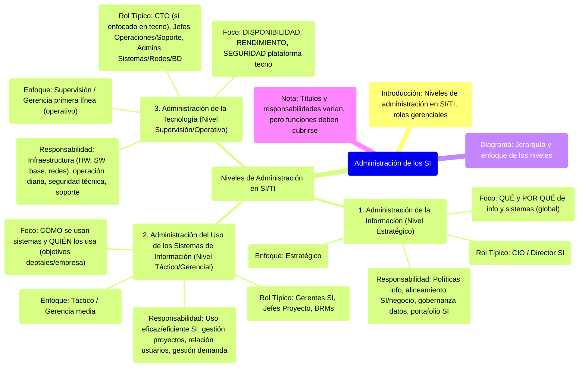

# 11. Administración de los SI

Este documento describe los diferentes niveles de administración dentro del área de Sistemas y Tecnologías de la Información (SI/TI), asociándolos con roles gerenciales típicos.

[< Volver al Índice Principal](./00_Indice_SI_TI.md) | [Anterior: 10. Management de Recursos de IS (Área de Sistemas)](./10_Management_Recursos_IS.md)

La administración dentro del ámbito de SI/TI se puede estructurar en diferentes niveles, cada uno con un enfoque y responsabilidades distintas, alineados con la jerarquía administrativa general de una empresa.

## Niveles de Administración en SI/TI

1.  **Administración de la Información (Nivel Estratégico)**
    *   **Enfoque**: Estratégico.
    *   **Responsabilidad Principal**: Definición de políticas de información, alineamiento de la estrategia de SI/TI con la estrategia de negocio, gobernanza de datos, gestión del portafolio de SI.
    *   **Rol Típico**: **CIO (Chief Information Officer)** o Director de Sistemas de Información.
    *   Se centra en el **QUÉ** y el **POR QUÉ** de la información y los sistemas a nivel global de la empresa.

2.  **Administración del Uso de los Sistemas de Información (Nivel Táctico/Gerencial)**
    *   **Enfoque**: Táctico o de gerencia media.
    *   **Responsabilidad Principal**: Asegurar que los SI se utilicen eficaz y eficientemente para soportar los procesos de negocio, gestión de proyectos de SI, relación con las áreas usuarias, gestión de la demanda de servicios de SI.
    *   **Rol Típico**: Gerentes de SI, Jefes de Proyecto, Gerentes de Desarrollo, Gerentes de Soporte, Business Relationship Managers (BRMs).
    *   Se centra en el **CÓMO** se utilizan los sistemas y **QUIÉN** los utiliza para lograr los objetivos departamentales y de la empresa.

3.  **Administración de la Tecnología (Nivel de Supervisión/Operativo)**
    *   **Enfoque**: Supervisión o gerencia de primera línea (operativo).
    *   **Responsabilidad Principal**: Gestión de la infraestructura tecnológica (hardware, software de base, redes, comunicaciones), operación diaria de los sistemas, seguridad técnica, soporte técnico, mantenimiento de la infraestructura.
    *   **Rol Típico**: **CTO (Chief Technology Officer)** en algunas organizaciones (especialmente si es más enfocado a la tecnología y no tanto a la información estratégica), Jefes de Operaciones de TI, Jefes de Soporte Técnico, Administradores de Sistemas/Redes/Bases de Datos.
    *   Se centra en la **DISPONIBILIDAD**, **RENDIMIENTO** y **SEGURIDAD** de la plataforma tecnológica.

Es importante notar que los títulos exactos (CIO, CTO) y la distribución de responsabilidades pueden variar significativamente entre organizaciones, dependiendo de su tamaño, estructura y cultura. Sin embargo, las funciones descritas en estos tres niveles generalmente necesitan ser cubiertas.

---

Siguiente Tema: [12. Integración de los SI y la Estrategia Empresarial](./12_Integracion_SI_Estrategia_Empresarial.md) 