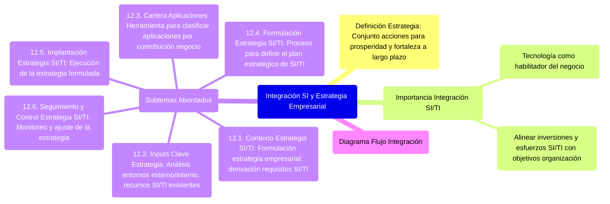

# 12. Integración de los SI y la Estrategia Empresarial

Este documento introduce la importancia y los mecanismos para integrar la estrategia de Sistemas de Información (SI) y Tecnologías de la Información (TI) con la estrategia empresarial global. Una estrategia se define como un conjunto integrado de acciones encaminadas a incrementar a largo plazo la prosperidad y las fortalezas de la empresa.



[< Volver al Índice Principal](./00_Indice_SI_TI.md) | [Anterior: 11. Administración de los SI](./11_Administracion_SI.md)

La integración efectiva de SI/TI con la estrategia empresarial es crucial para que la tecnología actúe como un habilitador del negocio y no como un silo aislado. Esto implica alinear las inversiones y esfuerzos en SI/TI con los objetivos y prioridades de la organización.

Los subtemas que se abordarán son:

*   **[12.1. Contexto de la Estrategia de SI/TI](./12a_Contexto_Estrategia_SI_TI.md)**: Cómo se formula la estrategia empresarial y cómo de ella se derivan los requisitos de SI/TI.
*   **[12.2. Entradas (Inputs) Clave para la Estrategia](./12b_Inputs_Clave_Estrategia.md)**: Análisis de los entornos externo e interno, y los recursos de SI/TI existentes.
*   **[12.3. Análisis de la Cartera de Aplicaciones](./12c_Cartera_Aplicaciones.md)**: Una herramienta para clasificar las aplicaciones según su contribución al negocio.
*   **[12.4. Formulación de la Estrategia de SI/TI](./12c_Formulacion_Estrategia_SI_TI.md)**: El proceso de definir los objetivos, iniciativas y el portfolio para SI/TI.
*   **[12.5. Implantación de la Estrategia de SI/TI](./12d_Implantacion_Estrategia_SI_TI.md)**: Cómo llevar a la práctica la estrategia formulada, gestionando proyectos y el cambio.
*   **[12.6. Seguimiento y Control de la Estrategia de SI/TI](./12e_Seguimiento_Control_Estrategia_SI_TI.md)**: Mecanismos para monitorear el progreso, evaluar resultados y ajustar la estrategia.

```mermaid
graph TD
    EstrategiaEmpresarial[Estrategia Empresarial Global]

    subgraph "Proceso Estratégico de SI/TI"
        Contexto[12.1 Contexto Estrategia SI/TI]
        Inputs[12.2 Inputs Clave]
        Cartera[12.3 Análisis Cartera Aplicaciones]
        Formulacion[12.4 Formulación Estrategia SI/TI]
        Implantacion[12.5 Implantación Estrategia SI/TI]
        Seguimiento[12.6 Seguimiento y Control]
    end

    EstrategiaEmpresarial --> Contexto
    Contexto --> Inputs
    Inputs --> Cartera
    Cartera --> Formulacion
    Formulacion --> Implantacion
    Implantacion --> Seguimiento
    Seguimiento --> Formulacion %% Feedback loop to adjust strategy

    click Contexto "./12a_Contexto_Estrategia_SI_TI.md" "Contexto Estrategia SI/TI"
    click Inputs "./12b_Inputs_Clave_Estrategia.md" "Inputs Clave para Estrategia"
    click Cartera "./12c_Cartera_Aplicaciones.md" "Análisis de Cartera de Aplicaciones"
    click Formulacion "./12c_Formulacion_Estrategia_SI_TI.md" "Formulación de Estrategia SI/TI"
    click Implantacion "./12d_Implantacion_Estrategia_SI_TI.md" "Implantación de Estrategia SI/TI"
    click Seguimiento "./12e_Seguimiento_Control_Estrategia_SI_TI.md" "Seguimiento y Control"
```

---

Siguiente Subtema: [12.1. Contexto de la Estrategia de SI/TI](./12a_Contexto_Estrategia_SI_TI.md)
O bien, navegue al siguiente tema principal: [13. Las Organizaciones según Chiavenato](./13_Organizaciones_Chiavenato.md) 