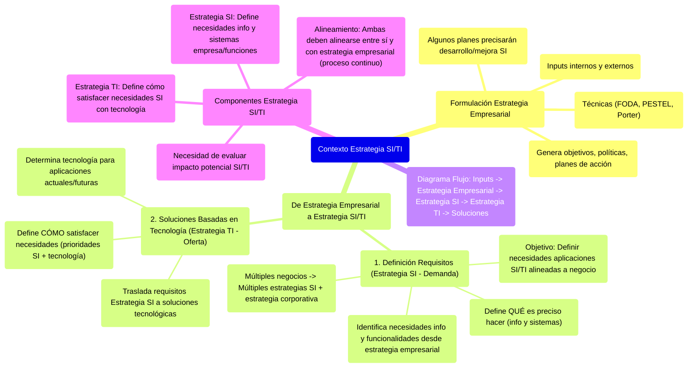

# 12.1. Contexto de la Estrategia de SI/TI

Este documento describe cómo se formula la estrategia empresarial y cómo de esta se derivan los requisitos para los Sistemas de Información (SI) y las Tecnologías de la Información (TI), estableciendo la base para su integración.



[< Volver a Integración de SI y Estrategia Empresarial](./12_Integracion_SI_Estrategia_Empresarial.md) | [< Volver al Índice Principal](./00_Indice_SI_TI.md)

## Formulación de la Estrategia Empresarial

La **estrategia empresarial** de una organización se formula mediante:
1.  El análisis de diversos **inputs internos y externos** (ver [Inputs Clave para la Estrategia](./12b_Inputs_Clave_Estrategia.md)).
2.  El empleo de varias **técnicas** (ej. FODA, PESTEL, Análisis de Porter) para generar **objetivos, políticas y planes de acción**.

Algunos de estos procesos y planes de acción precisarán el **desarrollo o la mejora de los sistemas de información**.

## De la Estrategia Empresarial a la Estrategia de SI/TI

1.  **Definición de Requisitos (Estrategia de SI - Demanda)**:
    *   A partir de la estrategia empresarial, se identifican las necesidades de información y funcionalidades de sistemas.
    *   Esto constituye la **Estrategia de SI**, que define **qué es preciso hacer** en términos de información y sistemas para soportar los objetivos de negocio.
    *   Su objetivo es definir las **necesidades de aplicaciones de SI/TI**, en línea con los planes y aspectos críticos de la empresa.
    *   Si la organización opera en más de un negocio, cada negocio tendrá su estrategia de SI, y además habrá una estrategia para satisfacer las necesidades corporativas globales.

2.  **Soluciones Basadas en Tecnología (Estrategia de TI - Oferta)**:
    *   Los requisitos de la Estrategia de SI se trasladan a soluciones basadas en tecnología.
    *   Esto constituye la **Estrategia de TI**, que define **cómo satisfacer las necesidades** identificadas, en base a las prioridades de la Estrategia de SI y a la tecnología necesaria.
    *   Esta estrategia determina la tecnología de información necesaria para desarrollar y operar las aplicaciones actuales y futuras.

```mermaid
graph LR
    InputsInternosExternos[Inputs Internos y Externos] --> AnalisisTecnicas[Análisis y Técnicas Estratégicas]
    AnalisisTecnicas --> EstrategiaEmpresarial[Estrategia Empresarial (Objetivos, Políticas, Planes)]
    EstrategiaEmpresarial --> RequisitosSI[Requisitos de SI]
    
    subgraph EstrategiaSI TI
        direction LR
        RequisitosSI --> EstrategiaSI[Estrategia de SI (Qué hacer / Demanda)]
        EstrategiaSI --> EstrategiaTI[Estrategia de TI (Cómo satisfacer / Oferta)]
    end

    EstrategiaTI --> SolucionesTecnologicas[Soluciones Tecnológicas]
    SolucionesTecnologicas --> DesarrolloMejoraSI[Desarrollo/Mejora de SI]

    style EstrategiaSI fill:#ccf,stroke:#333,stroke-width:2px
    style EstrategiaTI fill:#cfc,stroke:#333,stroke-width:2px
```
*Diagrama: Flujo desde los inputs estratégicos hasta la definición de las estrategias de SI y TI.*

## Componentes de la Estrategia de SI/TI

La integración de los SI y la estrategia empresarial debe incorporar métodos para **evaluar el impacto potencial** que pueden tener los SI/TI sobre la organización y su entorno.

Los dos componentes de una estrategia de SI/TI son, por tanto:

*   **La Estrategia de Sistemas de Información (Estrategia de SI)**: Define las necesidades de información y de sistemas de la empresa y sus funciones.
*   **La Estrategia de Tecnología de Información (Estrategia de TI)**: Define cómo se van a satisfacer las necesidades de SI mediante la tecnología.

Ambas deben estar **alineadas** entre sí y con la estrategia empresarial general para asegurar una contribución efectiva de la tecnología a los objetivos del negocio. Este alineamiento es un proceso continuo y dinámico.

---

Siguiente Subtema: [12.2. Entradas (Inputs) Clave para la Estrategia](./12b_Inputs_Clave_Estrategia.md) 