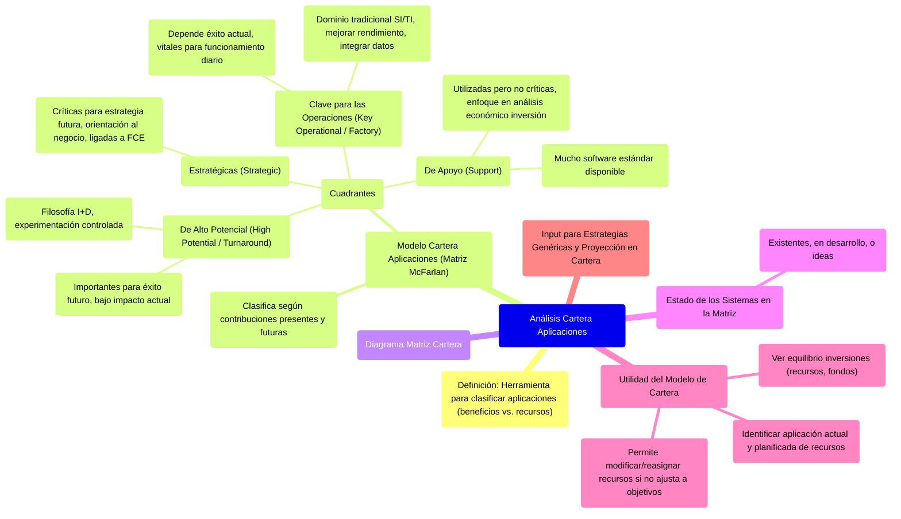
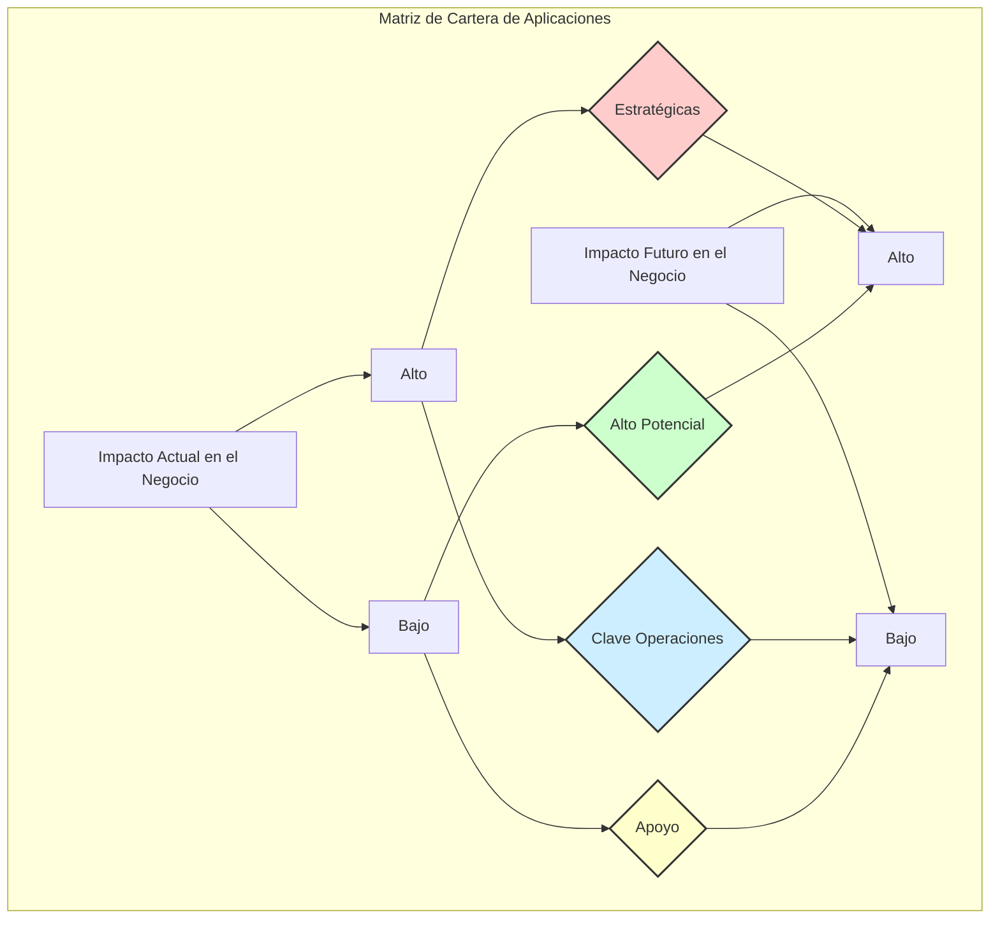

# 12.3. Análisis de la Cartera de Aplicaciones

Este documento describe el modelo de cartera de aplicaciones, una herramienta útil para clasificar los sistemas de información según su contribución actual y futura al negocio, y cómo este análisis informa la estrategia de SI/TI.

[< Volver a Integración de SI y Estrategia Empresarial](./12_Integracion_SI_Estrategia_Empresarial.md) | [< Volver al Índice Principal](./00_Indice_SI_TI.md)

El análisis de la cartera de aplicaciones es una **HERRAMIENTA para clasificar las aplicaciones** en función de los beneficios y los recursos utilizados en ella. Permite evaluar el conjunto de sistemas de información de una empresa.

## Modelo de Cartera de Aplicaciones (Matriz de McFarlan)

Un esquema particularmente útil tiene la forma de una matriz (a menudo atribuida a McFarlan) y clasifica una aplicación como de alto potencial, estratégica, clave para las operaciones o de apoyo, según sus **contribuciones presentes y futuras**, tal y como las percibe la dirección de la empresa.

|                                     | **Impacto Futuro en el Negocio ALTO** | **Impacto Futuro en el Negocio BAJO** | 
| :---------------------------------- | :------------------------------------ | :------------------------------------ |
| **Impacto Actual en el Negocio ALTO** | **Estratégicas**                      | **Clave para las Operaciones**        |
| **Impacto Actual en el Negocio BAJO** | **De Alto Potencial (Turnaround)**    | **De Apoyo (Support)**                |

*Diagrama: Matriz de Cartera de Aplicaciones.*

**Descripción de los Cuadrantes:**

*   **Estratégicas (Strategic)**:
    *   Aplicaciones que son **críticas para ejecutar la estrategia futura** de la empresa.
    *   El enfoque predominante es la **orientación al negocio**. Deben estar claramente relacionadas con los factores críticos de éxito (FCE) derivados de los objetivos de la empresa.
*   **De Alto Potencial (High Potential / Turnaround)**:
    *   Aplicaciones que pueden ser **importantes para lograr el éxito** de la empresa en el futuro, pero actualmente tienen bajo impacto o no existen.
    *   La filosofía básica es la **investigación y desarrollo (I+D)**; experimentación controlada para identificar beneficios, oportunidades y costos. Solo entonces se decide si merecen más inversión.
*   **Clave para las Operaciones (Key Operational / Factory)**:
    *   Aplicaciones de las que **depende actualmente el éxito** de la organización. Son vitales para el funcionamiento diario.
    *   Este es el **dominio tradicional** de los SI/TI. Pueden surgir para mejorar el rendimiento de actividades existentes, integrar sistemas de datos, etc.
*   **De Apoyo (Support)**:
    *   Aplicaciones que son **utilizadas, pero no críticas** para el éxito de la empresa.
    *   El mejor enfoque y razón principal para decidir si seguir adelante o no será el **análisis económico de la inversión**.
    *   Es el área donde hay disponible una gran cantidad de **software estándar**, porque suelen ser genéricas o comunes para todas las industrias.

Algunos sistemas pueden existir ya, otros estar en desarrollo, y otros ser solo una idea, pero todos se sitúan en la matriz según su contribución actual y futura.

## Utilidad del Modelo de Cartera

El modelo de cartera permite:

*   Ver el **equilibrio de las inversiones** en términos de recursos y fondos.
*   Identificar dónde se están aplicando recursos y esfuerzos, y dónde está planificado hacerlo.
*   Si esto no se ajusta a los objetivos de la empresa, entonces los recursos se pueden **modificar o reasignar**.

Este análisis es un input crucial para las [Estrategias Genéricas para la Gestión de SI/TI](./12d_Estrategias_Genericas_Gestion_SI_TI.md) y la [Proyección de Estrategias sobre la Cartera](./12e_Proyeccion_Estrategias_Cartera.md).

---

Siguiente Subtema: [12.4. Estrategias Genéricas para la Gestión de SI/TI](./12d_Estrategias_Genericas_Gestion_SI_TI.md) 