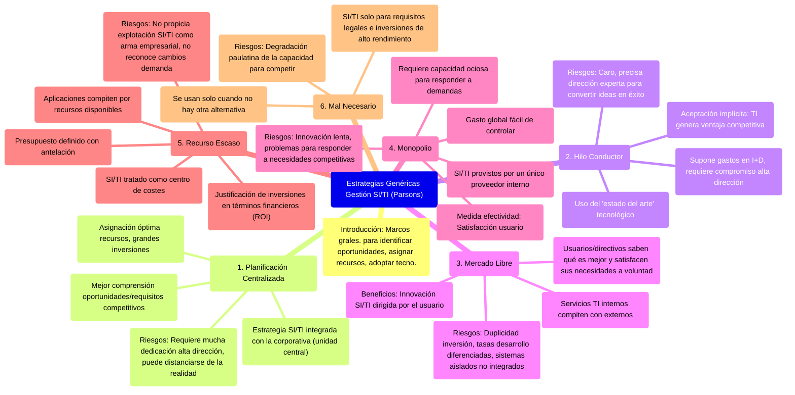

# 12.4. Estrategias Genéricas para la Gestión de SI/TI

[< Volver al Índice Principal](./00_indice_unidad_1.md) | [Anterior: 12.3. Análisis de la Cartera de Aplicaciones](./12c_Cartera_Aplicaciones.md) | [Siguiente: 12.5. Proyección de Estrategias Genéricas sobre el Modelo de Cartera](./12e_Proyeccion_Estrategias_Cartera.md)

---

Las cuestiones a abordar en cada segmento de la matriz de cartera son diferentes, al igual que los riesgos y beneficios. Parsons describe seis **estrategias genéricas** que una organización puede seguir para vincular la gestión de SI/TI con la dirección general. Estas estrategias son marcos generales que guían la identificación de oportunidades de TI, la asignación de recursos, el ritmo de adopción de nuevas tecnologías y el nivel de impacto de la TI en la empresa.

### 1. Planificación Centralizada
-   La estrategia de los SI/TI está **totalmente integrada con la estrategia corporativa** a través de una unidad centralizadora y especializada a nivel de la alta dirección.
-   Permite una mejor comprensión de las oportunidades y requisitos competitivos.
-   Facilita una **asignación óptima de los recursos** y la realización de grandes inversiones, especialmente las que afectan a varias aplicaciones.
-   **Desventajas**: Requiere mucha dedicación por parte de la alta dirección y puede distanciarse de la realidad operativa de la empresa.

### 2. Hilo Conductor
-   Implica la aceptación de que la **TI va a generar ventajas competitivas** y que se debe utilizar el "estado del arte" de la tecnología respecto a los competidores.
-   Supone efectuar gastos en I+D y asumir alguna inversión perdida, requiriendo el **compromiso de la alta dirección** para su definición (aunque no su implicación total en el desarrollo).
-   **Desventajas**: Puede ser caro y precisa una dirección experta para convertir ideas innovadoras en aplicaciones de éxito. Es necesaria para explotar las aportaciones de la tecnología, pero no se ajustará a todas las aplicaciones.

### 3. Mercado Libre
-   Supone que los directivos, que son también usuarios, **saben qué es mejor para la empresa** y pueden evaluar y satisfacer sus propias necesidades de SI/TI a voluntad.
-   Los servicios internos de TI deben **competir con proveedores externos**.
-   **Ventajas**: Conduce a una innovación en SI/TI dirigida por el usuario.
-   **Desventajas**: Puede producir duplicidades en la inversión, tasas de desarrollo diferenciadas y sistemas aislados que no están integrados.

### 4. Monopolio
-   Los SI/TI son proporcionados por un **único proveedor dentro de la organización**, al que se debe acudir en todos los casos.
-   Será necesaria una cierta capacidad ociosa para responder rápidamente a todas las demandas del usuario.
-   La medida principal de la efectividad es la **satisfacción del usuario** con los servicios centralizados.
-   El gasto global en SI/TI es fácil de identificar y controlar.
-   **Desventajas**: Puede dar lugar a que la innovación sea lenta y, por tanto, que haya problemas para responder a las necesidades competitivas. Sin embargo, un monopolio bien gestionado proporcionará un servicio profesional y sistemas de calidad.

### 5. Recurso Escaso
-   Se define un **presupuesto con antelación** y las aplicaciones compiten puramente para obtener una parte de los recursos disponibles.
-   Asegura una gestión cuidadosa de los recursos de TI mediante controles financieros. Las inversiones deben justificarse en términos financieros (ej. ROI).
-   Se tratan los SI/TI como un **centro de costes**.
-   **Desventajas**: No propicia la explotación de los SI/TI como un arma empresarial, no reconoce cambios en la demanda y la definición de prioridades es una cuestión compleja.

### 6. Mal Necesario
-   Los SI/TI se dedican únicamente a cumplir los **requisitos legales y para inversiones de alto rendimiento**.
-   Se utilizan solo donde no hay otra alternativa disponible.
-   **Desventajas**: Tiene muchas desventajas y puede degradar paulatinamente la capacidad de la empresa para competir eficazmente, a menos que los SI/TI sean casi totalmente irrelevantes para el negocio.

---
[< Volver al Índice Principal](./00_indice_unidad_1.md) | [Anterior: 12.3. Análisis de la Cartera de Aplicaciones](./12c_Cartera_Aplicaciones.md) | [Siguiente: 12.5. Proyección de Estrategias Genéricas sobre el Modelo de Cartera](./12e_Proyeccion_Estrategias_Cartera.md) 