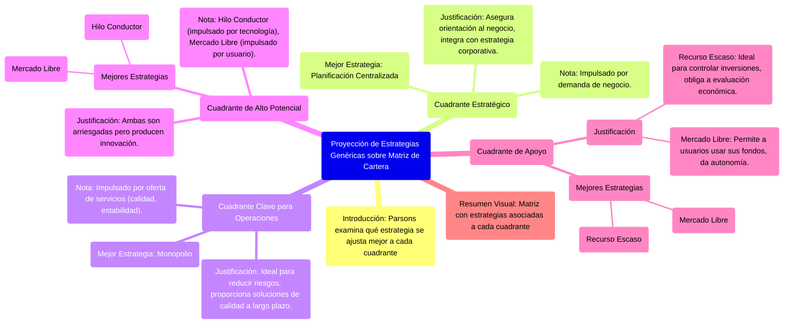
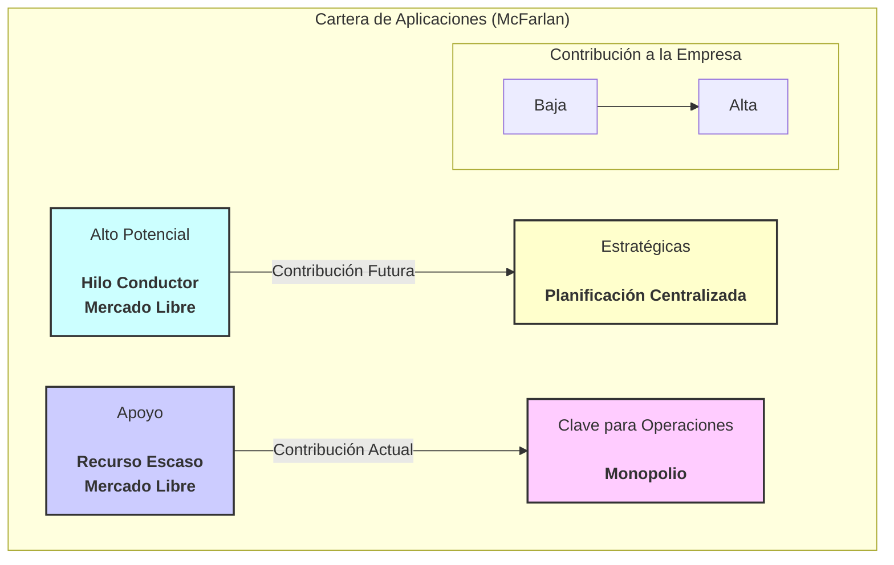

# 12.5. Proyección de Estrategias Genéricas sobre el Modelo de Cartera

[< Volver al Índice Principal](./00_indice_unidad_1.md) | [Anterior: 12.4. Estrategias Genéricas para la Gestión de SI/TI](./12d_Estrategias_Genericas_Gestion_SI_TI.md) | [Siguiente: 12.6. Migraciones y Prioridades dentro de la Cartera de Aplicaciones](./12f_Migracion_Prioridades_Cartera.md)

---

Parsons examina la forma en que cada estrategia genérica se ajusta a la cartera de aplicaciones para así identificar el **mejor encaje en cada segmento**. Concluye que, en cada caso, hay una o dos estrategias que funcionarán mejor.

### Estrategias para las Aplicaciones Estratégicas
Las aplicaciones estratégicas precisan un enfoque de **planificación centralizada** para garantizar que sea la orientación hacia el negocio la que determine los requisitos y el planteamiento más apropiado para la implantación.

### Estrategias para las Aplicaciones Clave para las Operaciones
Una estrategia de **monopolio** es potencialmente restrictiva, pero es ideal para reducir riesgos. Proporciona soluciones de calidad a largo plazo, una necesidad de los sistemas clave para las operaciones.

### Estrategias para las Aplicaciones de Alto Potencial
Las dos estrategias que mejor se adaptan son el **hilo conductor** y el **mercado libre**; ambas son arriesgadas, pero producirán innovación.

### Estrategias para las Aplicaciones de Apoyo
La escasez de recursos (**recurso escaso**) es ideal para controlar las inversiones en sistemas de apoyo, porque obliga a realizar una clara evaluación de los resultados esperados antes de que suceda nada. Asimismo, se puede aplicar el **mercado libre** siempre que se permita a los usuarios utilizar sus propios fondos, dándoles cierta autonomía y control financiero.

### Observaciones Clave
-   La **planificación centralizada** (estratégicas) es una estrategia de gestión de la **demanda** impulsada por las necesidades del negocio.
-   El **monopolio** (clave para operaciones) es fundamentalmente un planteamiento de gestión de la **oferta**; ambas implican una centralización de la toma de decisiones.
-   El **hilo conductor** (alto potencial) es un planteamiento de gestión orientado a la **demanda** impulsado por la tecnología.
-   El **recurso escaso** (apoyo) es una estrategia de gestión de la **oferta** basada en la limitación de los recursos financieros.
-   El **mercado libre** (alto potencial y apoyo) permite que los usuarios determinen la demanda y también decidan la fuente de aprovisionamiento.

---
[< Volver al Índice Principal](./00_indice_unidad_1.md) | [Anterior: 12.4. Estrategias Genéricas para la Gestión de SI/TI](./12d_Estrategias_Genericas_Gestion_SI_TI.md) | [Siguiente: 12.6. Migraciones y Prioridades dentro de la Cartera de Aplicaciones](./12f_Migracion_Prioridades_Cartera.md) 