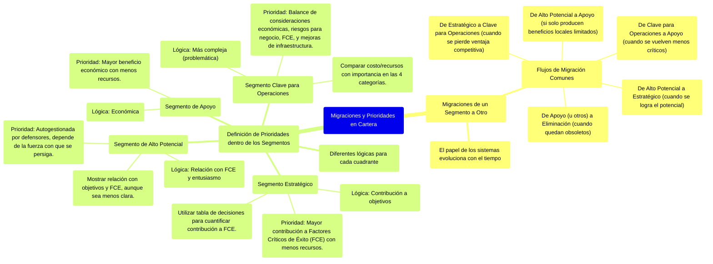

# 12.6. Migraciones y Prioridades dentro de la Cartera de Aplicaciones

[< Volver al Índice Principal](./00_indice_unidad_1.md) | [Anterior: 12.5. Proyección de Estrategias Genéricas sobre el Modelo de Cartera](./12e_Proyeccion_Estrategias_Cartera.md)

---

Las aplicaciones en los cuatro cuadrantes de la cartera se justifican por diferentes razones y necesitan distintos enfoques para su desarrollo y gestión. El papel de los sistemas también evolucionará con el tiempo, lo que requerirá **migraciones** de un segmento a otro.

## Migraciones de un Segmento a Otro

Los flujos de migración más comunes son:
1.  **De Alto Potencial a Estratégico**: A medida que el potencial de una aplicación se logra y se demuestra su valor estratégico.
2.  **De Estratégico a Clave para Operaciones**: A medida que una aplicación estratégica pierde su ventaja competitiva (por ejemplo, porque los competidores la adoptan) y se convierte en esencial para el funcionamiento diario.
3.  **De Alto Potencial a Apoyo**: Cuando una oportunidad de alto potencial finalmente solo produce beneficios locales o limitados, sin llegar a ser estratégica.
4.  **De Clave para Operaciones a Apoyo**: A medida que la empresa evoluciona, algunos sistemas que eran críticos pueden volverse menos cruciales y ser reclasificados como de apoyo.
5.  **Eliminación**: Finalmente, algunas aplicaciones, principalmente los sistemas de apoyo, quedarán obsoletas y será preciso eliminarlas de la cartera.

## La Definición de Prioridades dentro de los Segmentos de la Cartera

La lógica para establecer prioridades varía significativamente entre los cuadrantes.

### Prioridades en el Segmento de Apoyo
La definición de prioridades es relativamente sencilla. La lógica es principalmente **económica**: la prioridad más alta debe corresponder a las aplicaciones que proporcionen los **mayores beneficios económicos empleando menos recursos**.

### Prioridades en el Segmento Estratégico
La lógica básica es igualmente clara: las aplicaciones que **más contribuyan a alcanzar los objetivos de la empresa** y utilicen menos recursos deberán ir en primer lugar. Para evaluar esto, es útil emplear una tabla de decisiones que cuantifique la contribución de cada proyecto a los **Factores Críticos de Éxito (FCE)** de la empresa.

### Prioridades en el Segmento de Alto Potencial
La priorización aquí es más subjetiva. Aunque las aplicaciones deben mostrar alguna relación con los objetivos y FCE, la selección a menudo depende de la **energía y el entusiasmo de sus defensores**. La priorización y utilización de recursos son, en efecto, **auto-gestionadas**, y los resultados dependerán no solo del valor de la idea, sino también de la fuerza con la que se persiga.

### Prioridades en el Segmento Clave para las Operaciones
Esta es la priorización **más problemática** porque la lógica es más compleja. Los argumentos para priorizar estos sistemas se basan en un balance de:
1.  Consideraciones **económicas**.
2.  **Riesgos** para el negocio actual si el sistema falla o no se mejora.
3.  Contribución a **FCE**.
4.  **Mejoras de infraestructura** que habilitan otros sistemas.

Se debe comparar el coste y los recursos del proyecto con su importancia en cada una de estas cuatro categorías para establecer las prioridades globales.

---
[< Volver al Índice Principal](./00_indice_unidad_1.md) | [Anterior: 12.5. Proyección de Estrategias Genéricas sobre el Modelo de Cartera](./12e_Proyeccion_Estrategias_Cartera.md) 