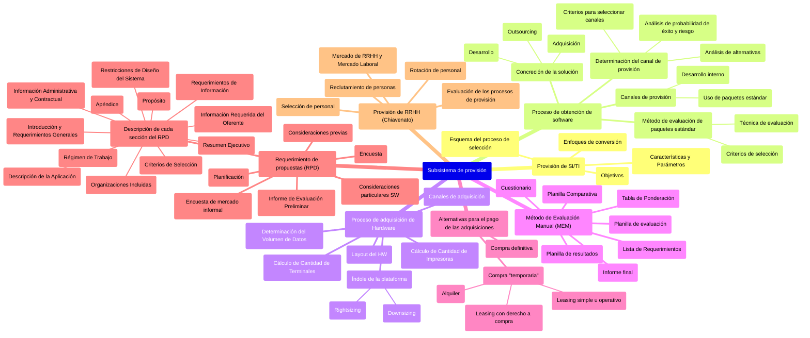

# Unidad 2: Subsistema de provisión

## Secciones de la Unidad 2

*   [1. Provisión de SI/TI](./01_provision_si_ti.md)
*   [2. Proceso de obtención de software](./02_proceso_obtencion_software.md)
*   [3. Proceso de adquisición de Hardware](./03_proceso_adquisicion_hardware.md)
*   [4. Método de Evaluación Manual (MEM)](./04_metodo_evaluacion_manual_mem.md)
*   [5. Alternativas para el pago de las adquisiciones](./05_alternativas_pago_adquisiciones.md)
*   [6. Requerimiento de propuestas (RPD)](./06_requerimiento_propuestas_rpd.md)
*   [7. Provisión de RRHH (Chiavenato)](./07_provision_rrhh_chiavenato.md)

## Mindmap General de la Unidad 