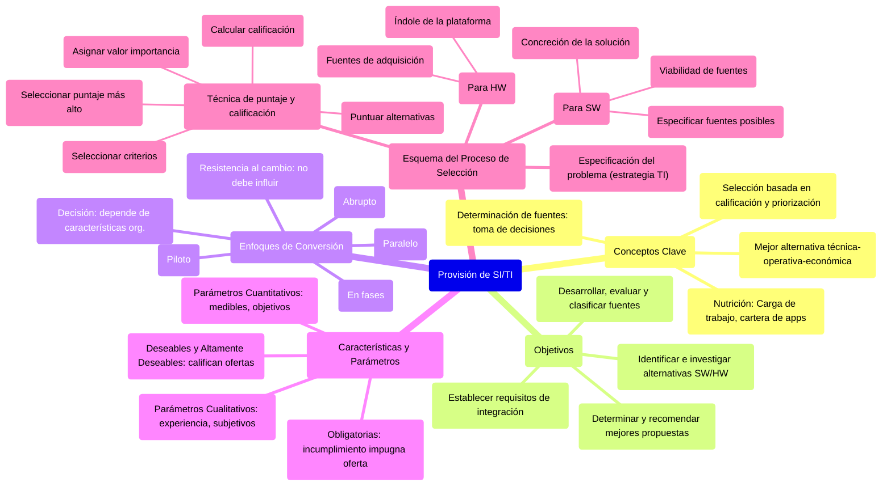

# 1. Provisión de SI/TI

[< Volver al Índice Principal](./00_indice_unidad_2.md)

## Provisión de SI/TI

Es el conjunto de **procedimientos técnicos de calificación y pautas** que tienen como fin la selección de soluciones de sw y/o hw más conveniente para la organización. Su finalidad es **abastecer a la organización de los SI/TI** adecuado para la arquitectura planeada (tengo en cuenta la ubicación ej: centralizado marco las pautas, si son delegados tendré que seguir las pautas de los delegados).

El *sistema de seguridad y auditoría*, le da la corrección y grado de cumplimiento de los PP de los diseños y desarrollos (grado de cumplimeinto en ls proceos, en los diseños, en las metodologías de desarrollo que supe que mi org ha decidido seguir para desarrollar ⇒ cuando voy a una provisión debo tener en cuenta todo); como devolución le da, las políticas de provisión, los contratos, las verificaciones de prestaciones, los objetivos de las aps, etc.

*La Provisión de SITI → recursos adecuados para la arquitectura que se diseñó.*

*![][image19]![][image20]*

**Conceptos claves**

* El proceso de provisión consiste en determinar **la mejor alternativa técnica-operativa-económica para proveer del SW y/o HW** que requiere la organización, de acuerdo a las diferentes circunstancias que se puedan presentar, **apelando al principio de RACIONALIDAD.** 

* Los recursos de SW y HW deben **ser seleccionados en base a técnicas de calificación y priorización**, siguiendo pautas de provisión formales y las establecidas por criterio profesional. Por más chica e informal que sea la organización, se debe cumplir esto *(cada componente tiene una prioridad, criterio profesional a medida que voy adquiriendo experiencia).*

* El proceso de **determinar las fuentes**, no es un proceso técnico, **es un proceso de toma de decisiones.**

* ***¿De que me voy a nutrir?*** La carga de trabajo, esta refleja mi entorno informático (usuarios simultáneos, aplicaciones y de qué tipo, cuales se están ejecutando, cuanto es el uso de las aps, cuanto espacio ocupan, etc) ⇒ necesito conocer esta carga para poder dimensionar, por ejemplo, el performance que necesito para un posible servidor que voy a adquirir. **Aparte de la cartera, tengo que ver mi carga de trabajo, todo eso nutre a mi proceso de provisión.**

### Objetivos

* Identificar e investigar las alternativas de obtención de SW y HW concretos, susceptibles de servir de soporte a la solución recomendada para el sistema de información objeto. *(Investigación de alternativas de solución posibles en el mercado)*  
* Desarrollar, evaluar y clasificar las fuentes de obtención posibles. *(ó desarrollo, ó adquiero, dos extremos de decisión)*  
* Determinar y recomendar las mejores propuestas de los posibles proveedores. *(Parte del proceso de provisión)*  
* Establecer los requisitos de integración de los desarrollos y/o productos elegidos. *(Cómo y de qué forma se van a integrar a los sistemas existentes)*

### Enfoques de conversión

Se consideran cuatro enfoques básicos de conversión en donde, de manera aproximada, el "riesgo" sigue un orden ascendente y la generación de costos adecuados un orden descendente. Este enfoque debe determinarse antes de hacer la adquisición y en el inicio del proceso de selección, pues la opción de la estrategia de conversión influirá a su vez en otras opciones. 

![][image21]  
Explica cómo voy a convertirme de un sistema nuevo a uno viejo. 

* **Abrupto**: dejo de usar el viejo de un día para el otro.   
* **En fases:** voy pasando por funciones o por etapas, y voy supliendo de a poco hasta que hago que el nuevo reemplaza del todo al otro. Incorporo la funcionalidad del sistema nuevo, y esa misma similar dejo del sistema existente.se incorpora el modulo dejando el viejo  
* **Paralelo:** uso los dos a la vez y en un día específico me deshago del viejo.   
* **Piloto**:tengo parte del sistema nuevo (como islitas del sistema anterior), pero esto lo puedo ver en el distribuido como sucursales con el sistema nuevo y algunas otras con el sistema viejo, en este caso pueden llegar a convivir el sistema viejo con el sistema nuevo (ocurre, por ejemplo, cuando el sistema viejo tiene funcionalidades que pueden seguir siendo usadas), y las "islitas" (en estas islas solo se usa el sistema nuevo, se saca el viejo en esa parte)son funcionalidades que se aplican del nuevo sistema porque antes no existían o porque se reemplazan. Voy eligiendo determinadas áreas y le doy una parte de la aplicación nueva que le corresponde 

**La decisión del enfoque de conversión depende de las características de la organización**, por ejemplo: Si continuidad del servicio es vital, es muy probable que el enfoque paralelo sea un mejor método de conversión que el del cambio abrupto; cuando el elemento del sistema dado depende de otros, es más adecuado el enfoque en fases, pues reduce el riesgo

**La resistencia al cambio de los usuarios no puede influir en la decisión de alguno de estos enfoques, nosotros tenemos el deber de convencer.**

No hay que cambiar sin razón; cuando es preciso cambiar, es mejor hacerlo de manera simple y buscar la flexibilidad. Sobre todo, hay que partir desde el problema empresarial y tratar de solucionarlo mediante el software y el hardware, y no buscar la solución más elegante sin considerar el problema real

### Características y Parámetros

La selección requiere identificar determinadas necesidades en un orden de prioridades. Éstas pueden establecerse sobre la base de dos elementos:

* **Características obligatorias:** El incumplimiento de alguna de ellas implica la impugnación de la oferta en su totalidad. Cualquier alternativa que carezca de las características obligatorias no tiene curso en el proceso de selección  
* **Características Deseables y Altamente Deseables:** Sirven para flexibilizar la oferta de los oferentes, ya que sobre ellas se efectúa el proceso de calificación de características de las ofertas presentadas.

Los **parámetros cuantitativos** son medidas, o proyecciones de éstas, de alguna capacidad o cantidad que determina una característica o sub-característica de un elemento de HW o de una facilidad de SW. **Su determinación se basa en el empleo de fórmulas matemáticas determinísticas o métodos probabilísticos**, que arrojan una apreciación altamente objetiva sobre una característica. *Ej.: tps, tasa de transferencia, capacidad de almacenamiento.*

Los **parámetros cualitativos** son similares a los anteriormente nombrados, con el agregado de que su cumplimiento no solo permitirá definir al mejor equipo que se adapte a la organización, sino también aquel que posea la mejor performance aplicada a las capacidades manejadas por la misma. Es decir, los parámetros cualitativos **son determinados por la experiencia, la observación, convenciones, restricciones, políticas, etc. Poseen cierta subjetividad** y por lo general se deben transformar en cuantitativas, o controlar que no superen el 20% del total de parámetros. *Ej.: tecnología de disco, dimensiones de pantalla, variables de consumo de electricidad (como frecuencia y voltaje), estética, etc.*

### Esquema del proceso de selección

![][image22]![][image23]

***|Nota|Especificación del problema:** hablamos de la estrategia de ti (ya sé la solución), ahora tengo que ver cómo la adquiero.*

La compra de servicios de SI debe implicar un determinado proceso de selección, que generalmente involucra **cierta técnica de puntaje y calificación** (la economía de la información es una de ellas). Sin importar el grado de formalidad o informalidad del método de selección, los principios básicos de la técnica son:

1\. Seleccionar los criterios para hacer la elección.  
2\. Asignar a cada criterio un valor de importancia.  
3\. Dar un puntaje a las alternativas de adquisición (cómo satisfacen cada criterio).  
4\. Calcular la calificación de cada propuesta, multiplicando los puntajes por el valor de importancia; los resultados se suman en un total.  
5\. Seleccionar la alternativa que tenga el puntaje más alto.

**→ Para el SW**  
Ya tengo mis necesidades, la cosa es ver la fuente que voy a necesitar ⇒

**1- Especificar las fuentes posibles:** requiere investigación, es casi lo mismo cómo investigar el mercado de RRHH para ver donde encuentro lo que busco. Voy a tener info de las decisiones del comité SI/TI, algún lineamiento que me bajen de las posibles fuentes, opiniones tencias, investigación del mercado de sw, políticas de org y SI/TI ⇒ me enmarcar a donde va mi investigación y mi carpeta de apps que me guia.

**2- Viabilidad de las posibles fuentes:** evaluación, se determina cuales de las fuentes son viables PARA MI. Los criterios con los que voy a evaluar las opciones  es seguir las restricciones de la org. 

**3- Concreción de la solución mediante la fuente seleccionada:**  tengo parámetros cuantitativos y cualitativos; cualquiera sea la fuente, a quien me la vaya a dar la app le tengo que decir mis requerimientos, los cuales reflejan esos parámetros; es como un gran pliego de condiciones técnicas

* Adquirir paquete  
  * Desarrollo paquete  
  * Outsourcing. Si tengo todo en la nube, estoy en uno de los esquemas de acá (agencia de servicios)

**→ Para el HW**  
Se centra en dos cuestiones:

1- Las fuentes de adquisición (externo)  
2- Indole de la plataforma.

---

Siguiente: [2. Proceso de obtención de software](./02_proceso_obtencion_software.md) 