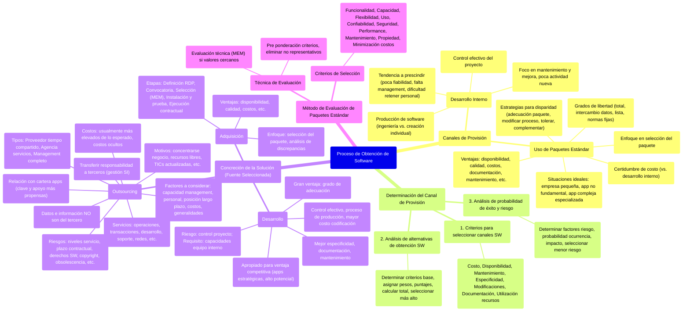

# 2. Proceso de obtención de software

[< Volver al Índice Principal](./00_indice_unidad_2.md)

## Proceso de obtención de software

### ![][image24]

### Canales de provisión

Las opciones de provisión de SW comprenden un continuo de posibilidades que se muestran en la figura, dónde se observa que no existe una división fija entre los desarrollos externos e internos, y que solo las opciones 1a, 1b, 4 y 5 pueden definirse claramente. 

![][image25]

Independientemente de que el desarrollo definitivo sea interno o no, es necesaria la participación de personal experto interno para establecer los requerimientos. Lo que determina que rutas de adquisición son las más apropiadas es la índole de esos requerimientos, que capturan los principios comprendidos en la estrategia de SI. Los requerimientos deben incluir limitaciones en el proceso de selección.

#### ***Desarrollo interno***

Cuando se considera el software de aplicaciones muchas empresas eligen desarrollar sus propios sistemas. Cuanto mayor es la sección de IS, y cuanto más centralizada está, mayores son las probabilidades de que se desarrolle internamente.

Los proyectos de desarrollo de software actuales contienen incertidumbres inherentes debido a la necesidad de retener la flexibilidad en un entorno que cambia con rapidez.

Para evitar ese problema, el trabajo de desarrollo interno requiere:

* Control efectivo del proyecto por medio de enfoques actuales de management de proyecto.  
* Predisposición y herramientas para la producción de software.

* La necesidad de un control eficaz de proyecto es obvia, pero puede ser difícil lograrlo a menos que el software se realice mediante ingeniería de producción en lugar de ser creado individualmente.

Ha habido una tendencia estable a prescindir de los equipos de desarrollo a gran escala formados por personal interno. Los factores que motivaron esa tendencia están dados por todo un historial de poca fiabilidad, falta de un management de proyectos capacitado y dificultad de retener los equipos de personal con aptitudes en un entorno de cambios veloces.

**En general los paquetes estándar presentan menores costos.**

Como resultado de la tendencia hacia el desarrollo de aplicaciones por usuarios y de los paquetes adquiridos, gran parte del trabajo interno consiste en el mantenimiento y mejora de los sistemas existentes, por lo general en la reingeniería de dichos sistemas, y muy pocas actividades se dedican a los nuevos desarrollos.  
**![][image26]**

#### ***Uso de paquetes estándar***

Los paquetes están presentes en **todas** las arquitecturas de hardware (no solo pc).

Para la mayoría de las empresas aportan ventajas, sobre todo en las áreas de aplicación de baja importancia estratégica. Para las pequeñas empresas que se han informatizado, es impensable considerar otra cosa que no sean las soluciones en paquete.

Algunas de **las ventajas** son: 

| Rápida disponibilidad Procedimientos comerciales sólidos Calidad conocida y comprobable Menores costos iniciales y generales | Documentación verificable Mantenimiento disponible Investigación y actualización continuas Soporte y capacitación variados |
| :---- | :---- |

El costo de la compra o de la licencia del paquete, si bien puede ser alto, ofrece **certidumbre***,* a diferencia del costo de un desarrollo interno de software.

Cuando se adquiere un paquete, todo el aprendizaje de desarrollo queda retenido por el fabricante. Existen tres situaciones ideales de uso que **recomiendan la opción de paquetes de soluciones:**

* Un conjunto de aplicaciones bien integradas para una empresa relativamente pequeña que desea adoptar un paquete sin realizar cambios.  
* Una aplicación no fundamental para la actividad principal de la empresa, que tenga una interfaz bien definida y relativamente simple.  
* Una aplicación compleja que necesite de especialización técnica en un área donde la empresa no considere que puede obtener una ventaja competitiva importante.

**En la adquisición de paquetes, el esfuerzo y las aptitudes dejan de centrarse en el desarrollo del SW y pasan a enfocarse en la selección del paquete,** que lleva un ciclo de desarrollo bastante diferente que el del SW a medida. Además, como la mayoría de los paquetes se pueden adecuar, existen diferentes caminos a seguir, que también es preciso seleccionar. La identificación y la priorización de los requerimientos puede compararse con algo ya existente y el comprador tiene que localizar dónde están los desfasajes y decidir sobre un proceso para manejar la disparidad de capacidades. A continuación, se ilustran **estrategias para manejar la disparidad entre las necesidades de la empresa y las capacidades del paquete.**   
![][image27]

* **ADECUACIÓN DEL PAQUETE:** Genera conflictos primero legales, ya que perdemos las licencias y a su vez quien se hará cargo de implementar la modificación.(No es viable).  
* **MODIFICAR EL PROCESO EMPRESARIAL:** Tienen definido un mapa de proceso (Haciendo referencia a la práctica). Es una alternativa a evaluar.  
* **TOLERAR EL DESAJUSTE:** Dependiendo del nivel de desajuste, si son tolerables o no.  
* **COMPLEMENTAR EL PAQUETE CON FUNCIONALIDAD ADICIONAL**: del fabricante o de terceros

Existen cuatro enfoques diferentes para definir el **grado de libertad** que pueden tener las áreas empresariales al seleccionar los paquetes:

1\. ***Libertad total:*** este enfoque permite que todas las áreas empresariales elijan su paquete preferido y puede provocar el caos, donde nadie sabe qué comprar, cuáles son los costos de instalación, capacitación y soporte, ni tampoco los costos futuros, posiblemente enormes, que surgen de las oportunidades perdidas de integración. Sin embargo, cada área puede optar por un paquete que se adecue bien a sus requerimientos sin compromiso.

2\. ***Intercambio de datos**:* este enfoque permite que los sectores individuales adquieran el paquete que desean siempre que soporte el intercambio de datos con otros paquetes y sistemas, según sea necesario.

3\. ***Lista***: en este enfoque, algún área de la empresa dedicada a la definición de normas confecciona una lista breve de los paquetes aceptables; los sectores individuales sólo pueden optar sobre la base de esa lista.

4\. ***Normas fijas***. El área dedicada a la definición de normas establece el paquete permitido, y de ese modo los sectores individuales pueden optar por "cualquier color que deseen, siempre que sea negro".

*Los dos primeros enfoques se refieren a un área de sistemas descentralizada, mientras que los últimos a áreas de sistemas centralizadas*

### Determinación del canal de provisión

#### ***1\. Criterios para seleccionar canales de provisión de SW***

Los criterios listados deben considerarse en el proceso de decisión del canal de obtención de SW, esta consideración consiste en, determinar, para cada alternativa, en qué grado los criterios listados se cumplen, afectan, benefician, constituyen una ventaja o desventaja según la situación de la organización y la estrategia (según el impacto estratégico que representan). 

1. Costo  
2. Disponibilidad  
3. Mantenimiento  
4. Especificidad de la aplicación  
5. Modificaciones  
6. Documentación  
7. Utilización de recursos

#### ***2\. Análisis de alternativas de obtención de SW***

Una vez que se han determinado todas las alternativas (canales): 

1. Determinar un subconjunto de los criterios que serán la base de la evaluación  
2. Asignar pesos según la importancia relativa de cada criterio base  
3. Asignar puntajes para cada combinación alternativa/criterio sobre la base de la escala definida  
4. Multiplicar los puntajes por los pesos y se suman los resultados para cada alternativa  
5. La alternativa con el puntaje más alto satisfará mejor los requerimientos de usuario. Si se impone un mayor análisis (por ej. las dos alternativas poseen un puntaje muy próximo) **se puede recurrir a una segunda técnica**, análisis de las probabilidades de éxito y riesgo. 

#### ***3\. Análisis de probabilidad de éxito y riesgo***

Descartar aquellas opciones que tengan alta probabilidad de ocurrencia de un factor de alto impacto estratégico. El procedimiento es el siguiente:

1. Se determinan los factores de riesgo.  
2. A cada riesgo se le da una probabilidad de ocurrencia (alta/mediana/baja) y un puntaje similar por el impacto que tendrá en la organización  
3. Se obtienen los totales  
4. Se selecciona la alternativa de menor impacto o riesgo  
5. Se deben descartar aquellas opciones que tengan alta probabilidad de ocurrencia de un factor de riesgo con alto impacto. 

| Riesgos | Alternativas |  |  |  |
| ----- | :---: | :---: | :---: | :---: |
|  | Desarrollo interno |  | Desarrollo personal contratado |  |
|  | Probabilidad | Impacto | Probabilidad | Impacto |
| **Sobreutilización de recursos** | A | M | B | A |
| **Escaso apoyo para mantenimiento** | M | M | A | M |

### Concreción de la solución mediante la fuente seleccionada

Se tienen en cuenta parámetros cuantitativos (se pueden medir) y cualitativos (responden a criterios profesionales sobre algo). Hay tres posibilidades:

* Adquisición  
* Desarrollo  
* Outsourcing

#### ***Adquisición***

* Rápida disponibilidad.  
* Procedimientos comerciales sólidos.  
* Calidad conocida y comparable.  
* Menores costos iníciales y generales.  
* Documentación verificable.  
* Actualización continua.  
* Soporte y capacitación variados.

Estos esfuerzos se centran en la adecuación de las funcionalidades y modos de operación del mismo a las de la organización (Costos adicionales al precio de compra) y eventualmente la conversión de datos. **El proceso principal será la selección del paquete**. Se analiza el plano de discrepancias.

**Etapas del proceso**

1. **Definición de la solución y elaboración del RDP** (también llamado pliego técnico), es un documento usado para solicitar ofertas competitivas para adquisiciones especiales.  
2. **Convocatoria de oferentes.**  
3. **Selección de la oferta** → Herramienta MEM, esta da un resultado que es numérico y representa el grado de adecuación de la propuesta a mis necesidades (RDP). Luego de esto se presenta generalmente a otras áreas (financieras).  
   1. Si no cumple las características obligatorias → afuera.  
   2. Luego analizo las deseables → ver cuánto mejor me lo ofrece.

Estoy tratando de buscar una aplicación que mejor cumpla con la intersección de requerimientos empresariales y funcionalidades del paquete.

4. **Instalación y prueba de aceptación** de la solución seleccionada.  
5. **Ejecución de los aspectos contractuale**s consecuentes de la etapa 4 (financieros, administrativos, legales).

#### ***Desarrollo***

* **Control efectivo del proyecto** de desarrollo mediante una gestión del proyecto apropiada.  
* **Considerar al desarrollo de SW como un proceso de producción,** por lo tanto hay que definir criterios que hagan a la medición de productividad.  
* **El mayor costo** va a estar en el proceso de codificación.  
* **El análisis de ahorro de costos:** desarrollo interno presenta costos y tiempos importantes en el análisis, diseño, desarrollo y prueba. Sin embargo, es mejor con respecto a la especificidad, documentación y el mantenimiento.  
* Apropiado para cuando la necesidad empresarial consiste en **obtener ventaja competitiva**. → APLICACIONES ESTRATÉGICAS Y DE ALTO POTENCIAL DE LA CARTERA.  
* LA GRAN VENTAJA ES EL GRADO DE ADECUACIÓN POSIBLE  
* El mayor riesgo: debo tener un control efectivo del proyecto  
* Otro requisito importante, mi equipo de desarrollo interno \-debe tener las capacidades y habilidades necesarias.

#### ***Outsourcing*** 

Consiste en transferir a terceros la responsabilidad de proporcionar un servicio adaptado a las necesidades de una organización.

**Se entiende por outsourcing la cesión, a una empresa externa, de la gestión de los SI de una organización.** Aglutina una combinación dinámica de actividades de gestión de SI y que puede ir desde la asistencia técnica en labores de operación de centro de proceso de datos, mantenimiento de equipos, etc. hasta el desarrollo y mantenimiento de aplicaciones, diseño de redes de comunicaciones, consultoría, etc.

⇒ Le transfiero a un tercero la responsabilidad que debería tener el área de sistemas, y el área de sistemas de la organización debe controlar ese servicio (con pautas contractuales y pautas de servicio bien detalladas). LO QUE NUNCA ES DEL TERCERO SON LOS DATOS Y LA INFORMACIÓN.

⇒ ***¿Qué servicios pueden estar incluidos en estos contratos de tercerización?***

* Transferencia de operaciones de management a gran escala    
* Transacciones rutinarias  
* Procesamiento de datos  
* Proyectos de desarrollo  
* Apoyo al usuario  
* Redes  
* Almacenamiento  
* Cualquier aspecto relacionado con la operación o management de los SI 

**Tipos:**  
Representan el grado de transferencia de la responsabilidad del MANAGEMENT DE LOS SI, van de menor a mayor responsabilidad respectivamente:

* **Proveedor de tiempo compartido**: proveen acceso en línea a una capacidad de procesamiento externa que generalmente se cobra según el tiempo utilizado. El espacio de almacenamiento requerido puede ser compartido o privado. Cloud storage, alquiler de capacidad de procesamiento para cálculos complejos, etc.

* **Agencia de servicios**: se cede una tarea completa a una empresa. Por ejemplo, soporte técnico, desarrollo y mantenimiento de aplicación, liquidación de haberes.

* **Management completo de servicios**: Todos los elementos de los SI permanecen dentro de la casa del cliente, pero el management (por ende la toma de decisiones) y la operación de dichos elementos es lo que se terceriza, es decir que el cumplimiento de esas funciones de management son responsabilidad del tercero contratado. Por ejemplo: Sistema de gestión tributaria de la Municipalidad de Resistencia. 

  * De los tres enfoques de contratos de servicios, es el que presenta más riesgo y quien exige mayor demanda sobre el contratado (es más probable que el proveedor experimente problemas, sobre todo porque los insumos siguen siendo propiedad del cliente o contratante). En este caso la empresa, el contratante, sólo retiene el management del contrato, y tal vez el management estratégico (define plan estratégico si/ti, define cartera de apps)

![][image28]

**Decidir la tercerización de los sistemas informáticos exige una profunda evaluación del qué, cómo, cuándo y con quien tercerizar.** Para esto la empresa debe tener en claro las aptitudes esenciales, la naturaleza de la empresa y la importancia empresarial del elemento de los SI. 

Una organización que apuesta a la innovación tecnológica debe disponer de recursos flexibles, procesos organizacionales orgánicos y fluidos y capacidades experimentales, atributos todos que la tercerización no garantiza.

![][image29]

Algunos **motivos** para tercerizar:

* Concentrarse en el negocio de la compañía  
* Los recursos libres para otros propósitos.  
* Disponer de tics actualizadas.  
* Acelera los beneficios de la reingeniería.  
* Riesgos compartidos.  
* Hace fondos a capitales disponibles.  
* La infusión constante.  
* Reduce y controla los costos operacionales.  
* La difícil tarea de administrar los SI/TI (fuera de control)

**Riesgos** de tercerizar:

* Mantener los niveles de servicio: controlar los servicios que se contrató.  
* Plazo contractual inadecuado. Dificultad para separar funciones de servicios.  
* Dificultad para proteger los derechos de SW.  
* Pérdidas del copyright del SW propio ejecutado por el proveedor.  
* Pérdidas del copyright del SW desarrollado por el proveedor para la contratista.  
* Habilidades tecnológicas obsoletas (capacidades del personal interno original pérdidas)  
* Dificultad para cambiar el proveedor.  
* Costos ocultos

La salida de esta etapa es la solución definitiva.

***Relacionando con la cartera de aplicaciones*** → las aplicaciones de tipo estratégico y alto potencial de la cartera deberían ser las que más usen el desarrollo interno, mientras que las clave para las operaciones y las de apoyo son las más propensas a beneficiarse del outsourcing o adquisición.

**¿Qué factores deben tenerse en cuenta para el outsourcing?.** 

* **Capacidad del management:** las distintas rutas de adquisición requieren diferentes aptitudes de management. Los estilos, la cultura y la idoneidad del management de la empresa forman la base para la adecuación de cualquier ruta.  
* **Capacidad del personal:** es probable que la escasez de aptitudes técnicas, de visión comercial, de management de proyectos o de negociación de contratos limite significativamente las alternativas, al igual que el grado de compromiso del personal.  
* **Posición a largo plazo:** deben considerarse las posibles consecuencias de la transferencia a largo plazo del management, del personal y de los recursos, que al otorgar valor agregado de especialización, favorece a la empresa externa.  
* **Costos convenientes**: compartir los costos para beneficio de ambas partes puede compensar el conflicto inherente de intereses en la relación cliente/proveedor.  
* **Generalidades:** el grado de generalidad de los requerimientos debe afectar significativamente la decisión.

**Los costos de los SI relacionados con la provisión externa son menores que los generados por los desarrollos internos?** 

Normalmente, los contratantes descubren que l**os costos de tercerización son más elevados de lo que esperaban** *(Fuente: estudio de 1994 dice que solo el 57% de contratos con terceros perciben un ahorro real).* Los costos iniciales que se definen, a lo largo de la prestación del servicio pueden ir cambiando, y el contratante termina pagando más. También, si la tercerización incluye trabajo de desarrollo, esta incluye los [costes de personal,](https://docs.google.com/document/d/1WYvXYmw1cM3d8N8IJ9fMtDY1Txxq5-6mkgo2Pufqv8w/edit#heading=h.h1svywz1gln1) que pueden ir fluctuando (por ejemplo aumento en índices de rotación dispara costos no esperados) ⇒ Debo reestructurar los contratos de tercerización, incluir costos a largo plazo.

**¿Qué otros riesgos o costos ocultos se presentan?** Muchos contratos pueden ser poco flexibles, tener cláusulas punitivas, donde en el caso de que el servicio no  brinde los beneficios esperados, el contratante deberá pagar por rescindir el contrato. Donde no solo se percibe el costo punitorio, sino también el desaprovechamiento de las ventajas, y por ende de la inversión, de los SI/TI al no ser implementados de la manera esperada y no poder cambiarlo fácilmente (también mencionado en riesgos de tercerizar).

### Método de evaluación de paquetes estándar

Si del proceso de decisión sobre el canal de provisión de SW, se define que la alternativa es la adquisición de un paquete estándar, el proceso tiene una segunda etapa que es la decisión sobre cuál de las ofertas de paquetes disponibles en mercado se adecue mejor a las necesidades de la organización. 

#### ***Criterios de selección de paquetes estándares de SW***

Se establece un conjunto de criterios que permitan ser ajustados en función a las expectativas deseadas de los paquetes a evaluar, que pudieran reflejar potenciales particulares, y que sirvan al mismo tiempo de elementos de evaluación. 

1. **Funcionalidad**: Aspectos operativos. Si el paquete cubre todos los procesos que debería realizar. 

2. **Capacidad**: Si el paquete cubre aspectos de administración de datos, en cuanto a tamaño y cantidades, transacciones.

3. **Flexibilidad**: ¿Se pueden cambiar fácilmente el formato de las transacciones y de los informes? ¿La disposición de las pantallas pueden cambiarse fácilmente? ¿Es difícil agregar nuevos cálculos o pasos de procesamiento? ¿Pueden adaptarse los programas a nuevas aplicaciones?

4. **Uso**: Se refiere a aspectos de facilidad de uso, interfaz amigable, nivel de conocimientos, etc.)

5. **Confiabilidad**: Que el paquete falle lo menos posible (MTBF) y que se pueda recuperar rápidamente de caídas.

6. **Seguridad**: Se refiere a aspectos de restricciones de acceso y resguardo de la información

7. **Performance**: Se refiere al nivel de respuesta del paquete, dependiendo de una carga de trabajo representativa. Siempre está en conflicto con el criterio de capacidad.

8. **Mantenimiento**

9. **Propiedad**: Se refiere a los tipos de licencia y derechos que tendrá sobre el producto (licencia de uso, licencia de propiedad, copyright del producto y/o documentación, etc.). 

10. **Minimización de costos operativos y de mantenimiento**

11. **Minimización de costos de compra e instalación**

#### ***Técnica de evaluación***

Una vez establecidos los criterios, se puede efectuar una comparación de los paquetes de SW propuestos. Debido a que no todos los criterios pueden ser representativos, es importante establecer solamente **un mínimo de criterios que respondan a necesidades reales,** a través de una "pre ponderación" de los mismos en función al nivel de necesidad de la empresa, permitiendo eliminar criterios que carecen de representatividad para el escenario en particular, y disminuyendo la complejidad del proceso de evaluación *(dejar de lado aquellos que estén debajo de un nivel de corte preestablecido con anterioridad)*. 

![][image30]

Finalizada esta primera selección, es posible pasar a un segundo proceso llamado **evaluación técnica**, solo en **el caso en que los valores obtenidos por oferentes se encuentren muy cercanos entre sí** (se establece una lista de componentes, elementos, características y subcaracterísticas referidos a aspectos técnicos del paquete a seleccionar). Se pasa ahora a un nuevo análisis **para detectar cuál de ellos es el más óptimo**, tomando como referencias sus capacidades técnicas.  Se puede proceder a una técnica para evaluar ofertas denominada **Método de Evaluación Manual (MEM)**

---

Siguiente: [3. Proceso de adquisición de Hardware](./03_proceso_adquisicion_hardware.md) 