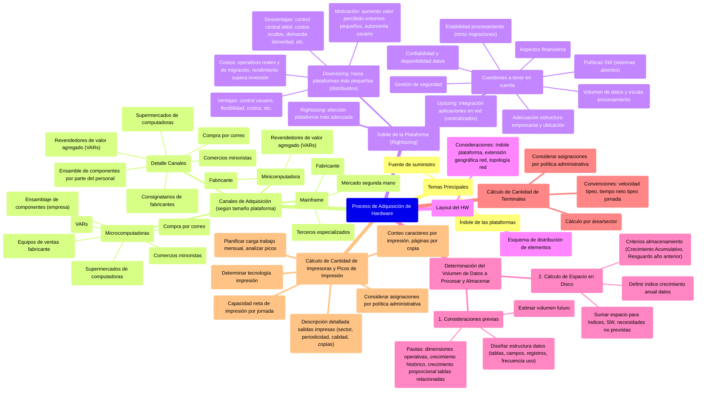

# 3. Proceso de adquisición de Hardware

[< Volver al Índice Principal](./00_indice_unidad_2.md)

## Proceso de adquisición de Hardware

Al analizar la adquisición de hardware, se presentan básicamente dos temas principales: la fuente de suministro y la índole de las *plataformas.* En la figura siguiente se describen someramente las diferentes fuentes de adquisición de HW.

| Mainframe | Computadoras de alto rendimiento con grandes cantidades de memoria y procesadores que procesan miles de millones de cálculos y transacciones simples en tiempo real.  Más orientado al upsizing (centralizado) | \- Fabricante \- Terceros especializados | Se pueden adquirir HW de cualquier tipo en el mercado de segunda mano |
| :---- | :---- | :---- | :---: |
| **Minicomputadora** | Tipo de computadora multiusuario que está comprendida en un rango medio de tamaño (no es una computadora muy pequeña, como sugiere el nombre.) Sistema informático económico en comparación con el mainframe y la baja necesidad de mantenimiento | \- Fabricante \- Revendedores de valor agregado (VARs) |  |
| **Microcomputadoras** | Es una computadora pequeña con un microprocesador.  Más orientado al downsizing | \- Equipos de ventas "tradicionales" del fabricante \- Revendedores de valor agregado \- Comercios minoristas \- Supermercados de computadoras \- Compra por correo \- Ensamblaje de componentes realizado en la empresa |  |

### Canales de adquisición

Con la pequeña excepción del ensamblaje de microcomputadoras, **todo el HW se adquiere de forma externa;** el **tamaño** de la plataforma define principalmente el alcance y la índole de los canales de adquisición de HW.

* **Consignatarios de fabricantes:** si el cliente es muy importante, es posible que se presente la opción de comprar directamente al fabricante. El equipo de ventas, gracias a sus conocimientos técnicos, diseña a medida soluciones muy específicas además de ofrecer un mantenimiento intensivo y la seguridad de contar con piezas de repuesto. La desventaja es que suelen tener un gasto mayor y una orientación más restringida la falta de soporte de integración con otros vendedores.  
* **Revendedores de valor agregado** (VARs): generalmente están preparados para vender y apoyar una amplia gama de productos. Los VARs agregan un margen al costo básico del software para cubrir su provisión de "servicios" (por ejemplo: instalación y mantenimiento).  
* **Comercios minoristas:** dado que las microcomputadoras ya son un artículo de uso cotidiano, se venden de la misma forma que otros bienes de consumo. Si bien los comercios minoristas brindan asesoramiento muy limitado, normalmente ofrecen poca variedad, y siempre dentro de la línea de uso generalizado.  
* **Supermercados de computadoras:** como ocurre con los comercios minoristas, no suelen estar orientados a las grandes empresas, pero buscan ofrecer el rango de opciones del canal directo junto con un servicio personal, además de permitir ver los productos antes de comprar. Sólo las empresas más grandes excluyen las compras mediante este canal.  
* **Compra por correo:** tiene como competidores a los supermercados de computadoras y a los comercios minoristas. Las agencias y los VARs de los fabricantes ofrecen un tipo de servicio tan diferente que pueden considerarse como canales complementarios.  
* **Ensamble de componentes por parte del personal:** algunas compañías compran componentes tales como motherboards, monitores, disqueteras, etc., que luego ensambla el personal de la empresa. La brusca reducción en los precios de hardware hace que este canal de adquisición no sea muy usado, excepto cuando se requieren configuraciones muy específicas o especiales.

### Índole de la plataforma

El segundo aspecto clave en la selección de hardware es la escala de la plataforma del hardware. **Durante la provisión de HW queremos alcanzar el rightsizing**

* **Rightsizing:** elección de la plataforma más adecuada  
* **Downsizing.** Tendencia hacia el uso de plataformas de procesamiento más pequeñas (mejor para sistemas distribuidos).  
* **Upsizing:** integración de aplicaciones. y ordenadores aislados en entornos de red, de forma que se permita el compartimiento de datos (mejor para sistemas centralizados, justificado desde el punto de vista de integridad, complejidad y accesibilidad de los datos).

**Cuestiones a tener en cuenta:**

* Aspectos financieros.  
* Grado de adecuación entre la estructura empresarial y la ubicación.  
* Gestión de la seguridad.  
* Confiabilidad y disponibilidad de los datos.  
* Volumen de los datos a procesar y almacenar, y la escala de procesamiento.  
* Políticas del SW: sistemas abiertos.  
* Estabilidad del procesamiento de la información (ritmo de implementación de las migraciones).

#### ***Downsizing***

El **downsizing** es la etapa actual de una tendencia a muy largo plazo que consiste en desarrollar bases de hardware para sistemas de software más pequeños y por lo tanto más distribuibles. Es muy probable que la opción de distribuir el poder de procesamiento representado por el downsizing esté motivada por una autonomía mayor del usuario causada por la computación controlada por el usuario (U-CC), y a su vez, la mayor flexibilidad ofrecida por las aplicaciones de PCS en red sobre los sistemas mainframe estimule el crecimiento de la computación de usuario final. Esta tendencia llega hasta tal punto que los nuevos desarrollos tienen tanta posibilidad de estar basados en plataformas desktop como de hacerlo en arquitecturas de mainframe o de mediano rango.

La expresión downsizing implica la migración de un sistema o de un conjunto de sistemas desde un mainframe o minicomputadora a una red de PC o minicomputadoras. Sin embargo, a las aplicaciones nuevas y basadas en plataformas pequeñas también se les da este nombre (es decir que vocablo incluye un grado importante de distribución y procesamiento de red). 

El downsizing se puede aplicar en todas las áreas empresariales y de sistemas. Lo que motiva el downsizing es el aumento en el valor percibido de los entornos más pequeños. El downsizing requiere de equipos del mercado masivo y no de grandes máquinas. Sin embargo, el costo no siempre es la mayor motivación, se considera que el downsizing permite que el personal tenga más espacio para manejarse, lo que resulta ventajoso para la empresa.

Usualmente se considera que sus ventajas más importantes son el potencial ahorro de costos y el incremento en los controles del usuario. Por lo general, cuanto mayor es la escala de hardware, mayormente son los costos asociados, en especial los gastos operativos. De la misma forma, una de las mayores críticas que ha recibido el downsizing han sido en base a la realidad de ese ahorro de costos, ya que existen muchos costos ocultos que no se suelen tener en consideración. Estos costos subestimados presentan dos aspectos: el costo operativo real y el costo de migración. En realidad, se pudo determinar que a pesar de los costos ocultos y subestimados del downsizing, aún habrá un rendimiento que supera de dos a cinco veces la inversión total.  

| Posibles ventajas | Posibles desventajas |
| :---- | :---- |
| Mayor control y autonomía del usuario Mayor flexibilidad Costos descentralizados Menores costos Mayor capacidad de respuesta Incentivo de los sistemas adquiridos Reducción del volumen de trabajo de los SI Incentivo de la innovación Facilidad y rapidez de integración Capacidad de respuesta empresarial Orientación hacia los sistemas abiertos Desarrollo más rápido de los sistemas | Control central más débil Costos ocultos Mayor demanda de idoneidad del usuario Incremento en el volumen de trabajo de usuario Mayor inversión de capital inicial Resistencia del personal Falta de aptitudes Desintegración de la base de datos Desalienta una mentalidad más amplia Fragmentación de la dirección estratégica Ruptura con la empresa Complejidad técnica |

#### ***Rightsizing***

El **rightsizing** es el proceso de elegir la arquitectura de SI más adecuada. Aun dada la resolución del debate sobre el ahorro de costos potenciales del downsizing, todavía existen casos en los que la decisión que se toma consiste en seguir con la plataforma de hardware existente e incluso extenderla. Actualmente existe una gama de alternativas de hardware de procesamiento, y las ventajas y desventajas de cada una para cada caso particular constituyen una forma de tomar la decisión de rightsizing motivada por la empresa. 

La controversia entre el procesamiento centralizado y el procesamiento distribuido está ligada a la **ubicación** de los recursos de SI. Este debate debe ser resuelto antes del downsizing, pues junto con una mayor distribución del **procesamiento** se produce una mayor distribución de los **datos**.

Cabe recordar que el desarrollo de nuevas aplicaciones en hardware de pequeña escala no necesariamente hace que las aplicaciones existentes sean obsoletas, y que el rightsizing **no es** solo decidir si es adecuado migrar de un mainframe a una red de PC. 

### Layout del HW

Un layout es un esquema de distribución de los elementos, utilizado como boceto de diseño.

En el caso de los recursos de SI/TI, **se utiliza para tener "un plano"** de la disposición de las estaciones de trabajo, impresoras, servidores, routers, medios de comunicación, etc. y sus cantidades de acuerdo con:

* **La índole de la plataforma elegida**: downsizing, upsizing.  
* **La extensión geográfica de la red**: LAN, MAN, WAN.  
* **La topología de red elegida:** Bus, Anillo, Estrella.

### Determinación del Volumen de Datos a Procesar y Almacenar

En la adquisición de hardware HW es necesario analizar la *fuente de suministro* y *la índole de las plataformas.* Se debe definir previamente el volumen de datos a procesar y almacenar; y las operaciones de entrada/salida que el HW a adquirir deberá soportar.

**1\. Consideraciones previas**  
Para poder realizar las estimaciones requeridas, primero es necesario diseñar la estructura de datos que el sistema necesitaría manejar (tablas; campos por tabla, tipo y tamaño de cada uno; cantidad de registros y tamaño aproximado de c/u; frecuencia de uso y/o actualización)

Esto ayudaría a tener una primera idea del volumen de datos actual, o sea que se necesitan manejar hoy. Por lo tanto, luego se deberá estimar cuál sería el volumen futuro de datos.

Pautas y convenciones para considerar:

* Tener bien definidas las dimensiones operativas de la organización: cantidad de transacciones, frecuencia de cada operación, etc.  
* En base a los antecedentes históricos, estimar el crecimiento que tendrá la organización, en término de sus dimensiones operativas.  
* De acuerdo al crecimiento estimado para una tabla, también deberán crecer en forma proporcional las tablas con datos relacionados.

Estos cálculos permiten determinar volúmenes o cantidades "potenciales", para casos de máxima exigencia.

**2\. Cálculo de Espacio en Disco**  
Para realizar el cálculo de espacio en disco, otras de las cuestiones a definir previamente es el crecimiento que tendrá el volumen de información a almacenar.

Analizando la operatoria de la organización y sus antecedentes históricos (en cuanto a volumen de transacciones) se podrá determinar cuál es el índice (porcentaje) de crecimiento anual que tiene cada uno de los datos con los que trabaja.

Luego de determinar el índice de crecimiento para cada archivo/tabla de datos, se deben determinar los **criterios de almacenamiento** a utilizar para cada uno, los que incluyen:

* **Crecimiento Acumulativo**: Se refiere a aquel que se calcula teniendo en cuenta que, si bien el índice de crecimiento anual es igual para cada año, el mismo debe ser aplicado al volumen de datos que se tendría cada año, ya que éste se va incrementando año a año según el índice definido.

La forma de calcular el volumen de transacciones para un período de N años, con un índice de crecimiento acumulativo de X %, sería la siguiente:  
**Transacciones en N años** \= Transacciones Actuales x (1 \+ X/100)N 

* **Resguardo de información del año anterior**: Este criterio hace referencia a determinar la necesidad de ir armando un "histórico" de transacciones, lo cual generalmente resulta muy conveniente para los archivos de datos que crecen periódicamente y de manera constante, y cuyos registros por lo general no serán eliminados, ya que es importante poder disponer siempre de cada uno de los registros de esta información, como lo son los archivos de registro de cuotas y facturaciones, por ejemplo. Por lo tanto, al calcular su crecimiento se deberá tener presente que se requiere un tratamiento especial, diferente al simple crecimiento acumulativo.

La forma de calcular el volumen de transacciones para un período de N años, con un índice de crecimiento anual acumulativo de X %, con resguardo de la información anterior, sería la siguiente:

**Transacciones en N años \=** S \[Transacciones Actuales x (1 \+ X/100)N\] \=Transacciones Actuales x S (1 \+ X/100)N .

* Otra cuestión a considerar es que los índices de crecimiento se deben estimar y justificar adecuadamente, basándose en la recolección de diferentes datos.

* Finalmente, como los datos son sólo uno de los elementos que se deben almacenar, para calcular el espacio total de almacenamiento, al espacio requerido por los datos se le debe sumar el espacio requerido para almacenar los otros elementos (índices, software de aplicaciones, sw de sistema, necesidades no previstas).

### Cálculo de Cantidad de Terminales

Para poder determinar cuántas terminales se requieren para procesar la información, se deben tener en cuenta las siguientes convenciones y supuestos:

* **Velocidad de tipeo de un Operador:** Existe un estándar de 3 caracteres/segundo x terminal

* **Cantidad de Caracteres a tipear por Jornada**: Según estudios realizados por expertos, se ha llegado a la conclusión de que sólo el 75% del tiempo de una jornada laboral son de tipeo neto.

Entonces, considerando una jornada laboral de 6 hs. diarias, sólo 4 hs. serán de tipeo neto. Luego:  
1 h. 3.600 seg.  
4 hs. 14.400 seg. de tipeo neto por jornada.  
1 seg. 3 car.  
14.400 seg. 43.200 car. Se pueden tipear en 1 jornada laboral x terminal.

* **Cantidad de Jornadas Laborales en 5 años**: Considerando una semana laboral de 5 días, y que el año tiene 52 semanas, tenemos que en 1 año podemos tener 260 días hábiles. Luego, en 5 años hay 1.300 días hábiles,

* **Cantidad de Transacciones por día**: Se obtiene dividiendo las "Transacciones a 5 años" calculadas **anteriormente**, por la cantidad de jornadas laborales en 5 años.

* Otro aspecto a considerar es que el cálculo de terminales debe hacerse por cada área o sector de la Organización, a fin de poder determinar la cantidad de terminales que cada una requiere.

Una vez definidas las áreas que requerirán de terminales, para cada una deberá determinarse con qué datos (archivos o tablas) necesita trabajar, cuál es el volumen de transacciones sobre cada uno, y cuántos caracteres deberá tipear por cada uno de esos archivos.

Finalmente, luego de haber calculado la cantidad de terminales que cada área requerirá para el procesamiento de la información, es importante tener en cuenta además aquellas terminales que se podrían asignar por razones de política administrativa de la empresa (por ejemplo: para los niveles jerárquicos, para un sistema especial, turnos de trabajo y cantidad de personal en cada turno, seguridad en el acceso a usuarios, relación entre la cantidad de usuarios/puesto de trabajo, etc.).

Por lo tanto, luego de realizar estos cálculos por cada área, se podrá obtener el **total de terminales que se necesitan en toda la Organización**.

### Cálculo de Cantidad de Impresoras y Picos de Impresión

Para poder determinar cuántas impresoras se requieren en una Organización, es necesario que previamente se realice una descripción detallada de las salidas impresas que se requieren, como informes, boletas de pago, etc. (mejor aún si se acompaña con un diseño), clasificadas según el sector que las debe generar, su periodicidad, calidad y cantidad de copias.

Una vez detallada cada salida impresa se debe realizar el conteo de caracteres, a fin de determinar la cantidad máxima de caracteres que incluiría cada impresión de la misma.

Luego, considerando que cada página impresa en tamaño A4 puede tener 80 columnas y 66 líneas (como máximo), se tendría que: **1 página \= 80 x 66 \= 5280 car. (Como máximo)**. Entonces, en base a esto se debe calcular cuántas páginas tendría cada copia.

Luego, en función a los requerimientos de impresión de la organización, en cuanto a calidad, volumen y velocidad de impresión –definidos como parámetros cuantitativos y cualitativos–, y a lo que el mercado ofrece, se deberá determinar la tecnología de impresión a utilizar para cada salida impresa.

Luego, partiendo de la convención de que **cada impresora tiene una capacidad neta de impresión (**nos referimos a que se descuentan los tiempos "muertos" que se pierden en: tomar y sacar cada hoja, comunicación entre ordenador e impresora, solucionar problemas de atascamiento de papel, cargar más papel cuando la impresora se queda sin él, etc.)  **de 60 minutos por jornada laboral (6 hs.),** se debe calcular cuántas impresoras se necesitarán para soportar los requerimientos de impresión de cada sector.

Finalmente, por cada tipo de impresora se debe planificar su carga de trabajo para todo el mes (siempre que sea posible) y luego analizar los picos de impresión que tendría cada una en cada sector.

Luego de analizar todos los aspectos indicados, para calcular la cantidad definitiva de impresoras para un sector hay que tener en cuenta también las impresoras que la organización asigna por cuestiones de política administrativa.

---

Siguiente: [4. Método de Evaluación Manual (MEM)](./04_metodo_evaluacion_manual_mem.md) 