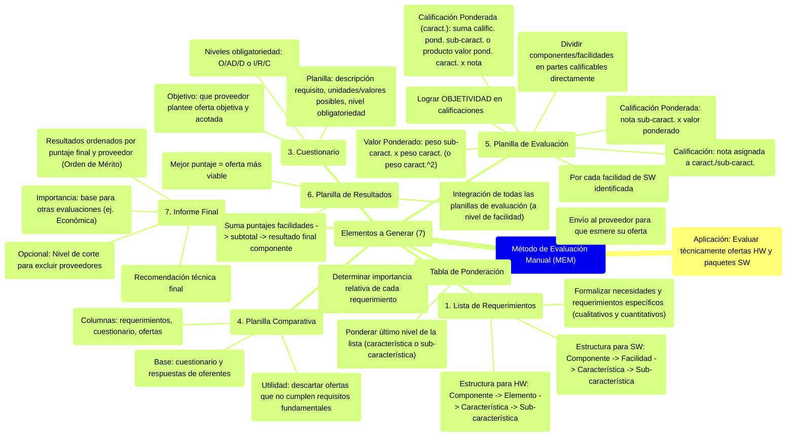

# 4. Método de Evaluación Manual (MEM)

[< Volver al Índice Principal](./00_indice_unidad_2.md)

## Método de Evaluación Manual (MEM)

El **M**étodo de **E**valuación **M**anual (MEM) se aplica en forma común para evaluar **técnicamente** ofertas de HW y de paquetes de SW.

Los elementos que se deben generar a fin de poder llegar a materializar el sistema de la aplicación del método de evaluación manual son 7:

1. Lista de requerimientos  
2. Tabla de ponderación  
3. Cuestionario  
4. Planilla comparativa  
5. Planilla de evaluación  
6. Planilla de resultados  
7. Informe final

**1- Lista de Requerimientos**  
Una vez realizada la detección de las necesidades, y la determinación de los requerimientos específicos **(parámetros cualitativos y cuantitativos)** se hace necesario formalizar en cuanto a la elaboración de una lista que refleje el conjunto de dispositivos de hardware y software necesarios para la implementación. 

Si el canal de obtención de SW es la adquisición de un paquete estándar, debido a la gran cantidad y diversidad de ofertas que pueden llegar a presentarse en el proceso de adquisición, se hace necesario establecer una estructura que permita agrupar los requisitos del SW en distintos niveles de la siguiente manera:

1 – Componente 1 – SW....  
1.1 – Facilidad 1  
1.2 – Facilidad 2  
1.2.1 – Característica 1  
1.2.2 – Característica 2  
1.2.2.1 – Sub-característica 1  
1.2.2.2 – Sub-característica 2  
1.2.2.3 – Sub-característica 3

2 – Componente 2 – HW  
2.1 – Elemento 1  
2.2.1 – Característica 1  
2.2.1.1 – Sub-característica 1  
2.2.1.2 – Sub-característica 2  
2.2.1.3 – Sub-característica 3  
2.2.2 – Característica 2  
2.2 – Elemento 2

**2- Tabla de Ponderación**  
Una vez determinados los parámetros se debe efectuar la respectiva ponderación de los mismos. Sobre la base de la lista de requerimientos, se debe determinar la importancia relativa que tiene cada requerimiento con respecto a los demás, y en función de esta diferencia se los pondera. La ponderación entonces deberá ser establecida sólo al último nivel de la lista de requerimiento, sea esta una característica o sub-característica.

El envío de la tabla de ponderación al proveedor, le permite esmerarse en la definición del paquete a ofertar teniendo en cuenta las facilidades de software que tengan mayor peso.

**3- Cuestionario**  
Consiste en una planilla que contiene en su primera columna la descripción de cada requisito de SW solicitado en la lista de requerimientos. En esta, se procede a asentar a cada característica y sub-característica de la lista de requerimientos indicando las unidades y/o valores posibles para cada característica y sub-característica. Por ej.: "Mbps" o "Sí/No" o "GHz", etc. 

En una segunda columna el nivel de obligatoriedad de cada característica y sub-característica. Los posibles niveles de obligatoriedad son:

1. Sistema de prioridades Obligatorio (O), Altamente Deseable (AD), Deseables (D)  
2. Sistema de prioridades Imprescindibles (I), Recomendables (R), Convenientes (C)

Cada una de ellas con una connotación distinta dentro del proceso de evaluación.

La confección de Cuestionarios obliga a que el proveedor plantee su oferta lo más objetiva y acotada posible, en función a las necesidades planteadas.

![][image31]

**4- Planilla Comparativa**  
Sobre la base del cuestionario, y luego de haber recibido las respuestas de los oferentes (ofertas), se elabora una planilla comparativa por cada oferta y para cada facilidad. Es decir, la primera columna es la lista de requerimientos, la segunda el cuestionario, y cada una de las columnas siguientes representan a las ofertas. 

Esta planilla se completa volcando lo que cada oferta propone para cada característica y sub- característica. La utilidad de esta planilla es sumamente importante pues se usa para descartar aquellas ofertas que no cumplen con los requisitos fundamentales, y evitar que prosigan en la etapa de evaluación.

![][image32]

**5- Planilla de evaluación**  
Se debe confeccionar una planilla de evaluación por cada facilidad de SW que se identifique en la lista de requerimientos que se confecciona. Es necesario confeccionar estas Planillas de Evaluación tratando de lograr **OBJETIVIDAD en las calificaciones.**

Cada componente o facilidad no puede ser calificado en forma directa. Para que la calificación que reciban tenga cierta objetividad, se deben dividir a estos en partes que sí se puedan calificar en forma directa y con objetividad.

**Valor Ponderado:** Es el valor obtenido de multiplicar el peso de una sub-característica por el peso de la característica respectiva. Si no hay sub-características, el valor ponderado es igual al cuadrado del peso de la característica.

**Calificación:** Nota asignada a una característica /sub-característica, en función al análisis de las ofertas del Cuestionario.

**Calificación Ponderada:** Valor que surge de multiplicar la nota de una sub-característica por su correspondiente valor ponderado.

La calificación ponderada a nivel de característica será:

* La suma de las calificaciones ponderadas de las subcaracterísticas, o bien  
* El producto del valor ponderado de la característica por la nota respectiva (si no está desagregada en sub-características)

**6- Planilla de resultados**  
La planilla de resultados deberá reflejar la integración de todas las planillas de evaluación, al nivel de facilidad. El que tenga mejor puntaje, será la oferta más viable.

Sumando en la planilla de evaluación el puntaje de cada facilidad, se obtiene un subtotal. Estos subtotales se suman en otra planilla obteniéndose el resultado final. Cuando se agotan todas las facilidades de SW se hace un subtotal para ese componente. Es decir, se tendrá una planilla de resultado que integre los resultados parciales de las facilidades del componente SW.

**7- Informe Final**  
Permite reflejar la recomendación técnica final que surja del análisis de todo el proceso de evaluación y sus correspondientes resultados, ordenándolos por Puntaje final obtenido y el nombre del proveedor. A esto último se le conoce como **Orden de Mérito.**

Es importante su confección ya que seguramente estos resultados serán tomados por otros equipos que continuarán aplicando evaluaciones orientadas a otros aspectos, como por ejemplo el Económico.

Algunos equipos de evaluación técnica, suelen establecer antes del proceso un valor denominado nivel de corte, que permita excluir a aquellos proveedores que hubieran obtenido puntuaciones finales por debajo de esta franja.

---

Siguiente: [5. Alternativas para el pago de las adquisiciones](./05_alternativas_pago_adquisiciones.md) 