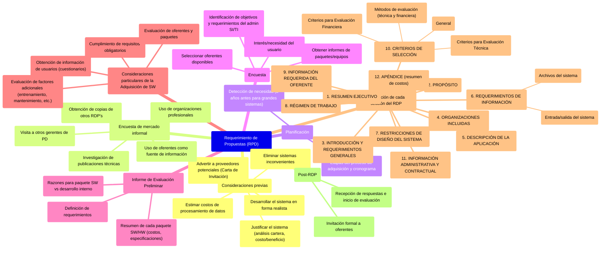

# 6. Requerimiento de propuestas (RPD)

[< Volver al Índice Principal](./00_indice_unidad_2.md)

## Requerimiento de propuestas (RPD) {#requerimiento-de-propuestas-(rpd)}

**Consideraciones previas**
Dentro de la primera etapa de un proceso de compra de SW y HW (Estudio de solución y determinación de los criterios) se deben efectuar el estudio de factibilidad de la solución y definir las necesidades de tecnología de SI. Así se debe:

* **Eliminar sistemas inconvenientes:** eliminar sistemas inadecuados, concentrando el esfuerzo en aquellos que se consideren aceptables.
* **Estimar los costos de procesamiento de datos:** un cálculo de capital y de costos de ejecución de procesamiento de datos.
* **Justificar el sistema:** Debe realizarse el análisis de la cartera de aplicaciones y las estrategias genéricas. Así también se deben indicar las razones económicas para las soluciones. Análisis de costos/beneficios). Es decir, deben estar justificadas y factibles
* **Desarrollar el sistema en forma realista:** El RDP debe ser realista en el sentido de que se tendrá en cuenta el potencial real tanto del equipo como de la tecnología disponible.
* **Advertir a los proveedores potenciales:** es conveniente dar aviso previo a los posibles oferentes, a fin de que cuenten con tiempo para preparar ofertas serias. Esto suele implementarse a través de la denominada "Carta de Invitación".

**Encuesta de mercado informal**
Se realizará luego de ser conocida la necesidad de un nuevo sistema.

Tal encuesta ayudará también a refinar las consideraciones cualitativas y cuantitativas inherentes a la obtención del nuevo sistema. Sólo después de efectuada esta encuesta pueden armonizarse eficiente e inteligentemente las necesidades del comprador con los sistemas disponibles. La encuesta ahorrará tiempo futuro, y debe comprender las siguientes actividades:

* Obtención de copias de otros RDP's: De organizaciones similares
* Visita a otros gerentes de procesamiento de datos (PD)
* Uso de organizaciones profesionales: Asociarse a las organizaciones profesionales permite compartir conocimientos técnicos y profesionales, así como contactarse con los fabricantes.
* Investigación de publicaciones técnicas especializadas: Las publicaciones pueden ofrecer información detallada y comparativa acerca de los sistemas actuales de PD, y de los problemas de administración asociados a ellos.
* Uso de los oferentes de computadoras como fuente de información: Los oferentes brindan mucha información sin costo alguno, y pueden ofrecer demostraciones de casi todos los temas que se deseen.

**Planificación**
Es necesario planificar las etapas del proceso de adquisición y elaborar el cronograma respectivo.

La mejor planificación ocurre cuando se detecta la necesidad del reemplazo aproximadamente 2 años antes de que se efectúe el reemplazo real. El plazo de dos años es para grandes sistemas. No obstante, los plazos dependerán de las prioridades empresariales, tiempos de cada organización, de la dimensión de los cambios y plataformas y del tiempo de vida útil que el administrador de los recursos - a través del monitoreo y evaluación del sistema actual- considere que reste antes del reemplazo.

**Encuesta**
Debe establecerse el interés del usuario por, o su necesidad de, la nueva aplicación. El administrador de las SI/TI debe tener una clara comprensión de los objetivos de la organización, así como de los objetivos y necesidades del usuario.

Una vez realizado esto, el administrador de las SI/TI debe identificar sus propios objetivos y requerimientos y asegurarse de que no existe en la organización un sistema similar.

Seleccionar todos los oferentes disponibles que ofrecen paquetes de SW y/o HW que satisfagan los requerimientos.

Obtener informes que analicen los paquetes/equipos que se están considerando. Es caro evaluar un gran número de sistemas. Consecuentemente, es importante eliminar candidatos lo más rápidamente posible, de manera que la evaluación total se aplique a un pequeño número de sistemas.

**Informe de Evaluación Preliminar**
Como resultado de la encuesta preliminar, el responsable técnico debe preparar un informe preliminar que incluya:

* Definición de los requerimientos del paquete/equipo.
* Razones por las cuales se recomienda un paquete de SW, en vez de su desarrollo interno.
* Resumen de cada paquete de SW que incluya costos, especificaciones y características. (Ídem para el HW).

**Consideraciones particulares de la Adquisición de SW**
En el proceso de adquisición de SW, es importante determinar si el SW propuesto cumple con los requisitos obligatorios. La esencia de un requisito obligatorio es que excluye totalmente a aquellos sistemas de SW que no lo contengan. La selección de los sistemas a considerar es la primera parte del proceso de evaluación.

Además de evaluar las características y capacidades funcionales de los sistemas a considerar, deben tomarse en cuenta otros factores, tales como entrenamiento, mantenimiento, apoyo en la instalación, documentación, flexibilidad, implementación y operación del sistema de SW dentro de la organización. Para hacer posible la consideración de estos factores, es necesario evaluar tanto a los oferentes como a los paquetes.

También es beneficioso obtener información de usuarios que han instalado los sistemas que se consideran, lo cual se puede hacer desarrollando un cuestionario del usuario y un cuestionario del vendedor de paquetes de SW.

En la evaluación de usuario se deben hacer preguntas respecto a: Operación, confiabilidad, mantenimiento, performance, flexibilidad, instalación, costos, seguridad, documentación, etc.

En la evaluación de vendedor se deben hacer preguntas respecto a: Uso de paquete de aplicación (nombre, fecha de creación, cantidad de organizaciones que lo usa, etc.), documentación, modificación del paquete (si hay planeadas, si se pueden hacer), costos, operaciones, instalación y mantenimiento, seguridad, descripción de la empresa vendedora, otras garantías, tipos de contrato.

### Descripción de cada sección del RDP {#descripción-de-cada-sección-del-rdp}

**1\. RESUMEN EJECUTIVO**
Aunque esta es la primera sección que se presenta, debe ser la última redactada. Es un resumen del contenido del RDP, y no se lo puede hacer con propiedad hasta que se lo ha redactado. Debe contener una breve descripción de la empresa, sus operaciones y requerimientos de sistema. El resumen debe afirmar explícitamente que es un panorama general del RDP, y que el oferente no debe considerarse como sustituto del RDP (o de **cualquiera de sus subsecciones).**

**2\. PROPÓSITO**
Esta sección debe considerar 3 tópicos esenciales. Primero, debe discutir la estructura básica y objetivos generales del RDP. Debe incluir ítems tales como los elementos principales del RDP, las expectativas explícitas referentes a la respuesta del oferente, y los objetivos principales de la adquisición propuesta.

Segundo, debe identificar el departamento/oficina/división de la empresa que emitió el RDP, incluyendo el nombre y dirección al cual se deben dirigir todas las propuestas y preguntas relacionadas. Debe también identificar el departamento/persona(s) responsables de decidir respecto de los méritos y aceptación de las propuestas.

Finalmente, debe establecer el alcance del RDP. En otras palabras, debe definir exactamente lo que el RDP pretende ser, y las limitaciones implícitas en su estructura o contenido.

**3\. INTRODUCCIÓN Y REQUERIMIENTOS GENERALES**
Esta sección debe comenzar con una breve descripción general del negocio en que opera su compañía, y la extensión de sus operaciones.

En segundo lugar, esta sección debe discutir las funciones que se van a realizar por medio de o de las operaciones a ser soportadas por el sistema propuesto.

Finalmente, se deben identificar y definir los requerimientos generales del sistema propuesto. Además de las funciones y/o capacidades requeridas, esta sección debe especificar los elementos (HW-SW-Servicio) del sistema propuesto, que la gerencia espera que el proveedor suministre.

Deben identificarse todos los requerimientos mayores, pese a que la descripción puede (y posiblemente debe), indicar al oferente a las sub secciones apropiadas del RDP para los detalles.

**4\. ORGANIZACIONES INCLUIDAS**
Aquí se deben identificar los departamentos o divisiones de la compañía que utilizarán el sistema propuesto, incluyendo las funciones generales y responsabilidades de los departamentos identificados y su interrelación.

Implícitamente se identificarán las demandas que cada departamento hará sobre el sistema propuesto. El objetivo de esta sección es brindar al proveedor toda la información referente a las operaciones de la empresa, lo cual le ayudará al oferente a proveer un sistema con la máxima eficiencia operativa, al menor costo.

Cuanta más información se ofrezca al oferente, mayor es la garantía de recibir un sistema que satisfaga todas las expectativas.

**5\. DESCRIPCIÓN DE LA APLICACIÓN**
Esta es una de las secciones más importantes del RDP. Es esencial que exista el mayor nivel de detalle. Deben incluirse todos los detalles que puedan ayudar al oferente a comprender las operaciones y requerimientos.

Se debe presentar en primer lugar una descripción del flujo general de información en la empresa; es recomendable mostrar un diagrama de flujo con puntos descriptivos.

Debe seguir una descripción detallada de cada subsistema de aplicación.

Las descripciones deben ser acompañadas por diagramas, diagramas de flujo, explicaciones y ejemplos de entradas y salidas. Además, deben detallarse totalmente las metodologías de cálculo, y las presunciones usadas en la metodología.

Esta sección debe describir también el/los sistemas/s a ser utilizado hasta que el sistema propuesto sea operativo, su limitación, sus similitudes y diferencias con el sistema propuesto, y la manera en que va a ocurrir la transición a éste.

Finalmente, deben tratarse a fondo todos los aspectos particulares (por ejemplo: integridad y seguridad de los datos y del sistema, etc.).

**6\. REQUERIMIENTOS DE INFORMACIÓN**
En esta sección debe detallarse todos los elementos de información del sistema (archivos, tablas, bases de datos, objetos), así como las operaciones de entrada/salida.

**Archivos del sistema:** para cada uno debe especificarse:

* Nombre y Propósito (por ejemplo: de oferentes, de clientes, etc.)
* Tipificación de los Elementos de datos que va a contener cada
* Tamaño/ cantidad de registros
* Restricciones de acceso
* Requerimientos y restricciones para la actualización
* Frecuencia de uso/ actualización

**Entrada/salida del sistema:** Legibles por la máquina. Deben identificarse todas las entradas y salidas que deben estar en forma legible para la máquina, y debe especificarse esa forma. Por ejemplo, puede desearse pasar las transacciones contables diarias a archivos de cinta.

**7\. RESTRICCIONES DE DISEÑO DEL SISTEMA**
Aquí se establece el tamaño actual y el crecimiento esperado de las operaciones de la empresa.

El propósito es cuantificar y/o calificar las expectativas de manejo del sistema propuesto en términos de crecimiento y flexibilidad. Esta información es vital para el oferente, a fin de determinar los requerimientos de SW, el tamaño del HW y los servicios correspondientes (es decir, mantenimiento y entrenamiento).

La discusión de estas expectativas y restricciones debe estar dividida en categorías individuales, tales como performance general, hardware (computador y periféricos), software del sistema y de aplicación, comunicaciones, etc. Dentro de cada categoría se debe distinguir entre capacidades obligatorias, altamente deseables y deseables (o bien entre imprescindibles, recomendables y convenientes). Deben definirse claramente los parámetros usados (especialmente las restricciones cualitativas como confiabilidad, facilidad de operación y calidad de servicio) para evitar posibles confusiones y ambigüedades.

Otras cuestiones a incluir en esta sección, relacionadas con restricciones de diseño y expectativas, son: entrenamiento, mantenimiento (tiempos y disponibilidad), finanzas y técnicas de evaluación.

**8\. RÉGIMEN DE TRABAJO**
El propósito de esta sección es identificar y describir los servicios que deseamos comprar al oferente más allá del sistema básico.

Es decir, en esta sección se debe identificar, especificar y definir claramente el alcance y límites de las responsabilidades del oferente, para evitar confusiones, ambigüedades y posteriores discusiones y debe incluir todas las tareas obligatorias a ser cumplidas por el vendedor.

a) El vendedor debe proveer un plan detallado del proyecto de todo el trabajo a realizar

b) El vendedor debe desarrollar y entregar para su revisión el diseño lógico detallado para el sistema propuesto. El diseño y la correspondiente documentación incluirán descripción de las entradas, procesamiento, salidas, elementos de datos, relaciones entre programas y relaciones entre todos los elementos de datos y todos los programas. El vendedor debe proveer también una capacidad de backUp manual que permita que las operaciones sean sólo mínimamente alteradas en caso de mal funcionamiento del sistema. También se proveerán las medidas que aseguren la seguridad e integridad de los datos.

c) El vendedor debe desarrollar y entregar para su revisión los diseños físicos detallados para el sistema propuesto. El diseño y la correspondiente documentación describirán la relación del diseño lógico con el HW y el SW de sistema del sistema.

d) El vendedor debe desarrollar e instalar SW y documentación para el sistema propuesto. El sistema operará en la computadora del usuario y será compatible con los sistemas relacionados existentes. La documentación incluirá por lo menos:

* Programa fuente y otra información requerida y la documentación de programas necesaria para permitir el mantenimiento y modificaciones por parte del personal del usuario.
* Procedimientos de uso y operación del sistema. La documentación debe ser fácil de usar y comprender y fácil de actualizar. Los procedimientos deben contener todos los procedimientos manuales necesarios para la operación del sistema, así como controles de seguridad.
* Materiales de entrenamiento para asistir al personal del usuario en el entrenamiento para el uso, operación y mantenimiento del sistema.

h) El vendedor debe desarrollar un programa de entrenamiento incluyendo por lo menos lo siguiente:

i) El vendedor debe brindar apoyo técnico para el uso operativo del sistema propuesto durante los primeros 3 meses de operación. El apoyo técnico incluirá ayuda en el uso, operación y mantenimiento del sistema. El vendedor solucionará cualquier problema que ocurra durante este período, debido a los materiales por él provistos.

j) El vendedor debe brindar apoyo de mantenimiento para todo el SW de aplicación. (O HW provisto)

**9\. INFORMACIÓN REQUERIDA DEL OFERENTE**
Este es un resumen ejecutivo de esta sección particular del RDP. Se usa para describir la información y el formato general de la presentación que queremos que el oferente brinde en sus respuestas.

* General: Esta sección específica el contenido de la respuesta general
* Software del sistema: Aquí se requiere la respuesta
* Software de aplicación: Generalmente, esta sección específica requerimientos de respuesta similares a aquellos que se listaron en "Software del sistema".
* Preparación del terreno: A menudo se incluye esta sección en la de HW (Características del HW).
* Apoyo del oferente: capacitación, mantenimiento, etc.
* Datos financieros
* Instalación
* Tabla de evaluación: Generalmente, esto se refiere exclusivamente al HW y SW del sistema. Usualmente se especifica una tabla de evaluación completa (cuyo contenido y formato deben especificarse en la sección Restricciones de Diseño del RDP) para cada sistema propuesto por el oferente.
* Visita de demostración en el lugar: Los requerimientos recomendados incluyen una descripción de la demostración propuesta y una lista de lugares posibles para la demostración.
* Cronograma del Proyecto: Los requerimientos recomendados incluyen fechas estimadas para entrega, instalación, prueba e implementación de cada elemento del HW, SW del sistema y SW de aplicación, con la fecha de otorgamiento del contrato considerada como día cero.

**10\. CRITERIOS DE SELECCIÓN**

* **General**: Esta subsección enuncia explícitamente que el objetivo del proceso de evaluación es asegurar la selección de un sistema que mejor se adecue a las necesidades (presentes y futuras) de la empresa y que satisfaga todos los requerimientos especificados en el RDP.
* **Métodos de evaluación a usarse**: El propósito de esta subsección es identificar las 2 áreas de evaluación (técnica y financiera) y sus pesos relativos en la decisión final (generalmente se le asignan pesos relativos iguales).
* **Criterios para la Evaluación Técnica**: Se describe el procedimiento de evaluación técnica.
* **Criterios para la Evaluación Financiera**: Esta subsección debe especificar los métodos usados para evaluar las implicaciones financieras de la propuesta del oferente. Los métodos usuales empleados son una combinación del análisis del valor actual, del impacto del presupuesto de capital en el comprador, y de la medida en la cual la propuesta es compatible con las restricciones presupuestarias del comprador.

**11\. INFORMACIÓN ADMINISTRATIVA Y CONTRACTUAL**
El propósito de esta sección es establecer explícitamente las implicaciones legales y contractuales del RDP (y/o de la respuesta del oferente) y todos los descargos del emisor del RDP. Esta sección debe contener los siguientes tópicos:

Propuestas del oferente, Rechazo de propuestas, Costos incurridos, Agregados al RDP, Fecha de la respuesta, Propuestas múltiples, Aceptación del Contenido de la Propuesta, Economía en la Preparación, Presentación Oral, Responsabilidad primaria del contratista, Difusión de Noticias, Programa de actividades, Acuerdos Estándar Negociados, Propuesta de Cotización de Precio de Alquiler/Compra, Visitas a Usuarios, Confidencialidad de la Información, Registros Públicos, Provisiones Contractuales, Revisiones subsiguientes.

**12\. APÉNDICE**
El apéndice debe incluir la especificación de contenido y formato del resumen de costo(s). Para cada alternativa financiera se debe solicitar un resumen por separado (para alquiler; alquiler/compra; compra directa, etc.). Cada resumen debe dividirse en:

* **Plan financiero:** El plan financiero debe incluir la duración del período de renta, período de cancelación y precio de compra.
* Costos de HW
* Costos de SW del Sistema y de Aplicación
* Costos de Capacitación y Entrenamiento

Luego de la elaboración del RDP, se debe efectuar la invitación formal a los oferentes.

Recibidas las respuestas, se inicia el proceso de evaluación propiamente dicho.

---

Anterior: [5. Alternativas para el pago de las adquisiciones](./05_alternativas_pago_adquisiciones.md)
Siguiente: [7. Provisión de RRHH (Chiavenato)](./07_provision_rrhh_chiavenato.md)