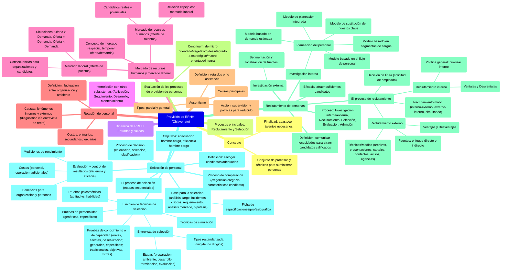

# 7. Provisión de RRHH (Chiavenato)

[< Volver al Índice Principal](./00_indice_unidad_2.md)

## Provisión de RRHH (Chiavenato) {#provisión-de-rrhh-(chiavenato)}

Conjunto de procesos y técnicas que suministran las personas que se integrarán a la organización. Su finalidad es abastecer a la organización con los talentos humanos necesarios para su funcionamiento.

***|Nota| RECURSOS HUMANOS** → Conjunto de proceso y técnicas que se destina a como obtengo las personas que se INTEGRARÁN a la org, a mi cultura, la tecnocracia, etc. Su finalidad es abastecer a los talentos que tiene que estar en mi org y que son los que requiero **para el funcionamiento que yo planifiqué.***

***![][image33]***

***![][image34]***

Los dos grandes procesos de la provisión van a ser EL RECLUTAMIENTO Y LA SELECCIÓN, después tengo una zona media borrosa que me daría las confirmaciones a aspectos de salud, etc para que la admisión sea definitiva.

Nos interesa el hecho de que los recursos humanos ingresan en el sistema y salen de él, generando una dinámica especial. Los RRHH, entran y salen de las organizaciones. No son recursos estables, incluso se pueden ir moviendo de áreas.

![][image35]

*EL PROCESO DE PROVISIÓN SE ALIMENTA DE APLICACIÓN DE RR A TRAVÉS DE LA FICHA DE CARGO, a su vez el de provisión le da a aplicación le da las personas.*

*Provisión le da las personas a evaluar (las que ingresan) al de Seguimiento (evaluación de desempeño, para ver cómo se integran) y el de Seguimiento le da el resultado de evaluacion, me dice que tan bien seleccione*

*DESARROLLO Y MANTENIMIENTO LE DA VACANTES Y LAS políticas salariales, posibilidades de carrera, etc a Provisión. La provisión le da las necesidades inmediatas de condición y desarrollo (capacitación) al desarrollo y mantenimiento.*

### Mercado de recursos humanos y mercado laboral {#mercado-de-recursos-humanos-y-mercado-laboral}

El concepto de **mercado** presenta tres aspectos importantes:

* **Dimensión espacial***.* Todo mercado se caracteriza por un área física, geográfica o territorial. (Los mercados varían de lugar en lugar).
* **Dimensión temporal***.* Todo mercado depende de la época. En épocas diferentes, un mismo mercado puede presentar características distintas.
* **Dimensión de oferta y demanda***.* Todo mercado se caracteriza por la oferta y la disponibilidad de algo y, al mismo tiempo, por la demanda y la búsqueda de algo. Si la oferta es mayor que la demanda, el producto o servicio es fácil de obtener y se presenta competencia entre los vendedores o entre quienes ofrecen ese producto o servicio. Si la demanda es mayor que la oferta, entonces la situación se invierte, y el producto o servicio se constituye en algo de difícil adquirir; en este caso, se presenta competencia entre los compradores o entre quienes necesitan ese producto o servicio.

En términos de suministro de recursos humanos, existen dos tipos de mercados diferentes, aunque estrechamente entrelazados e interrelacionados: **el mercado laboral (OFERTA de puestos) y el mercado de recursos humanos (OFERTA de talentos).**

.![][image36]![][image37]

![][image38]

#### ***Mercado laboral***

Está conformado por las ofertas de trabajo o de empleo hechas por las organizaciones en determinado lugar y época. En esencia, lo definen las organizaciones y sus oportunidades de empleo.

El mercado laboral se comporta en términos de oferta y demanda, es decir, disponibilidad de empleos y demanda de empleos, respectivamente. Como puntos de referencia, se presentan a continuación las tres posibles situaciones del mercado laboral:

**Oferta mayor que la demanda**: las ofertas de empleo de las organizaciones exceden al número de candidatos para satisfacerlas.

*Consecuencias para las organizaciones:*

* Elevadas inversiones en reclutamiento
* Criterios de selección más flexibles y menos rigurosos
* Elevadas inversiones en capacitaciones del personal
* Ofertas salariales más seductoras, lo que ocasiona distorsiones en la política salarial de la organización
* Elevadas inversiones en beneficios sociales, tanto para atraer candidatos como para conservar el personal existente
* Énfasis en el reclutamiento interno
* Fuerte competencia entre las organizaciones que disputan el mismo mercado de recursos humanos
* Los recursos humanos se convierten en un recurso difícil y escaso

  *Consecuencias para los candidatos:*

* Exceso de oportunidades de empleo
* Los candidatos seleccionan las organizaciones que les ofrezcan los mejores cargos, salarios, etc.
* Aumenta la rotación ya que las personas se predisponen a salir de sus organizaciones para probar oportunidades mejores
* Las personas se sienten dueñas de la situación y comienzan a pedir aumentos salariales, mejores beneficios sociales, se vuelven indisciplinadas, hay ausentismo, etc.

**Oferta igual a la demanda***.* Situación de relativo equilibrio entre el volumen de ofertas de empleo y el volumen de candidatos para satisfacerlas

**Oferta menor que la demanda***.* Situación en que las ofertas de empleo hechas por las organizaciones son pocas; hay escasez de ofertas de empleo y exceso de candidatos para satisfacerlas.

*Consecuencias para las organizaciones*

* Bajas inversiones en reclutamiento
* Criterios de selección más rígidos y rigurosos
* Bajas inversiones en capacitación, ya que la organización puede aprovechar candidatos ya capacitados
* Pueden hacer ofertas salariales más bajas
* Bajas inversiones en beneficios sociales
* Énfasis en el reclutamiento externo como medio para mejorar el potencial humano
* No hay competencia entre las organizaciones en cuanto al mercado de recursos humanos
* Los recursos humanos se convierten en un recurso fácil y abundante que no requiere atención especial

  *Consecuencias para los candidatos*

* Escasez de vacantes
* Compiten entre sí por las pocas vacantes que surgen
* Buscan afianzarse en las organizaciones
* Se vuelven más disciplinados y procuran no faltar al trabajo ni atrasarse

#### ***Mercado de recursos humanos***

Lo define el sector de población que está en condiciones de trabajar o está trabajando, es decir, el conjunto de personas empleadas (mercado de RH aplicado) o desempleadas (mercado de RH disponible) y aptas para trabajar. Se trata de **candidatos reales** cuando están buscando alguna oportunidad, estén empleados o no, y son **candidatos potenciales** cuando \-aunque no estén buscando empleo- están en condiciones de desempeñarlo a satisfacción.

En teoría, **el mercado de recursos humanos actúa como un espejo del mercado laboral:** cuando uno está en oferta, el otro está en demanda, y viceversa. La oferta de un mercado corresponde a la demanda de otro, y viceversa. Es decir, los dos son sistemas en constante interrelación: la salida *{output)*} de uno es la entrada *(input)* del otro, y viceversa.

### Rotación de personal {#rotación-de-personal}

El término rotación de recursos humanos se utiliza para definir la fluctuación de personal entre una organización y su ambiente.
![][image39]

En general, la rotación de personal se expresa mediante la relación porcentual entre las admisiones y los retiros, y el promedio de trabajadores que pertenecen a la organización en cierto periodo.

Si en niveles vegetativos la rotación es provocada por la organización para hacer sustituciones orientadas a mejorar el potencial humano existente, a reemplazar una parte de sus recursos humanos por otros recursos de mejor calidad existentes en el mercado, entonces la rotación se halla bajo el control de la organización. Sin embargo, cuando las pérdidas de recursos no son provocadas por la organización, es decir, cuando se presentan independientemente de los objetivos de esta, resulta esencial establecer los motivos que provocan la desasimilación (desincorporación) de los recursos humanos, para que la organización pueda actuar sobre aquellos y disminuir el volumen de retiros inconvenientes.

![][image40]![][image41]

#### ***Diagnóstico de las causas de rotación de personal***

La rotación del personal no es una causa sino un efecto, consecuencia de ciertos fenómenos localizados en el interior o el exterior de la organización que condicionan la actitud y el comportamiento del personal. **Es una variable dependiente de los fenómenos internos y/o externos**.

Como **fenómenos externos** pueden citarse la situación de oferta y demanda de recursos humanos, la situación económica, las oportunidades de empleo, etc. Entre los **fenómenos internos** pueden mencionarse la política salarial y de beneficios sociales de la organización, el tipo de supervisión, etc.

La información correspondiente a estos fenómenos internos y externos se obtiene mediante entrevistas de retiro.

La entrevista de retiro abarca el motivo de retiro y opiniones acerca de los siguientes puntos: la empresa, el cargo que ocupaba, su jefe directo, horarios, condiciones físicas, beneficios sociales, salario, relaciones humanas, oportunidades de progreso, moral y actitud de compañeros, mercado laboral.

#### ***Determinación del costo de la rotación de personal***

![][image42]
**Costos primarios de la rotación de personal.** Se relacionan directamente con el retiro de cada empleado y su reemplazo por otro. Incluye:
**Gastos secundarios de la rotación de personal.** Abarcan aspectos intangibles difíciles de evaluar en forma numérica porque sus características son cualitativas en su mayor parte
**Costos terciarios de la rotación de personal.** Se relacionan con los efectos colaterales mediatos de la rotación, que se manifiestan a mediano y a largo plazos. En tanto los costos primarios son cuantificables y los costos secundarios son cualitativos, los costos terciarios son solo estimables. Entre dichos costos se cuentan:

1. **Costo de inversión extra**: Aumento proporcional de las tasas de seguros, depreciación de equipo, mantenimiento y reparaciones con respecto al volumen de producción. Aumento del volumen de salarios pagados a los nuevos empleados y, por tanto, incremento de reajustes a los demás empleados cuando la situación del mercado laboral es de oferta, lo que intensifica la competencia y la oferta de salarios iníciales más elevados en el mercado de recursos humanos.
2. **Pérdidas en los negocios:** Se reflejan en la imagen y en los negocios de la empresa, ocasionadas por la falta de calidad de los productos o servicios prestados por empleados inexpertos en periodo de ambientación.

#### ***Ausentismo***

Es la suma de los períodos en que, por cualquier motivo, los empleados se retardan o no asisten al trabajo en la organización. Entre las principales causas están:

* Enfermedad comprobada; o no comprobada
* Diversas razones de carácter familiar
* Tardanzas involuntarias por motivos de fuerza mayor
* Faltas voluntarias por motivos personales
* Dificultades y problemas financieros
* Problemas de transportes
* Baja motivación para trabajar
* Escasa supervisión de la jefatura
* Políticas inadecuadas de la organización

Una vez diagnosticadas las causas del ausentismo, debe efectuarse una acción coordinada de supervisión con el debido apoyo de políticas de la organización y apoyo de la dirección para *tratar de reducir los niveles de ausencia y tardanzas del personal.*

Puedo tener:

* **Ausentismo parcial** (faltas, retrasos)
* **Ausentismo general** (vacaciones, licencias, es un periodo más prolongado). Esta puede ser una necesidad de aprovisionarse de personas, osea puedo tener una rotación de personal por ausencia si es que su puesto no puede quedarse vacío.

### Evaluación de los procesos de provisión de personas {#evaluación-de-los-procesos-de-provisión-de-personas}

| ![][image43] |  |
| ----- | ----- |
| Lado izquierdo **Micro orientado:** pues se halla dirigido hacia el cargo que se quiere ocupar y nada más. **Vegetativo:** porque se orienta al mantenimiento del status quo, con el simple cubrimiento de vacantes.  **Desintegrado:** porque cada demanda de una vacante es una tarea particular y aislada de las demás. | Lado derecho **Estratégicos:** porque la planeación organizacional se lleva a cabo con miras al presente y al futuro y se orienta a largo plazo y al destino de la organización y de las personas que la conforman.  **Macro orientado:** porque cada demanda forma parte de una visión organizacional amplia y global. De ahí también se deriva su carácter integral y amplio. |
| El desafío está en el desplazamiento gradual y definitivo del extremo izquierdo hacia el extremo derecho del *continuum.* |  |

### Reclutamiento de personas {#reclutamiento-de-personas}

**PROCESO DE PROVISIÓN** *\[las etapas son secuenciales\]*

* Investigación Interna y Externa *\[Chiavennato lo explica dentro de reclutamiento, en clase lo vimos como etapa\].*
* Reclutamiento.
* Selección.
* Evaluación → exámenes médicos, antecedentes penales, etc.
* Admisión.

***¿Qué sentido tiene la "obligatoriedad" del requisito?** Limitar la cantidad de candidatos y gente que va a pasar a la selección. Porque las etapas posteriores son más minuciosas y caras.*

***¿Cuando un proceso de reclutamiento es eficaz?** Cuando atrae suficientes candidatos para abastecer adecuadamente al proceso de selección*

**El Reclutamiento funciona como un embudo (contra los requisitos excluyentes/obligatorios).** Es el proceso que comunica la necesidades de perfiles a un segmento del  mercado laboral para atraer a los candidatos potencialmente calificados. Comunica que cargos están disponibles, que vacantes tengo en mi org.
![][image44]
Consiste en:

**Una investigación interna:** verificación continua de que necesidad que voy a tener en el corto-mediano-largo plazo.
**Una investigación externa:** analizar el mercado laboral para entroncar los perfiles que busco ⇒ segmentación del mercado y determinar las fuentes de reclutamiento
*¿Por qué fuentes?* Es en que lugar tengo esos posibles candidatos.
Puedo tenerlos dentro de mi org (**reclutamiento interno**)
O fuera de mí org (**reclutamiento externo**)
![][image45]
A partir de ahi recien puedo hablar de las técnicas de reclutamiento (convocatorias de pasantías, anuncio en mi página web que se aceptas cv, etc)

![][image46]

⇒ A través del reclutamiento la org divulga y ofrece al mercado de RRHH los empleos que pretende llenar. **Se comunican las necesidades de la organización.**

***|Nota| El insumo principal del proceso de provisión es la Planificación estratégica**  estrategias de SI/TI, Planes, Ubicación, Rol y Organización.*

#### ***Investigación interna*** {#investigación-interna}

Verificación de las necesidades de la organización respecto a sus necesidades de recursos humanos a corto, mediano y largo plazos para saber que requiere de inmediato y cuáles son sus planes futuros de crecimiento y desarrollo, que significarán nuevos aportes de recursos humanos. En muchas organizaciones, esta investigación interna se sustituye por un proceso más amplio denominado planeación de personal.

##### **Planeación del personal**

La planeación de personal es un proceso de decisión respecto de los recursos humanos necesarios para conseguir los objetivos organizacionales en un periodo determinado. Se trata de prever cuales serán la fuerza laboral y los talentos humanos necesarios para la realización de la acción organizacional futura.

Existen varios modelos de planeación; algunos son genéricos y abarcan toda la organización, otros son específicos para determinados sectores. Casi todos exigen la participación del órgano encargado de personal.

**Modelo basado en la demanda estimada del producto o servicio**

Las necesidades de personal son una variable dependiente de la demanda estimada del producto (en el caso de la industria) o del servicio (en el caso de una organización de servicios). La relación entre las dos variables \- número de personas y demanda del producto o servicio- está influida por variaciones en la productividad, la tecnología, la disponibilidad de recursos financieros internos o externos y la disponibilidad de personas en la organización.

**Modelo basado en segmentos de cargos**

Este modelo también se centra en el nivel operacional de la organización. Es una técnica de planeación de RH utilizada en muchas empresas de gran tamaño. Por ejemplo:

* Seleccionar un factor estratégico (nivel de ventas, capacidad de producción, planes de expansión, etc.) en cada área de la empresa
* Determinar los niveles históricos (pasado y futuro) de cada factor estratégico.
* Establecer los niveles históricos de fuerza laboral por área funcional.
* Proyectar los niveles futuros de fuerza laboral en cada área funcional, correlacionándolos con la proyección de los niveles (históricos y futuros) del factor estratégico correspondiente.

**Modelo de sustitución de puestos clave**

Se utiliza un modelo denominado mapas de sustitución u organigramas de carrera, que son una representación visual de quien sustituye a quien, en la organización, ante la eventualidad de que exista alguna vacante en el futuro.

Este estatus de los candidatos depende de dos variables: desempeño actual y posibilidad de ascenso.

**Modelo basado en el flujo de personal**

Intenta caracterizar el flujo de las personas hacia adentro de la organización, a través de ella y hacia fuera. Esto permite hacer una predicción a corto plazo de las necesidades de recursos humanos de la organización. Este modelo puede utilizarse también para predecir las consecuencias que podrían causar otras contingencias, como la política de promociones, rotación de personal, etc. Resulta muy útil para el análisis del planeamiento de carrera.

**Modelo de planeación integrada**

Es el modelo más amplio. Desde el punto de vista de insumos, la planeación de personal debe tener en cuenta cuatro factores o variables intervinientes:

1. Volumen de producción planeado
2. Cambios tecnológicos que alteran la productividad del personal
3. Condiciones de oferta y de demanda, y comportamiento de la clientela
4. Planeación de carreras en la organización

Desde el punto de vista del flujo interno, la planeación de personal debe considerar la composición cambiante de la fuerza laboral de la organización, haciendo un seguimiento o evaluando las entradas y las salidas de personal y su movimiento en la organización.

#### ***Investigación externa*** {#investigación-externa}

Es una investigación del mercado de RRHH orientada a segmentar y diferenciarlo para facilitar su análisis y su consiguiente estudio. Aquí sobresale la segmentación del mercado y la localización de fuentes de reclutamiento.

La ubicación correcta de fuentes de reclutamiento permite a la organización elevar el rendimiento del proceso de reclutamiento, disminuir su tiempo y reducir sus costos.

#### ***El proceso de reclutamiento*** {#el-proceso-de-reclutamiento}

El reclutamiento implica un proceso que varía según la organización. El comienzo del proceso depende de la decisión de línea. **Dado que el reclutamiento es una función de *staff,* sus actos dependen de una decisión de la línea**, que se oficializa mediante una especie de orden de servicio, generalmente denominada solicitud de empleado o solicitud de personal.

![][image47]

Cuando el órgano de reclutamiento la recibe verifica en los archivos si está disponible algún candidato adecuado, sino debe reclutar a través de las técnicas de reclutamiento más indicadas para el caso.

El mercado de recursos humanos presenta diversas fuentes que la empresa debe identificar y localizar con el propósito de atraer candidatos que suplan con sus necesidades. El mercado de los RRHH está compuesto por candidatos que pueden estar empleados o disponibles. Los dos tipos de candidatos pueden ser reales (están buscando trabajo o cambiar el que tienen) o potenciales (los que no están interesados).

##### **Reclutamiento interno**

Al presentarse determinada vacante, la empresa intenta llenarla mediante la reubicación de sus empleados, los cuales pueden ser ascendidos (movimiento vertical), transferidos (movimiento horizontal) o transferidos como promoción (movimiento diagonal).

El reclutamiento interno se basa en datos e informaciones relacionados con otros subsistemas:

* Resultados del candidato en pruebas de selección. (PROVISIÓN)
* Resultados de evaluaciones de desempeño. (SEGUIMIENTO)
* Resultados en programas de entrenamiento y perfeccionamiento. (DESARROLLO)
* Análisis del cargo que ocupa y que puede llegar a ocupar, para ver las diferencias. (APLICACIÓN)
* Planes de carreras del candidato. (APLICACIÓN)
* Condiciones de ascenso y de reemplazo (si ya hay alguien que ocupe el lugar que va a dejar) (APLICACIÓN)

| Ventajas | Desventajas |
| ----- | ----- |
| Es más económico y rápido  Presenta mayor índice de validez y seguridad . Les conozco las mañas y virtudes → mayor seguridad del potencial del candidato Poderosa fuente de motivación para los empleados  Aprovecha las inversiones de la empresa en entrenamiento de personal  Desarrolla un sano espíritu de competencia entre el personal | Exige que los empleados nuevos tengan condiciones de potencial de desarrollo para poder ascender y motivación suficiente para llegar allí.  Puede generar un conflicto de intereses ya que tienden a crear una actitud negativa en los empleados que no demuestran condiciones.  Cuando se maneja de manera incorrecta puede conducir al "principio de Peter": las empresas, al promover innecesariamente a sus empleados, los llevan siempre a la posición donde demuestran el máximo de su incompetencia.  Cuando se efectúa continuamente puede llevar a los empleados a una progresiva limitación de las políticas, ya que éstos, al convivir sólo con la situación de la organización, se adaptan a ellas y pierden creatividad e innovación.  No puede hacerse en términos globales dentro de la organización. Para no perjudicar el patrimonio humano el reclutamiento interno se debe realizar cuando los candidatos internos igualen en condiciones a los candidatos externos. *Si hice bien los deberes el empleado estará capacitado y preparado para ascender* No es posible en cualquier cargo → Si añado muchos puestos del nivel más bajo (operativo)  tengo que traer gente nueva, nadie va a querer bajar de su cargo, no? |

**POLÍTICA (guía para tomar decisiones) GENERAL DE PROVISIÓN DE RRHH** → priorizar reclutamiento interno sobre externo
*¿Por qué priorizo el interno?*
Recupero inversión (amortizo dice soria tmb),
Maior seguridad
Motiva al personal, más rápido y económico
si por x razones no se puede → voy al externo

##### **Reclutamiento externo**

Opera con candidatos que no pertenecen a la organización. Incide sobre los candidatos reales o potenciales, disponibles o empleados en otras organizaciones.

Hay dos tipos de enfoques de las fuentes de reclutamiento: enfoque directo (la empresa tiene contacto directo con el mercado: otras empresas, escuelas y universidades, etc.) y enfoque indirecto (la agencia recluta a través de: agencias de reclutamiento, asociaciones gremiales, sindicatos).

Las principales técnicas **(Medios según cátedra)** de reclutamiento externos son las siguientes:

* **Consultas de los archivos de los candidatos**: Los candidatos que se presentan de manera espontánea o que no se consideraron en reclutamientos anteriores deben tener un currículo debidamente archivado. Este es el sistema de menor costo, y que, cuando funciona es uno de los más breves.
* **Candidatos presentados por empleados de la empresa:** es de bajo costo, alto rendimiento y bajo índice de tiempo. Refuerza la organización informal y brinda a los funcionarios colaboración con la organización formal.
* **Carteles o anuncios en la puerta de la empresa:** es de bajo costo, aunque su rendimiento y rapidez dependen de varios factores, como la localización de la empresa. A menudo es utilizado para cargos de bajo nivel.
* **Carteles con sindicatos y asociaciones gremiales:** no tiene tanto rendimiento como la anterior, pero tiene la ventaja de involucrar a otras organizaciones sin que haya elevados costos. Sirve como estrategia de apoyo a otra principal (enfoque indirecto).
* **Contactos con universidades y escuelas, agremiaciones estudiantiles, directores académicos, centros de integración empresa-escuela**: estos están orientados a divulgar las oportunidades ofrecidas por la empresa (enfoque indirecto).
* **Conferencias y charlas en universidades y escuelas:** destinadas a promover la empresa y crear una actitud favorable, describiendo la organización, sus objetivos, estructuras, etc.
* **Contactos con otras empresas que actúan en el mismo mercado:** una cooperación mutua (enfoque directo).
* **Viajes de reclutamiento a otras localidades:** cuando el mercado local de recursos humanos está ya bastante explotado. Después de un periodo de prueba los empleados se transfieren a la ciudad donde está situada la empresa.
* **Avisos en diarios y revistas:** es una de las más eficaces para atraer candidatos. Es más cuantitativo que cualitativo.
* **Agencias de reclutamiento:** es una de las más costosas, pero está compensado por factores relacionados con el tiempo y el rendimiento.

La mayor parte de las veces, estas técnicas se utilizan en conjunto. Los factores costo y tiempo son importantes a la hora de seleccionar la técnica. Cuanto mayor sea la limitación de tiempo, mayor será el costo de la técnica que se aplique.

| Ventajas | Desventajas |
| ----- | ----- |
| Trae "sangre nueva" y nuevas experiencias a la organización. La entrada de recursos humanos ocasiona una importación de ideas nuevas y enfoques diferentes, y casi siempre, una revisión de la manera como se conducen los asuntos dentro de la empresa  Renueva y enriquece los recursos humanos de la organización Aprovecha las inversiones en preparación y el desarrollo de personal efectuadas por otras empresas o por los propios candidatos | Generalmente tarda más que el reclutamiento interno Es más costoso y exige costos y gastos inmediatos Es menos seguro que el reclutamiento interno Cuando monopoliza las vacantes dentro de la empresa puede frustrar al personal. Los empleados pueden percibir el monopolio de reclutamiento externo como deslealtad de la empresa al personal Afecta la política salarial cuando la oferta y la demanda en el mercado de RRHH no están en equilibrio |

##### **Reclutamiento mixto**

Las empresas nunca hacen solo reclutamiento interno ni solo reclutamiento externo, uno siempre debe complementar al otro.

Cuando se hace reclutamiento interno, en algún punto de la organización siempre surge una posición que debe llenarse mediante reclutamiento externo, a menos que ésta se cancele. Por otra parte, siempre que se hace reclutamiento externo, debe plantearse algún desafío, oportunidad u horizonte al nuevo empleado.

El reclutamiento mixto enfoca tanto fuentes internas como externas de recursos humanos.

Puede ser adoptado de tres maneras:

* **Inicialmente reclutamiento externo seguido de reclutamiento interno**, en caso de que aquel no presente resultados deseables: la empresa está más interesada en la entrada de RRHH que en la transformación.
* **Inicialmente reclutamiento interno seguido de reclutamiento externo**, en caso de que no presente resultados deseables: La empresa da prioridad a sus empleados en la disputa o en la competencia por las oportunidades existentes.
* **Reclutamiento externo e interno simultáneo**: Caso en que la empresa está más preocupada por llenar la vacante existente, sea a través de entrada *(input)* o a través de la transformación de sus recursos humanos. Una buena política de personal debe preferir a los candidatos internos frente a los externos, en caso de que presenten igualdad de condiciones.

### Selección de personal {#selección-de-personal}

Escoger entre los candidatos reclutados a los más adecuados para ocupar los cargos existentes en la empresa, tratando de mantener o aumentar la eficiencia y el rendimiento del personal.

Busca solucionar dos problemas:

* Adecuación del hombre al cargo
* Eficiencia del hombre en el cargo

**Es un proceso que termina en una toma de decisión**, tengo que elegir entre los candidatos que se filtraron en el reclutamiento. Entra en juego **la racionalidad** para aumentar la eficiencia en el desempeño del personal o la eficacia organizacional.

Es con la selección con la cual garantizo que la persona que se va a incorporar es la que tiene las habilidades que se acercan al perfil que busco ⇒ **Al ser un proceso,** me va dando un pronóstico y un diagnóstico de la persona que evaluo. **Siempre tengo que partir de los datos del cargo**, porque ahí está el perfil, eso me permite tener todas las **especificaciones absolutamente objetivas**, me describe el cargo y en que aporta al área.

**Es una comparación porque siempre estoy comprando una persona con las especificaciones del cargo.** SIEMPRE COMPARO CON EL CARGO, no entre postulantes.

**Base para la selección:** recolección de la información acerca del cargo (clave), y luego elegir las técnicas de selección. Debo ver también la cantidad de etapas que va a tener mi proceso de decisiones, y de ahí veo en cada etapa qué técnica de selección ocupo.

***¿Qué rol juega el gerente de SITI?*** Pide el personal, sabe los requisitos del puesto, conoce las necesidades. En la selección diseña las pruebas de selección, puede o no participar en las entrevistas y es el que decide al final **(ES UN PROCESO DE DECISIÓN)**

***¿Qué rol juega el área de RRHH?*** Sigue las indicaciones, ve a donde buscar, dueña la convocatoria, me dicen quienes pasan del reclutamiento a la selección.

#### ***La selección como proceso de comparación***

La selección debe mirarse como un proceso de comparación entre dos variables: las exigencias del cargo y las características de los candidatos. La primera variable la suministra el análisis y descripción del cargo y la segunda se obtiene mediante la aplicación de técnicas de selección.
![][image48]
Puede darse que el candidato no cumpla las condiciones ideales para ocupar el cargo, que las cumpla justo, o que las sobrepase (superdotado para el cargo). Esta comparación se centra en una franja de aceptación que admite cierta flexibilidad más o menos cercana al punto ideal.

A través de la comparación, el organismo de selección (staff) presenta ante el organismo solicitante los candidatos aprobados en la selección. La decisión de escoger, aceptar o rechazar es facultad del organismo solicitante o de su inmediato superior.

#### ***La selección como un proceso de decisión***

El organismo de selección *(staff)* no puede imponer al organismo solicitante que acepte los candidatos aprobados durante el proceso de Comparación, sino que debe limitarse a prestar un servicio especializado, aplicar técnicas de selección y recomendar a aquellos candidatos que juzgue más idóneos para el cargo. La decisión final de aceptar o rechazar los candidatos es siempre responsabilidad del organismo solicitante.

Como proceso de decisión, la selección de personal implica **tres modelos de comportamiento:**

* **Modelo de colocación**: hay solo un candidato para una vacante que debe ser cubierta por él. El candidato presentado debe ser admitido sin objeción alguna

![][image49]

* **Modelo de selección**: hay varios candidatos para cubrir una vacante. Pueden ocurrir dos alternativas: aceptación o rechazo. Si se rechaza sale del proceso

![][image50]

* **Modelo de clasificación**: hay varios candidatos para cada vacante y varias vacantes para cada candidato. Las características de cada candidato se comparan con los requisitos que el cargo exige. Ocurren dos alternativas: el candidato puede ser aceptado o rechazado. Si es rechazado entra a concursar en los otros cargos vacantes hasta que estos se agoten. La empresa considera que el candidato puede ser colocado en el cargo más adecuado a las características del candidato.

![][image51]
Consecuencia, estos **dos requisito**s aparecen en la base de cualquier programa de clasificación:

* Técnicas de selección capaces de proporcionar información respecto de las vacantes disponibles, y de permitir comparaciones de los candidatos en relación con los cargos.
* Existencia de modelos de selección que permitan máxima ganancia en las decisiones sobre candidatos, o simplemente estándares cuantitativos de resultados.

![][image52]

#### ***Base para la selección de personas***

Recolección de información acerca del cargo. Puede hacerse a través de:

* **Análisis del cargo**: inventario de los aspectos intrínsecos (contenidos del cargo) y extrínsecos (requisitos que debe cumplir el aspirante al cargo) del cargo. Cualquiera que sea el método de análisis empleado, lo importante para la selección es la información con respecto a los requisitos y las características que debe poseer el aspirante al cargo para que el proceso de selección se centre en ellos.
* **Aplicación de la técnica de los incidentes críticos**: los jefes directos anotan todos los hechos y comportamientos de los ocupantes del cargo considerado, que han producido un mejor o peor desempeño en el trabajo. Esta técnica busca identificar las características deseables y las no deseables en los nuevos candidatos. Presenta el inconveniente de fundamentarse en la opinión del jefe inmediato.
* **Requerimiento de personal:** consiste en la verificación de los datos consignados en el requerimiento, a cargo del jefe inmediato, especificando los requisitos y características que el aspirante al cargo debe poseer.
* **Análisis del cargo en el mercado**: Cuando se trata de un cargo nuevo, sobre el que la empresa no tiene una definición a *priori,* ni el mismo jefe directo, existe la opción de verificar en empresas semejantes los cargos comparables, su contenido, los requisitos y las características de sus ocupantes.
* **Hipótesis de trabajo**: una predicción aproximada del contenido del cargo y su exigibilidad con relación al ocupante, en caso de que ninguna de las alternativas anteriores pueda aplicarse.

La información que el organismo recibe respecto de los cargos y de sus ocupantes se transforma en una **ficha de especificaciones o ficha profesiográfica,** que debe contener las características psicológicas y físicas necesarias para que el aspirante pueda desempeñarse satisfactoriamente en el cargo considerado. Con base en esta ficha, el organismo de selección puede establecer las técnicas de selección más adecuadas al cargo.

#### ***Elección de las técnicas de selección***

Una vez obtenida la información acerca del cargo del aspirante, y elaborada la ficha profesiográfica, el paso que sigue es la elección de las técnicas de selección más adecuadas al caso. **Las técnicas de selección pueden clasificarse en:**
![][image53]

**Cada una de las técnicas auxilia a las demás** proporcionando un amplio conjunto de información sobre el candidato. Se denomina predictor a la característica que debe tener una técnica de selección para predecir el comportamiento del candidato.

##### **Entrevista de selección**

La entrevista personal es el factor que más influye en la decisión final respecto de la aceptación o rechazo de un candidato al empleo. Debe ser conducida con gran habilidad y tacto para que pueda producir los resultados esperados.

En el enfoque sistémico el entrevistado es visto como una caja negra al que se le aplican determinados estímulos (inputs) para verificar sus reacciones (outputs).

Como todo proceso de comunicación, la entrevista adolece de todos los males (ruido, omisión/distorsión, sobrecarga y \-sobre todo- barreras) que enumeramos al estudiar la comunicación humana.

Entrenamiento de los entrevistadores: se intenta la eliminación de barreras personales y prejuicios para permitir la autocorrección y transformar la entrevista en un instrumento objetivo de evaluación. Para alcanzar esta meta todo entrevistador debe evitar sus prejuicios personales, no formular preguntas capciosas, escuchar y demostrar interés, hacer preguntas que conduzcan a respuestas narrativas, no emitir opiniones personales, evitar tomar notas durante la entrevista, entre otras cosas.

Construcción del proceso de la entrevista: Dependiendo de la habilidad del entrevistador puede tener mayor o menor libertad de conducción. Las entrevistas se clasifican según el formato de las preguntas y las respuestas requeridas.

* **Entrevista estandarizada por completo:** Entrevista estructurada, cerrada o dirigida, con un rumbo preestablecido, en que se invita al candidato a responder preguntas estandarizadas y elaboradas con anticipación.
* **Entrevista estandarizada solo en cuanto a preguntas**: las preguntas se elaboran con anticipación, pero permiten respuesta abierta o libre.
* **Entrevista dirigida (estandarizada en cuanto a respuestas):** no especifica las preguntas sino el tipo de respuesta deseada. El entrevistador debe saber formular las preguntas, de acuerdo con el desarrollo de la entrevista, para obtener el tipo de información requerida.
* **Entrevista no dirigida:** no especifica las preguntas ni las respuestas requeridas. Se denominan entrevistas no dirigidas, no estructuradas, exploratorias, informales, etc.

**Etapas de la entrevista de selección**

Su desarrollo comprende:
**Preparación:** la entrevista no puede ser improvisada. Tendrá un tiempo definido y debe ser planeada para determinar:

* Los objetivos específicos de la entrevista
* El tipo de entrevista.
* Lectura preliminar del curriculum vitae del candidato a entrevistar.
* La mayor cantidad de información del candidato.
* La mayor cantidad de información acerca del cargo a ocupar.

Esta preparación es necesaria para que el entrevistador se informe respecto de los requisitos para ocupar el cargo, para que pueda comprobar la adecuación de las características personales del aspirante

**Ambiente (de la entrevista):** Puede ser de dos tipos.

* **Físico**: el local de la entrevista debe ser confortable y sólo para ese fin, sin ruidos ni interrupciones.
* **Psicológico**: el clima de la entrevista debe ser ameno y cordial.

En una entrevista, la espera es inevitable. En consecuencia, debe haber sillas suficientes en la sala de espera y periódicos, revistas y textos, en especial periódicos internos o información sobre la organización.

**Desarrollo de la entrevista:** Constituye la entrevista propiamente dicha. Implica dos personas que inician un proceso de relación interpersonal, cuyo nivel de interacción debe ser bastante elevado. El entrevistador envía estímulos (preguntas) al candidato, con el fin de estudiar las respuestas y reacciones en el comportamiento (retroalimentación), para poder elaborar nuevas preguntas (estímulos), y así sucesivamente.
Así como el entrevistador obtiene la información que desea, debe proporcionar la que el aspirante requiere para tomar sus decisiones.

Una parte importante de la entrevista consiste en darle información de la empresa y de la vacante existente.

**Hay dos aspectos significativos**, el material y el formal:

* **Contenido de la entrevista:** constituye el aspecto material. El conjunto de información que el candidato suministra de sí mismo. Toda esa información reposa sobre el currículum vitae y/o en la solicitud de empleo.
* **Comportamiento del candidato:** constituye el aspecto formal. Es la manera cómo reacciona. Lo que pretende este aspecto es tener un cuadro de las características del candidato, independientemente de sus calificaciones profesionales.
* **Terminación de la entrevista:** la terminación de la entrevista debe ser cortés. El entrevistador debe hacer una señal clara para indicar que la entrevista terminó y debe proporcionarle al candidato información sobre la acción futura y cómo será contactado para saber el resultado.
* **Evaluación del candidato:** A partir del momento en que el entrevistado se marcha, el entrevistador debe iniciar la tarea de evaluación del candidato. Al final deben tomarse ciertas decisiones: aceptado o rechazado y cuál es su posición respecto de los otros aspirantes al mismo cargo. Los datos que el candidato aporta y la manera como se comporta ayudan a proyectar una imagen de él.

##### **Pruebas de conocimiento o de capacidad**

Son instrumentos para evaluar con **objetividad** el grado de **nociones, conocimientos y habilidades** adquiridos mediante el estudio, la práctica o el ejercicio.

Clasificación en cuanto a manera de aplicarlas

* Orales
* Escritas
* De realización

Clasificación en cuanto al área de conocimientos abarcados

* Generales: cuando tienen que ver con nociones de cultura o conocimientos generales
* Específicas: cuando indagan conocimientos técnicos directamente relacionados con el cargo.

Clasificación en cuanto a la manera como se elaboran las pruebas

* Pruebas tradicionales: de tipo discursivo o expositivo.
* Pruebas objetivas: también denominadas test. Estructuradas en forma de exámenes objetivos, cuya aplicación y corrección son rápidas y fáciles. Podemos nombrar Verdadero – Faso, Si – No, espacios para completar, de selección múltiple, ordenamiento o apareamiento, etc.
* Pruebas mixtas: Utilizan preguntas discursivas e ítems en forma de test.

##### **Pruebas psicométricas**

Designa un conjunto de pruebas que se aplica a las personas para apreciar su desarrollo mental, sus aptitudes, habilidades, conocimientos, etc. Es una medida **objetiva** y estandarizada de una muestra de **comportamiento**. Su función es analizar dichas muestras, examinarlas en condiciones estandarizadas y compararlas con patrones estadísticos.

En tanto las pruebas de conocimiento o capacidad miden la capacidad de realización de una persona, las pruebas psicométricas hacen énfasis en las aptitudes individuales.

La **aptitud** es innata y representa la predisposición o potencialidad de una persona para aprender determinada habilidad o comportamiento. Es decir, la aptitud es una habilidad latente o potencial en la persona, la cual puede ser desarrollada mediante ejercicio o práctica.

Por consiguiente, una prueba de conocimiento o de capacidad ofrece un diagnóstico real de las habilidades del candidato, en tanto que una prueba de aptitud proporciona un pronóstico futuro de su potencial de desarrollo. Las pruebas psicométricas presentan importantes características que las entrevistas no consiguen alcanzar: validez y precisión.

##### **Pruebas de personalidad**

Analizan los diversos rasgos determinados por el carácter (rasgos adquiridos) y por el temperamento (rasgos innatos). Un rasgo de personalidad es una característica marcada que distingue a una persona de las demás.

Se denominan genéricas o psicodiagnósticas cuando revelan los rasgos generales de personalidad en una síntesis global, y específica cuando investigan determinados rasgos o aspectos de la personalidad como equilibrio emocional, interés, frustraciones, etc.

##### **Técnicas de simulación**

Las técnicas de simulación tratan de pasar del tratamiento individual y aislado al tratamiento en grupo, y del método exclusivamente verbal o de ejecución a la acción social.

El aspirante es sometido a una situación de dramatización de algún acontecimiento generalmente relacionado con el futuro papel que desempeñará en la empresa, suministrando una expectativa más realista acerca de su comportamiento futuro en el cargo.

La simulación fomenta la retroalimentación y favorece el autoconocimiento y la autoevaluación. Las técnicas de simulación deben ser dirigidas por psicólogos y no por legos.

#### ***El proceso de selección***

La selección de personal funciona como un proceso compuesto de varias etapas secuenciales que atraviesan los candidatos. En las primeras etapas se encuentran las pruebas más sencillas y económicas y al final se hallan las pruebas más complejas y costosas.

Entre las principales alternativas de procesos de selección se encuentran:

* **Selección de una sola etapa:** las decisiones se basan en los resultados de una técnica de selección. Es el tipo más sencillo e imperfecto de selección.
* **Selección secuencial en dos etapas:** se emplea cuando la información estudiada en el primer paso se juzga insuficiente para aceptar o rechazar el candidato. Se exige una decisión definitiva después de la segunda etapa.
* **Selección secuencial en tres etapas:** incluye una secuencia de tres decisiones tomadas con base en tres técnicas de selección.
* **Selección secuencial en cuatro o más etapas:** Emplea mayor cantidad de técnicas de selección. La principal ventaja de los planes secuenciales radica en la disminución del costo de la obtención de la información, que se efectúa por etapas, según la necesidad del caso. Los métodos secuenciales se recomiendan cuando las pruebas son muy costosas, como en el caso de las pruebas que exigen exámenes y evaluaciones individualizados

En las organizaciones saludables las entrevistas prevalecen sobre las pruebas (de aptitud o de personalidad) en la selección de las personas. Las pruebas no pierden su importancia y significado, sino que, por el contrario, sirven de apoyo a la conducción de las entrevistas y la toma de decisiones respecto de los candidatos.

##### **Evaluación y control de resultados**

El proceso selectivo debe ser eficiente y eficaz. La eficiencia consiste en hacer las cosas de manera correcta: saber entrevistar bien, aplicar pruebas de conocimientos que sean válidas y precisas, agilizar la selección, contar con un mínimo de costos operacionales, involucrar las gerencias y sus equipos en el proceso de selección de candidatos, etc. La eficacia consiste en lograr resultados y conseguir los objetivos: atraer los mejores talentos hacia la empresa y, sobre todo, mejorar la empresa cada vez más con las nuevas adquisiciones de personal.

Para medir la eficiencia del proceso, deberá establecerse la siguiente estructura de costos, la cual permite un análisis adecuado:

* **Costos de personal***.* Incluyen el personal que administra los procesos de provisión de personal.
* **Costos de operación***.* Incluyen llamadas telefónicas, telegramas, correspondencia, honorarios de profesionales y de servicios involucrados, etc.
* **Costos adicionales***.* Otros costos como equipos, software, mobiliario, instalaciones, etc.

Pueden sugerirse otras mediciones de rendimiento del proceso de provisión de personal:

* Costo de las operaciones de reclutamiento y selección
* Costo por admisión
* Costo por admisión por fuente de reclutamiento
* Total de admisiones
* Total de admisiones por fuente de reclutamiento
* Calidad por fuente
* Beneficios por fuente y eficiencia de la fuente, entre otros.

No obstante, el elevado costo operacional, la selección de personal trae importantes y enormes beneficios a la organización

* Acoplamiento del hombre al cargo y satisfacción con el empleo
* Rapidez del nuevo empleado para integrarse y adaptarse a sus funciones
* Mejoramiento del potencial humano
* Reducción de la rotación del personal
* Mayor rendimiento y productividad
* Mejoramiento en las relaciones humanas
* Menor inversión y esfuerzo en capacitación, debido a la mayor facilidad para aprender.

La selección de personal también deja importantes beneficios para las personas:

* Aprovecha al máximo las habilidades y características de cada persona en el trabajo.
* Lo anterior favorece el éxito potencial en el cargo.
* Eleva la satisfacción de las personas porque encuentra la actividad más indicada para cada individuo.
* Evita pérdidas futuras en la reubicación o la sustitución de personas, debido al fracaso probable en el cargo.

---

En resumen…
![][image54]

---

Anterior: [6. Requerimiento de propuestas (RPD)](./06_requerimiento_propuestas_rpd.md) 