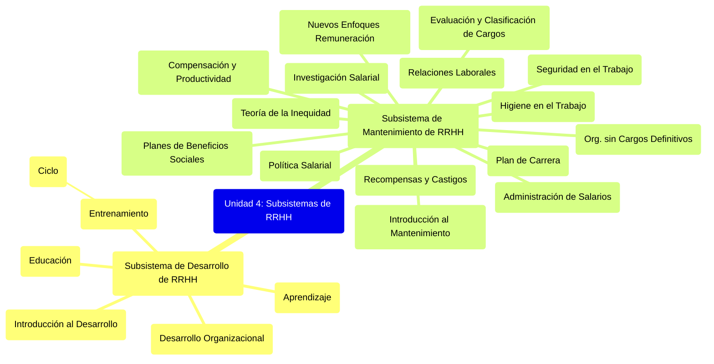

# **Unidad 4: Subsistemas de Desarrollo y Mantenimiento de RRHH** {#unidad-4:-subsistemas-de-desarrollo-y-mantenimiento-de-rrhh}

![][image18]

**Provisión de RRHH** → mercados intervinientes.  
**Aplicación de RRHH** → socialización del empleado, requisitos del cargo, discrepancias del rol.  
**Seguimiento** → evaluación del desempeño, resultados del seguimiento.

## Índice de Contenidos - Unidad 4

### Subsistema de Desarrollo de RRHH
- [Introducción al Subsistema de Desarrollo de RRHH](01_subsistema_desarrollo_rrhh_intro.md)
- [Aprendizaje](02_aprendizaje.md)
- [Educación](03_educacion.md)
- [Entrenamiento: Introducción](04_entrenamiento_intro.md)
- Ciclo del Entrenamiento:
    - [Resumen del Ciclo de Entrenamiento](05_entrenamiento_ciclo_resumen.md)
    - [Detección de Necesidades](05a_entrenamiento_deteccion_necesidades.md)
    - [Programa del Entrenamiento](05b_entrenamiento_programa.md)
    - [Ejecución del Entrenamiento](05c_entrenamiento_ejecucion.md)
    - [Evaluación de Resultados del Entrenamiento](05d_entrenamiento_evaluacion_resultados.md)
- Desarrollo Organizacional (DO):
    - [Introducción al Desarrollo Organizacional](06_desarrollo_organizacional_intro.md)
    - [Características del DO](06a_do_caracteristicas.md)
    - [El Proceso del DO](06b_do_proceso.md)
    - [Técnicas de Intervención en DO](06c_do_tecnicas_intervencion.md)
    - [Modelos de DO](06d_do_modelos.md)

### Subsistema de Mantenimiento de RRHH
- [Introducción al Subsistema de Mantenimiento de RRHH](07_subsistema_mantenimiento_rrhh_intro.md)
- [Recompensas y Castigos](08_recompensas_castigos.md)
- [Teoría de la Inequidad](09_teoria_inequidad.md)
- [Compensación y Productividad](10_compensacion_productividad.md)
- [Compensación (Administración de Salarios)](11_compensacion_admin_salarios.md)
- Evaluación y Clasificación de Cargos:
    - [Introducción a Evaluación y Clasificación de Cargos](12_evaluacion_clasificacion_cargos_intro.md)
    - [Métodos de Evaluación de Cargos](12a_evaluacion_cargos_metodos.md)
    - [Comité de Evaluación de Cargos](12b_evaluacion_cargos_comite.md)
    - [Clasificación de Cargos](12c_evaluacion_cargos_clasificacion.md)
- [Investigación Salarial](13_investigacion_salarial.md)
- [Política Salarial](14_politica_salarial.md)
- [Organización sin Cargos Definitivos](15_organizacion_sin_cargos_definitivos.md)
- Nuevos Enfoques de Remuneración:
    - [Introducción a Nuevos Enfoques de Remuneración](16_nuevos_enfoques_remuneracion_intro.md)
    - [Remuneración Variable: Resumen](17_remuneracion_variable_resumen.md)
    - [Incentivos](17a_remuneracion_variable_incentivos.md)
    - [Bonos](17b_remuneracion_variable_bonos.md)
    - [Reconocimientos o Premios](17c_remuneracion_variable_reconocimientos_premios.md)
- Planes de Beneficios Sociales:
    - [Introducción a Planes de Beneficios Sociales](18_planes_beneficios_sociales_intro.md)
    - [Orígenes de los Beneficios Sociales](18a_beneficios_sociales_origenes.md)
    - [Tipos de Beneficios Sociales](18b_beneficios_sociales_tipos.md)
    - [Costos de los Planes de Beneficios Sociales](18c_beneficios_sociales_costos.md)
    - [Criterios para el Planeamiento de Servicios y Beneficios Sociales](18d_beneficios_sociales_criterios_planeamiento.md)
- [Higiene en el Trabajo](19_higiene_trabajo.md)
- [Seguridad en el Trabajo](20_seguridad_trabajo.md)
- Relaciones Laborales:
    - [Introducción a Relaciones Laborales](21_relaciones_laborales_intro.md)
    - [El Sindicalismo](21a_relaciones_laborales_sindicalismo.md)
    - [Representación de los Trabajadores en la Organización](21b_relaciones_laborales_representacion_trabajadores.md)
    - [Conflictos](21c_relaciones_laborales_conflictos.md)
- [Plan de Carrera](22_plan_carrera.md) 