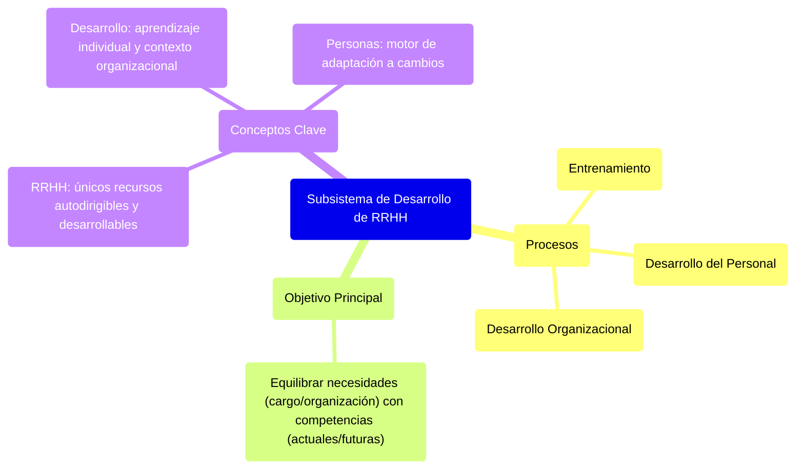

## **Subsistema de Desarrollo de RRHH** {#subsistema-de-desarrollo-de-rrhh}

Los procesos de desarrollo de personas incluyen las actividades de **entrenamiento, desarrollo del personal** y **desarrollo organizacional**. En las organizaciones, las personas se destacan por ser el único elemento vivo e inteligente, con potencial de desarrollo. Las organizaciones disponen de una variedad de medios para desarrollar a las personas, agregarles valor, capacitarlas y habilitarlas cada vez más para el trabajo.

Los dos primeros estratos (entrenamiento y desarrollo del personal) tratan el aprendizaje individual, en tanto que el estrato más amplio aborda la manera como aprenden y se desarrollan las organizaciones.

**Desarrollo de RRHH** → es aquel conjunto, englobamos todo aquello que tiene como finalidad **EQUILIBRAR las necesidades del cargo y la organización** con el conjunto de conocimientos habilidades, actuales y futuras que van a tener las persona (competencias) ⇒ Es una serie de esquemas que puedan lograr **disminuir la brecha entre las competencias de las personas y las necesidades de la org, pensando siempre a futuro.**

Algunos autores se refieren a un área genérica denominada **desarrollo**, la cual dividen en **educación y entrenamiento**: el entrenamiento significa la preparación de la persona para el cargo, en tanto que el propósito de la educación es preparar a la persona para enfrentar el ambiente dentro o fuera de su trabajo.

**Conceptos claves:**

* Los únicos recursos susceptibles de autodirección y desarrollo son los RRHH  
* Desarrollar los RRHH significa ver como las persona aprenden y se desenvuelven individualmente y como la org da el contexto y oportunidades para desarrollarse.  
* Las personas son las que piensan y logran la adopción a los cambios. Como consecuencia, el individuo también se debe adaptar (a lo que le pida el puesto y a cualquier demanda que se le puede hacer). 