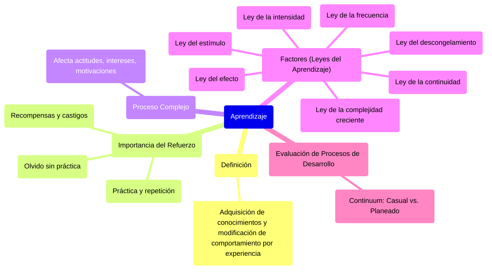

### Aprendizaje {#aprendizaje}

El **aprendizaje** es el proceso que permite a los individuos adquirir conocimientos de su ambiente y sus relaciones en el transcurso de su vida. Este se produce cuando se modifica el comportamiento de la persona en respuesta a una experiencia anterior.

El **refuerzo** de la práctica y del ejercicio repetido mejora el comportamiento y lo vuelve más eficaz y eficiente. No obstante, **lo aprendido se olvida si no se practica con frecuencia**. El refuerzo, manifiesto en **recompensas** (estímulo positivo) o **castigos** (estímulo negativo), es importante para el aprendizaje.

⇒ Es un **proceso complejo** en el que el individuo, no solo adquiere conocimiento, cambia y modifica su comportamiento. Se aprende también con la experiencia y afecta a las actitudes, intereses y a las motivaciones. Por ejemplo, ahora que aprendí esto, me puedo animar a proponer ideas relacionadas a lo mismo. Uno siempre busca reforzar las actitudes proactivas y tratar de cambiar lo que nos parece que no se ajusta a la organización (inclusive cuestiones de conducta.

![][image69]

En el aprendizaje influyen varios factores:

* El aprendizaje **obedece a la ley del efecto:** El individuo tiende a mantener un comportamiento que percibe recompensador o que produce algún efecto, y tiende a eliminar el comportamiento que no le trae ninguna recompensa. Para aprender y mantener el nuevo comportamiento, la persona debe recibir alguna recompensa inmediata y constante. *Ejemplo:* obtener conocimiento.  
* El aprendizaje **obedece a la ley del estímulo**: La recompensa estimula el aprendizaje. *Ejemplo:* aprendo esto para cambiarme al equipo que quiero.  
* El aprendizaje **obedece a la ley de la intensidad**: La intensidad de los ejercicios y de las prácticas determina el aprendizaje.  
* El aprendizaje **obedece a la ley de la frecuencia**: La frecuencia de las prácticas y los ejercicios tiende a servir de refuerzo al aprendizaje. Ergo, cuanto más practico algo o lo tengo que utilizar, más lo aprendo.  
* El aprendizaje **obedece a la ley de la continuidad**: El espacio de tiempo entre el aprendizaje y el desempeño es muy importante. Si la práctica y el ejercicio no son constantes, el aprendizaje da paso al olvido.  
* El aprendizaje **obedece a la ley del descongelamiento**: Aprender algo nuevo significa olvidar algo viejo. Siempre es difícil desaprender los viejos estándares de comportamiento que deben ser sustituidos. Para que la sustitución ocurra, es necesario que se cumplan tres condiciones: operación diferente, nuevo ambiente, y tiempo ⇒ ayuda a romper estructuras, poner en dudas lo que se sabe hasta ahora.  
* El aprendizaje **obedece a la ley de la complejidad creciente**: Si una persona debe aprender tareas complejas, el proceso de aprendizaje debe comenzar por los aspectos más sencillos.

**Evaluación de los procesos de desarrollo de las personas**  
Los procesos de desarrollo de las personas pueden evaluarse conforme al siguiente *continuum*

![C:\\Users\\Payoda\\AppData\\Local\\Microsoft\\Windows\\INetCache\\Content.Word\\prueba - Page 1.png][image70]

| Casual: Las oportunidades de entrenamiento se presentan al azar, sin planeación | Planeado: Utiliza la planificación estratégica de la organización |
| :---- | :---- |
| **Aleatorio**: Se dirige solo a unas cuantas personas de la organización elegidas al azar | **Intencional**: Busca alcanzar objetivos a corto, mediano y largo plazos, mediante cambios en el comportamiento que sustenten los cambios organizacionales |
| **Reactivo**: Se utiliza solo para resolver problemas y carencias que ya existen | **Proactivo**: Se orienta hacia delante, hacia el destino de la organización y de las personas que trabajan en ella |
| **Corto plazo**: Busca solucionar problemas actuales | **De visión a largo plazo**: Se sintoniza con la planeación estratégica y se orienta hacia cambios definitivos y globales |
| **Basado en la imposición**: Se impone a las personas independientemente de sus deseos | **Basado en el consenso**: No se impone desde arriba, sino que se consulta a las personas.  |