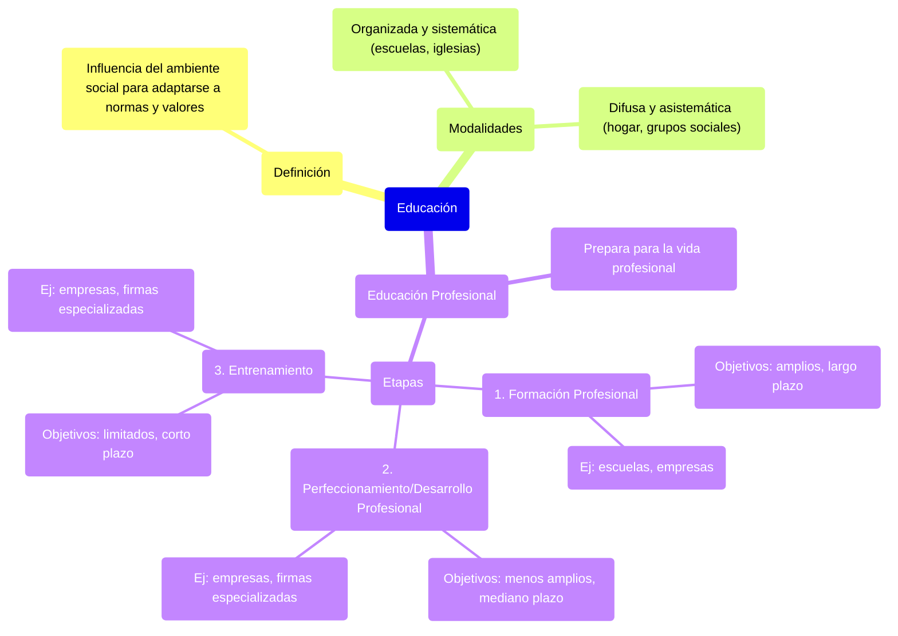

### Educación {#educación}

**La educación** es toda influencia que el ser humano recibe del ambiente social durante su existencia para adaptarse a las normas y los valores sociales vigentes y aceptados. No obstante, el ser humano recibe estas influencias y las asimila según sus inclinaciones y predisposiciones.

La educación puede ser ejercida de modo organizado y sistemático (escuelas, iglesias, etc. Donde se sigue un plan preestablecido) o bien de modo difuso, desorganizado y asistemático (hogar, grupos sociales, etc.). 

La **educación profesional** prepara al hombre para la vida profesional. Comprende tres etapas interdependientes, pero perfectamente diferenciadas:

* **Formación profesional:** Prepara al hombre para ejercer una profesión (objetivos amplios, a largo plazo). Se imparte en las escuelas (primaria, secundaria y educación superior) y también en las propias empresas ⇒ *Elegir, y tener, alguna acreditación del conocimiento de algún nivel*.  
* **Perfeccionamiento o desarrollo profesional:** Perfecciona al hombre para una carrera dentro de una profesión (objetivos menos amplios, a mediano plazo). Se imparte en las empresas o firmas especializadas en desarrollo de personal ⇒ *Es elegir posibilidades que tengan que ver con la formación, decido a qué dedicarme.*  
* **Entrenamiento:** Adapta al hombre para cumplir un cargo o una función (objetivos limitados e inmediatos, a corto plazo). Se imparte en las empresas o firmas especializadas en entrenamiento ⇒ *Es algo puntual para algo en especifico, es lo que en general llaman capacitación.* 