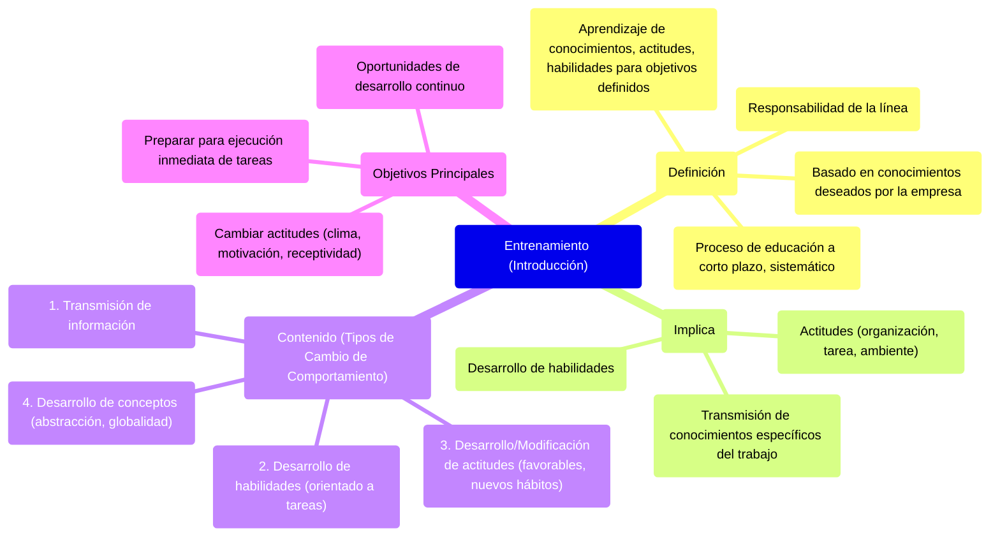

### Entrenamiento {#entrenamiento}

El **entrenamiento** es un proceso de educación a corto plazo que lo aplico de forma sistemática, y lo hago en base a los conocimientos que quiero adquirir según la empresa, mediante el cual las personas aprenden conocimientos, actitudes y habilidades, en función de objetivos definidos. ES RESPONSABILIDAD DE LA LÍNEA, pues es quien puede detectar problemas surgidos por falta de entrenamiento.

El entrenamiento implica la transmisión de conocimientos específicos relativos al trabajo, actitudes frente a aspectos de la organización, de la tarea y del ambiente, y desarrollo de habilidades.

El contenido del entrenamiento puede incluir **cuatro tipos de cambio de comportamiento**:

* **Transmisión de información**: distribuir información entre los entrenados como un cuerpo de conocimientos.  
* **Desarrollo de habilidades**. Sobre todo, aquellas destrezas y conocimientos relacionados directamente con el desempeño del cargo actual o de posibles ocupaciones futuras. Es un entrenamiento orientado de manera directa a las tareas.  
* **Desarrollo o modificación de actitudes**. En general, se refiere al cambio de actitudes negativas por actitudes más favorables entre los trabajadores. También puede implicar adquisición de nuevos hábitos y actitudes, ante todo, relacionados con los clientes o usuarios.   
* **Desarrollo de conceptos**. El entrenamiento puede estar dirigido a elevar el nivel de abstracción y conceptualización de ideas y pensamientos ya sea para facilitar la aplicación de conceptos en la práctica administrativa o para elevar el nivel de generalización, capacitando gerentes que puedan pensar en términos globales y amplios.

Los principales **objetivos** del entrenamiento son:

* Preparar al personal para la ejecución inmediata de las diversas tareas del cargo.  
* Proporcionar oportunidades para el desarrollo continuo, no solo en su cargo actual.  
* Cambiar la actitud de las personas ya sea para crear un clima más satisfactorio, aumentar la motivación o hacerlos más receptivos a técnicas de supervisión o gerencia. 