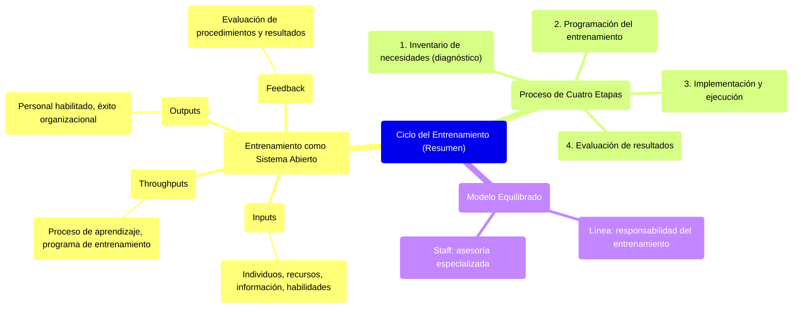

#### ***Ciclo del entrenamiento***

![C:\\Users\\Payoda\\AppData\\Local\\Microsoft\\Windows\\INetCache\\Content.Word\\prueba - Page 1 (1).png][image71]

En términos amplios, el entrenamiento se asemeja a un sistema abierto cuyos componentes son:

* **Entradas** (Inputs): Individuos en entrenamientos, recursos empresariales, información, habilidades.  
* **Procesamiento u operación** (Throughputs): Proceso de aprendizaje (individual), programa de entrenamiento, etc.   
* **Salidas** (outputs): Personal habilitado, éxito o eficacia organizacional, etc.  
* **Retroalimentación** (feedback): Evaluación de los procedimientos y resultados del entrenamiento, a través de medios informales o investigaciones sistémicas. 

E implica un proceso compuesto de cuatro etapas: 

1. Inventario de necesidades de entrenamiento (diagnóstico).  
2. Programación del entrenamiento para atender las necesidades.  
3. Implementación y ejecución.  
4. Evaluación de resultados.

![][image72]

La situación preferida sería un **modelo equilibrado** en que el organismo de línea asume la responsabilidad del entrenamiento y obtiene asesoría especializada del organismo de *staff*.

![][image73] 