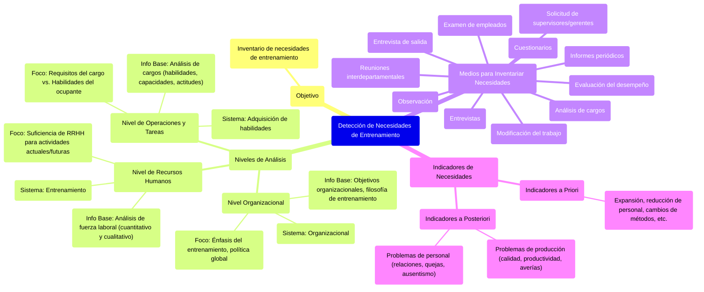

##### **Detección de necesidades (diagnóstico de la situación)**

¿Qué tomo para diagnosticar esto? Los objetivos, los desafíos que hay, determinar los requerimientos básicos (sacado de los cargos), las evaluaciones de desempeños, indicadores a-priori y a-posteriori. Análisis de los problemas de datos, etc. **EL RESULTADO de todo esto, es el inventario de necesidades de enterramiento**, es como un dosier de necesidades, y se clasifica en:

| Nivel de análisis | Sistema involucrado | Información base |
| ----- | ----- | ----- |
| **Análisis organizacional** | Sistema organizacional | Objetivos organizacionales y filosofía del entrenamiento. Voy a tener necesidades de entrenamiento por cambios organizacionales. |
| **Análisis de los recursos humanos** | Sistema de entrenamiento | Análisis de la fuerza laboral (análisis de las personas). Es como tener el panorama de cómo está mi personal. |
| **Análisis de operaciones y tareas** | Sistema de adquisición de habilidades | Análisis de habilidades, capacidades, actitudes, comportamiento y características personales exigidos por los cargos (análisis de cargos). |

* **Análisis de la organización total: sistema organizacional.**

El análisis organizacional consiste en "determinar en donde deberá hacer énfasis el entrenamiento". Se deberá verificar todos los factores (planes, fuerza laboral, eficiencia organizacional, etc.) capaces de evaluar los costos implicados y los beneficios esperados del entrenamiento, en comparación con otras estrategias capaces de alcanzar los objetivos empresariales, y determinar así la política global relacionada con el entrenamiento.

*Estoy tratando de analizar a la empresa en conjunto, no me centro en un área particular. Por eso hablamos de los objetivos a largo plazo, su cultura organizacional, todo aquello que me da una idea de a "dónde" está yendo la empresa, más allá de su misión.* 

![][image74]

* **Análisis de los recursos humanos: sistema de entrenamiento.**

El análisis de los recursos humanos procura verificar si los recursos humanos son suficientes, cuantitativa y cualitativamente, para llevar a cabo las actividades actuales y futuras de la organización.

![][image75]

* **Análisis de las operaciones y tareas: sistema de adquisición de habilidades.**

Nivel de enfoque más limitado que el inventario de necesidades de entrenamiento, puesto que se efectúa el análisis del cargo teniendo como base los requisitos que el cargo exige a su ocupante. Además de la organización y de las personas, el entrenamiento debe tener en cuenta también los cargos para los cuales las personas deben ser entrenadas.

El análisis de operaciones son estudios definidos para determinar qué tipos de comportamiento deben adoptar los empleados para desempeñar con eficacia las funciones de sus cargos.

El análisis de las operaciones u análisis ocupacional es un proceso que comprende la descomposición del cargo en sus partes constitutivas, para la verificación de habilidades, conocimientos y cualidades personales o responsabilidades exigidas al individuo en el desempeño de sus funciones, en otras palabras:

Requisitos exigidos por el cargo-Habilidades del ocupante del cargo=Necesidades de entrenamiento

![][image76]

**Medios para inventariar necesidades de entrenamiento**  
El inventario de necesidades de entrenamiento es una responsabilidad de línea y es una función de staff. Corresponde al administrador la responsabilidad de detectar los problemas provocados por la carencia de entrenamiento. Los principales medios para efectuar el inventario son:

* Evaluación del desempeño  
* *Observación.* Verificar donde hay evidencia de trabajo ineficiente  
* *Cuestionarios.* Investigaciones mediante cuestionarios y listas de verificación (*check list)* que evidencien las necesidades de entrenamiento.  
* Solicitud de supervisores y gerentes  
* Entrevistas con supervisores y gerentes  
* Reuniones interdepartamentales.  
* *Examen* de *empleados.* Resultados de los exámenes de selección de empleados que ejecutan determinadas funciones o tareas.  
* *Modificación del trabajo.* Cuando se introduzcan modificaciones parciales o totales en las rutinas de trabajo.  
* Entrevista de salida  
* *Análisis de cargos.* Cuadro de las tareas que debe cumplir el ocupante y de las habilidades que debe poseer.  
* Informes periódicos de la empresa o de producción.

Además de los medios antes nombrados, existen algunos indicadores de necesidades de entrenamiento:

* ***Indicadores a priori**.* Eventos que, si ocurrieran, proporcionarían necesidades futuras de entrenamiento fácilmente previsibles:  
  * Expansión de la empresa y admisión de nuevos empleados.  
  * Reducción del número de empleados.  
  * Cambio de métodos y procesos de trabajo.  
  * Sustituciones o movimientos de personal.  
  * Faltas, licencias y vacaciones del personal.  
  * Expansión de los servicios.  
  * Cambios en los programas de trabajo o de producción.  
  * Modernización de la maquinaria o el equipo.  
  * Producción y comercialización de nuevos productos o servicios.

* ***Indicadores a posteriori**.* Problemas provocados por necesidades de entrenamiento no atendidas.  
  *  Problemas de producción, como:  
  * Calidad inadecuada de la producción  
  * Baja productividad.  
  * Averías frecuentes en el equipo e instalaciones.  
  * Comunicación deficiente.  
  * Demasiado tiempo para el aprendizaje y la integración al puesto.  
  * Gastos excesivos para el mantenimiento de maquinaria y equipo.  
  * Exceso de errores y desperdicios.  
  * Elevado número de accidentes.  
  * Poca versatilidad de los empleados.  
  * Mal aprovechamiento del espacio disponible, etcétera. 

  * Problemas de personal, como:  
  * Relaciones deficientes entre el personal.  
  * Número excesivo de quejas.  
  * Poco o nulo interés por el trabajo.  
  * Falta de cooperación.  
  * Número excesivo de faltas y reemplazos.  
  * Dificultad para obtener buenos elementos.  
  * Tendencia a atribuir las fallas a los demás.  
  * Errores al acatar órdenes, etcétera 