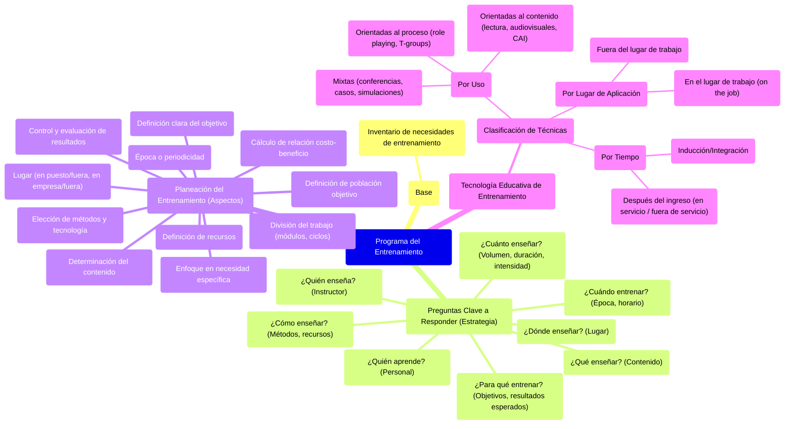

##### **Programa del entrenamiento**

Una vez se han inventariado y determinado las necesidades de entrenamiento, se procede a la programación del entrenamiento, sistematizada y fundamentada

El inventario de necesidades de entrenamiento debe suministrar la siguiente información para diseñar la programación de entrenamiento. Decisión en cuanto a estrategia → tengo que definir los diferentes PROGRAMAS de entrenamiento, pero tomándome el trabajo de responder estas preguntas:

* ¿**Qué** debe enseñarse? → Tema o contenido del entrenamiento  
* ¿**Quién** debe aprender? → Personal entrenado   
* ¿**Cuándo** entrenar? → Época de entrenamiento y horario  
* ¿**Cuánto** debe enseñarse?→ Volumen, duración intensidad   
* ¿**Dónde** debe enseñarse? → Lugar físico, organismo o entidad.  
* ¿**Cómo** debe enseñarse? → Métodos de entrenamiento y recursos necesarios  
* ¿**Quién** debe enseñar? → Entrenador o instructor  
* ¿**Para qué** se debe entrenar? → Objetivos o resultados esperados.

**Planeación del entrenamiento** **→** El programa de entrenamiento exige una planeación que incluya los siguientes aspectos (es la respuesta de lo de arriba):

* Enfoque de una **necesidad específica** cada vez.  
* Definición clara del **objetivo** de entrenamiento.  
* **División del trabajo** por desarrollar, en módulos, paquetes o ciclos.  
* Determinación del **contenido del entrenamiento**.  
* **Elección de los métodos** de entrenamiento y de la tecnología disponible.  
* **Definición de los recursos** necesarios para la implementación del entrenamiento  
* **Definición de la población** objetivo, es decir, el personal que va a ser entrenado  
* **Lugar** donde se efectuará el entrenamiento, considerando las alternativas: en el puesto de trabajo o fuera del mismo, en la empresa o fuera de ella.  
* **Época o periodicidad** del entrenamiento, considerando también el horario más oportuno o la ocasión más propicia.  
* Cálculo de **la relación costo-beneficio** del programa.  
* **Control y evaluación** de los resultados.

**Tecnología educativa de entrenamiento →** Una vez determinada la naturaleza de las habilidades y los conocimientos o comportamientos terminales buscados con el entrenamiento, el siguiente paso es **elegir las técnicas que van a utilizarse.**

Las técnicas de entrenamiento pueden clasificarse en cuanto a uso, tiempo y lugar de aplicación.

* **Técnicas de entrenamiento en cuanto al uso**  
  * *Técnicas de entrenamiento orientadas al contenido.* Diseñadas para la transmisión de conocimientos o de información (lectura, recursos audiovisuales, instrucción asistida por computador, etc.).  
  * *Técnicas de entrenamiento orientadas al proceso.* Diseñadas para cambiar actitudes, desarrollar conciencia acerca de sí mismo y de los demás, y desarrollar habilidades interpersonales (juego de roles, entrenamiento de grupos, etc.).  
  * *Técnicas mixtas de entrenamiento.* No solo se emplean para transmitir información, sino también para cambiar actitudes y comportamientos (conferencias, estudio de casos, simulaciones, etc.).

* **Técnicas de entrenamiento en cuanto al tiempo**  
  * *Entrenamiento de inducción o de integración a la empresa.* Busca la adaptación y ambientación inicial del nuevo empleado a la empresa y al ambiente social y físico donde va a trabajar.  
  * *Entrenamiento después del ingreso al trabajo:* el entrenamiento podrá llevarse a cabo:   
  * (1) En el lugar o sitio de trabajo (en servicio)   
  * (2) Fuera del lugar de trabajo (fuera del servicio).

* **Técnicas de entrenamiento en cuanto al lugar de aplicación**  
  * *Entrenamiento en el lugar de trabajo (on the job).* Pueden administrarlo empleados, supervisores o especialistas de staff. No requiere acondicionamiento ni equipos especiales, y constituye la forma más común de transmitir las enseñanzas necesarias a los empleados.  
  * *Entrenamiento fuera del lugar de trabajo.* La mayor parte de los programas de entrenamiento llevados a cabo fuera del servicio no están relacionados directamente con el trabajo. En general, son complementarios 