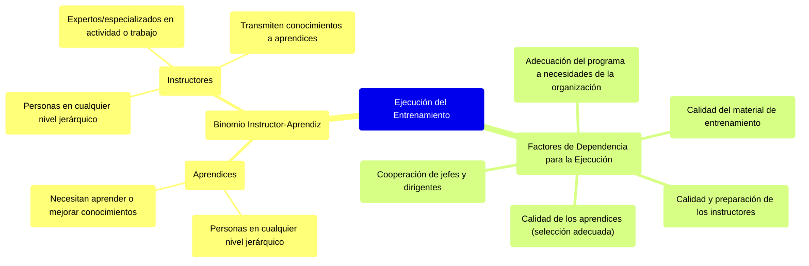

##### **Ejecución del entrenamiento**

La ejecución del entrenamiento presupone el binomio instructor-aprendiz. Los aprendices son personas situadas en cualquier nivel jerárquico de la empresa, que necesitan aprender o mejorar los conocimientos que tienen sobre alguna actividad o trabajo. Los instructores son personas situadas en cualquier nivel jerárquico de la empresa, expertos o especializados en determinada actividad o trabajo, que transmiten sus conocimientos a los aprendices.

**La ejecución del entrenamiento depende de los siguientes factores:**

* *Adecuación del programa de entrenamiento* a *las necesidades de la organización:* El entrenamiento debe ser la solución de los problemas que dieron origen a las necesidades diagnosticadas o percibidas.  
* *Calidad del material de entrenamiento presentado*  
* *Cooperación de los jefes y dirigentes de la empresa:* Es necesario que el personal tenga espíritu de cooperación y que los dirigentes den su apoyo, ya que los jefes y supervisores deben participar de manera efectiva en la ejecución del programa.  
* *Calidad y preparación de los instructores.* El éxito de la ejecución dependerá del interés, el esfuerzo y el entrenamiento de los instructores.  
* *Calidad de los aprendices:* Los mejores resultados se obtienen de una selección adecuada de los aprendices, en función de la forma y el contenido del programa y de los objetivos del entrenamiento, para que se llegue a disponer de un grupo homogéneo de personas. 