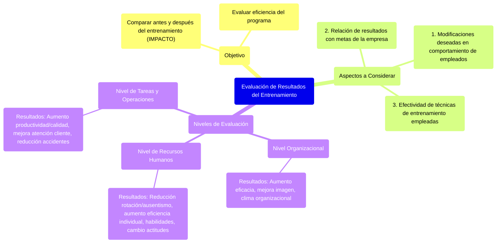

##### **Evaluación de los resultados del entrenamiento**

Acá me interesa comparar como estaba antes a como estoy ahora, **quiero ver el IMPACTO del entrenamiento**. Es necesario evaluar la eficiencia del programa de entrenamiento y se deben considerar dos aspectos:

* Determinar si el entrenamiento produjo las modificaciones deseadas en el comportamiento de los empleados.

* Verificar si los resultados del entrenamiento presentan relación con la consecución de las metas de la empresa.

Además de estos dos aspectos, es necesario determinar si las técnicas de entrenamiento empleadas son efectivas. **La evaluación de los resultados del entrenamiento puede hacerse en tres niveles:**

* *En el nivel organizacional.* En este nivel, el entrenamiento debe proporcionar resultados como aumento de la eficacia organizacional, mejoramiento de la imagen de la empresa, mejoramiento del clima organizacional, etc.  
* *En el nivel de los recursos humanos.* En este nivel, el entrenamiento debe proporcionar resultados como reducción de la rotación de personal, disminución del ausentismo, aumento de la eficiencia individual de los empleados, aumento de las habilidades y conocimientos, cambios de actitudes.  
* *En el nivel de las tareas y operaciones.* En este nivel, el entrenamiento puede proporcionar resultados como, aumento de la productividad, aumento en calidad de los productos y servicios, mejoramiento de la atención al cliente, reducción del índice de accidentes, etc.

![][image77]

![][image78] 