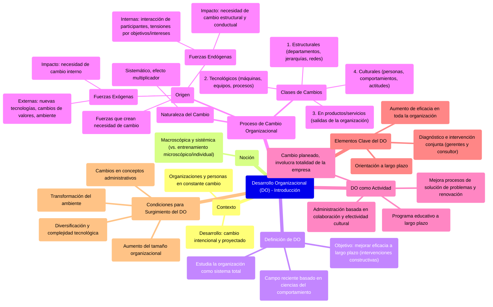

### Desarrollo organizacional {#desarrollo-organizacional}

Tanto las organizaciones como las personas que trabajan en ellas están en constante cambio. El término **desarrollo** se aplica cuando el cambio es intencional y se proyecta con anticipación → Es un enfoque situacional o de contingencia para mejorar la efectividad de la empresa.

![][image79]

Cuando se habla de entrenamiento y desarrollo, la noción es microscópica y casi siempre individual. En cambio, cuando se habla de desarrollo organizacional, la noción es macroscópica y sistémica.

El campo del **desarrollo organizacional (DO)** es reciente y se basa en los conceptos y métodos de las ciencias del comportamiento, estudia la organización como sistema total y se compromete a mejorar la eficacia de la empresa a largo plazo mediante intervenciones constructivas en los procesos y la estructura de las organizaciones.

El proceso de cambio organizacional comienza con el surgimiento de **fuerzas que crean la necesidad de cambio en algunas partes de la organización**. Estas fuerzas pueden ser exógenas o endógenas.

**1\. Fuerzas exógenas:** provienen del ambiente, como nuevas tecnologías, cambios de valores de la sociedad y nuevas oportunidades o limitaciones del ambiente (económico, político, legal y social). Estas fuerzas externas crean necesidades de **un cambio organizacional interno.** 

**2\. Fuerzas endógenas:** provienen del interior de la propia organización, crean necesidades de **cambio estructural y conductual**, en virtud de la interacción de sus participantes y de las tensiones provocadas por objetivos e intereses diferentes.

⇒ Los cambios no ocurren de forma aislada, sino que se presentan sistemáticamente y unos afectan a otros y provocan un poderoso efecto multiplicador. En las organizaciones existen cuatro clases de cambios:

**1\. Cambios estructurales:** que afectan la estructura organizacional, los departamentos (como divisiones o áreas, los cuales se fundan, crean, eliminan o subcontratan por medio de nuevos socios), las redes de información internas y externas, los niveles jerárquicos (reducidos al establecer comunicaciones horizontales) y las modificaciones en el esquema de diferenciación frente a la integración existente. 

**2\. Cambios en la tecnología:** que afectan máquinas, equipos, instalaciones, procesos empresariales, etcétera. La tecnología implica la forma en que la empresa realiza sus tareas y produce sus productos y servicios. 

**3\. Cambios en los productos o servicios:** que afectan los resultados o las salidas de la organización. 

**4\. Cambios culturales:** es decir, los cambios en las personas y sus comportamientos, actitudes, expectativas, aspiraciones y necesidades. 

El DO es una actividad de cambio planeado que involucra a la empresa como totalidad. Es un programa educativo a **largo plazo** orientado a mejorar los procesos de solución de problemas y de renovación de una organización mediante una administración basada en la colaboración y la **efectividad** de la cultura de la empresa. 

Lo elementos son:

* Orientación a largo plazo  
* Generación de esfuerzos para aumentar la eficacia en toda la organización.  
* Desarrollo conjunto de los pasos de diagnóstico y de intervención entre los gerentes de línea y el consultor

Condiciones básicas para el surgimiento del DO

* Transformación del ambiente  
* Aumento del tamaño organizacional, lo cual impide que el volumen de las actividades tradicionales de la organización sea suficiente para sostener el crecimiento.  
* Diversificación creciente y complejidad gradual de la tecnología  
* Cambios en conceptos administrativos (cambios en el concepto de hombre, de poder y de valores organizacionales). 