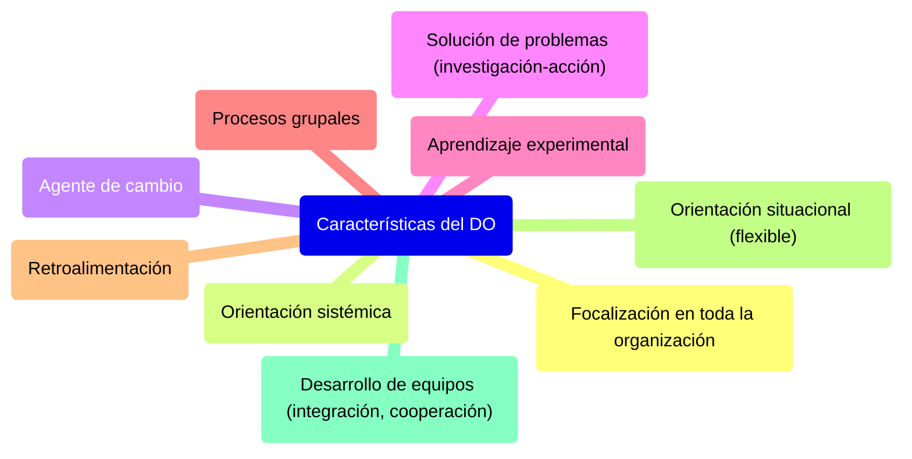

#### ***Características del DO***

* **Focalización en toda la organización:** toma a la organización como un todo para que el cambio sea efectivo.  
* **Orientación sistémica:** es más importante el funcionamiento en conjunto que el funcionamiento individual de las partes.  
* **Agente de cambio:** utiliza personas que desempeñan el papel de estimular y coordinar el cambio dentro de un grupo o dentro de la organización.  
* **Solución de problemas:** el DO hace énfasis en la solución, enfocándose en los problemas reales, utilizando investigación-acción.  
* **Aprendizaje experimental:** Los participantes aprenden a resolver experimentalmente en el ambiente de entrenamiento los problemas que deben enfrentar en el trabajo, además de discutir su experiencia y aprender de esta.  
* **Procesos grupales:** se basa en procesos grupales, como discusiones en grupo, debates, etc.  
* **Retroalimentación:** a sus participantes.  
* **Orientación situacional:** el DO se es flexible y adapta las acciones a las necesidades específicas.  
* **Desarrollo de equipos:** el objetivo es construir mejores equipos de trabajo. Propone integración, cooperación y ayuda a superar las diferencias individuales o grupales. 