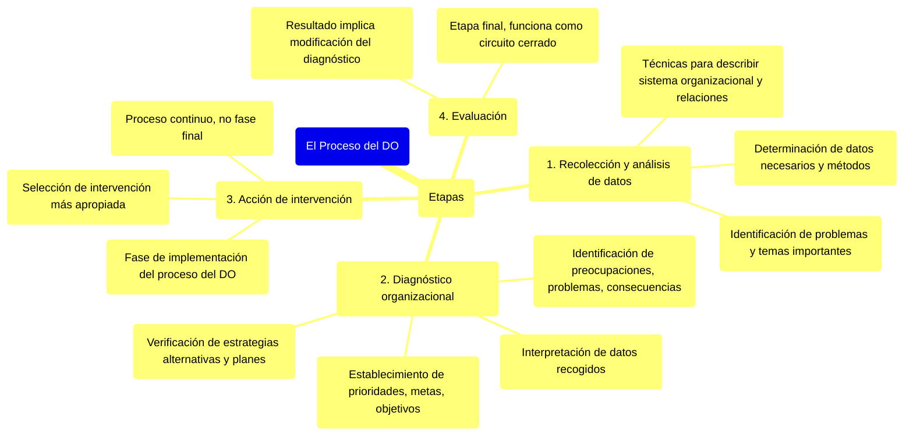

#### ***El proceso del DO***

Consta de las siguientes etapas:

* *Recolección y análisis de datos:* Determinación de los datos necesarios y los métodos útiles para recolectarlos dentro de la empresa. Incluye técnicas y métodos para describir el sistema organizacional y las relaciones entre sus elementos o subsistemas, así como los modos de identificar problemas y temas importantes.  
* *Diagnóstico organizacional:* Del análisis de los datos recogidos se pasa a la interpretación y al diagnóstico para identificar preocupaciones y problemas y sus consecuencias, establecer prioridades, metas y objetivos. En el diagnóstico, verifican las estrategias alternativas y los planes para implementarlas.  
* *Acción de intervención*: Fase de implementación del proceso del DO. Se selecciona la intervención más apropiada para solucionar un problema organizacional particular. Esta fase no es la fase final del DO ya que se trata de un proceso continuo.  
* *Evaluación:* Etapa final del proceso que funciona como circuito cerrado. El resultado de la evaluación implica modificación del diagnóstico.

![][image80] 